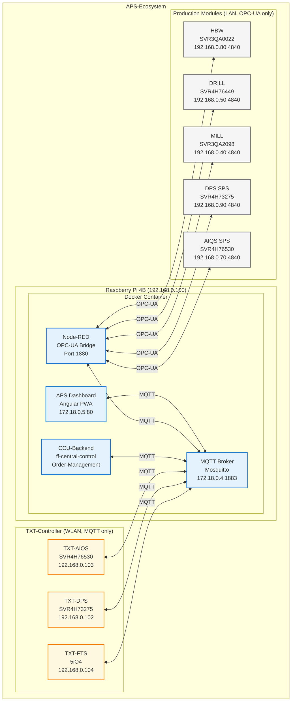
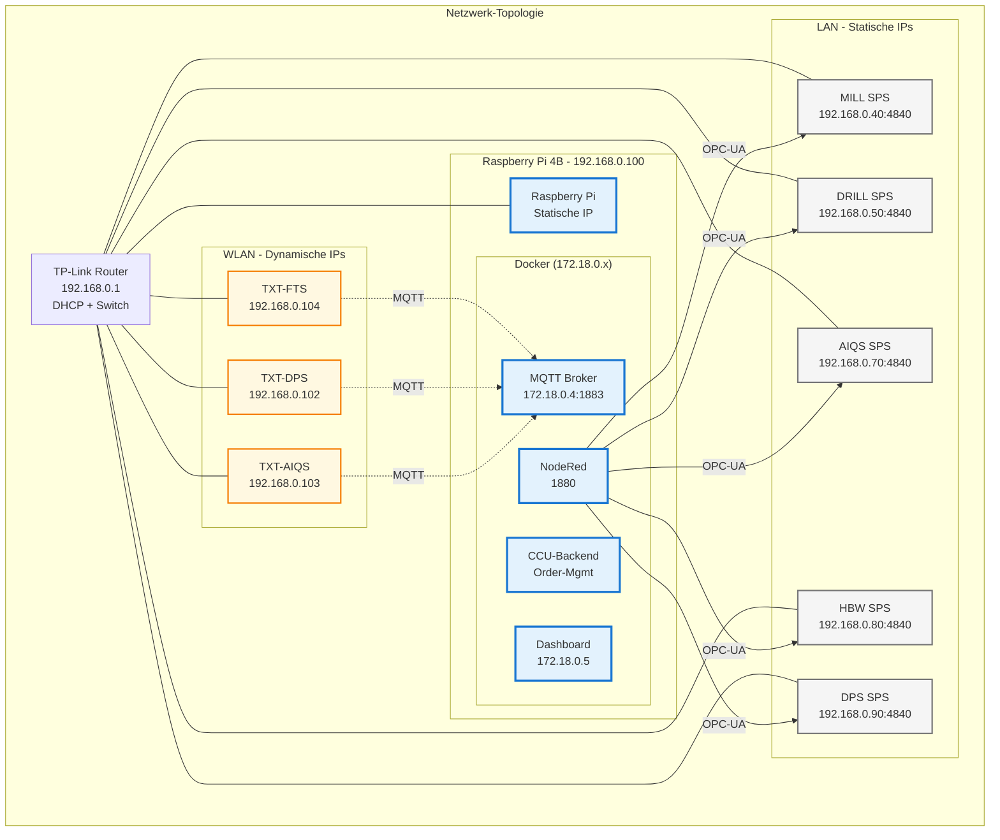

# 🏗️ APS Hardware-Architektur - "as IS"

**Verifiziert durch:** Netzwerk-Scans, Session-Logs, Integration-Tests  
**Datum:** 2025-10-08

---

## 🗺️ System-Architektur-Übersicht



**Wichtig:**
- 🔵 **Docker-Container** (blau) - Raspberry Pi
- 🟡 **TXT-Controller** (gelb) - MQTT-fähig
- ⚪ **SPS-Module** (grau) - Nur OPC-UA

---

## 🖥️ Zentrale Steuerung: Raspberry Pi 4B

### Hardware
- **Model:** Raspberry Pi 4 Model B
- **IP:** 192.168.0.100 (statisch)
- **OS:** Linux (Raspbian)
- **Rolle:** Zentrale Fabrik-Steuerung

### Docker-Container
```
Raspberry Pi: 192.168.0.100
├── MQTT Broker (Mosquitto)
│   └── Port: 1883
├── Node-RED
│   └── Port: 1880 (Admin API)
├── CCU-Backend (ff-central-control)
│   └── Source: integrations/APS-CCU/ff-central-control-unit/central-control/
└── APS Dashboard Frontend (Angular PWA)
    └── Port: 80
```

### Docker-Networking
```
172.18.0.4 → MQTT Broker
172.18.0.5 → Dashboard Frontend
192.168.0.100 → External Access
```

---

## 🤖 TXT-Controller (Fischertechnik TXT 4.0)

### Übersicht
- **OS:** Linux
- **MQTT:** ✅ Nativ
- **OPC-UA:** ❌ Nicht verfügbar
- **Netzwerk:** WLAN (DHCP)
- **SSH:** ft / fischertechnik

### TXT-FTS (Fahrerloses Transportsystem)
- **IP:** 192.168.0.104 (normalerweise)
- **Client-ID:** `auto-F6DFC829`
- **Serial:** 5iO4
- **Will Topic:** `fts/v1/ff/5iO4/connection`
- **Rolle:** AGV-Navigation nach VDA 5050

### TXT-DPS (Delivery & Pickup Station)
- **IP:** 192.168.0.102 (normalerweise)
- **Client-ID:** `auto-AC941349`
- **Serial:** SVR4H73275
- **Will Topic:** `module/v1/ff/NodeRed/SVR4H73275/connection`
- **Rolle:** Warenein-/ausgang, Roboter-Arm
- **Zusatz:** OPC-UA @ 192.168.0.90

### TXT-AIQS (AI Quality System)
- **IP:** 192.168.0.103 (normalerweise)
- **Client-ID:** `auto-B9109AD9`
- **Serial:** SVR4H76530
- **Will Topic:** `module/v1/ff/NodeRed/SVR4H76530/connection`
- **Rolle:** Qualitätskontrolle, Kamera, AI
- **Zusatz:** OPC-UA @ 192.168.0.70

---

## 🏭 Produktions-Module (Siemens S7-1200 SPS)

### Übersicht
- **Protokoll:** Nur OPC-UA (kein MQTT)
- **Netzwerk:** LAN (statische IPs)
- **MQTT-Bridge:** NodeRed übernimmt Kommunikation

### HBW (High Bay Warehouse)
- **Serial:** SVR3QA0022
- **IP:** 192.168.0.80:4840 (OPC-UA)
- **Version:** 1.3.0
- **Firmware:** MOD-FF22+HBW+24V
- **MQTT:** Via NodeRed (`module/v1/ff/SVR3QA0022/*`)

### DRILL (Bohrstation)
- **Serial:** SVR4H76449
- **IP:** 192.168.0.50:4840 (OPC-UA)
- **Version:** 1.3.0
- **Production Duration:** 5s
- **MQTT:** Via NodeRed (`module/v1/ff/SVR4H76449/*`)

### MILL (Frässtation)
- **Serial:** SVR3QA2098
- **IP:** 192.168.0.40:4840 (OPC-UA)
- **Version:** 1.3.0
- **Production Duration:** 5s
- **MQTT:** Via NodeRed (`module/v1/ff/SVR3QA2098/*`)

---

## 🌐 Netzwerk-Architektur



### WLAN-Netzwerk (192.168.0.x)
```
Router: 192.168.0.1 (TP-Link TL-WR902AC)
├── Raspberry Pi: 192.168.0.100 (statisch)
├── TXT-FTS: 192.168.0.104 (DHCP)
├── TXT-DPS: 192.168.0.102 (DHCP)
└── TXT-AIQS: 192.168.0.103 (DHCP)
```

**Hinweis:** TXT-Controller IPs können variieren (DHCP)

### LAN-Netzwerk (192.168.0.x)
```
Switch: 192.168.0.1
├── MILL (S7-1200): 192.168.0.40:4840 (statisch)
├── DRILL (S7-1200): 192.168.0.50:4840 (statisch)
├── AIQS (S7-1200): 192.168.0.70:4840 (statisch)
├── HBW (S7-1200): 192.168.0.80:4840 (statisch)
└── DPS (S7-1200): 192.168.0.90:4840 (statisch)
```

### Docker-Netzwerk (172.18.0.x)
```
Docker Bridge: 172.18.0.x
├── MQTT Broker: 172.18.0.4:1883
└── Dashboard: 172.18.0.5
```

---

## 🔄 Kommunikations-Protokolle

### MQTT (Message Queuing Telemetry Transport)
- **Broker:** 192.168.0.100:1883 (Mosquitto)
- **QoS:** 0 (Test), 1 (Sensor), 2 (Commands)
- **Encryption:** Keine
- **Authentication:** Keine
- **Verwendet von:** TXT-Controller, CCU-Backend, NodeRed, Dashboard

### OPC-UA (Open Platform Communications)
- **Port:** 4840 (Standard)
- **Encryption:** Keine
- **Security:** None
- **Verwendet von:** S7-1200 Module → NodeRed

### SSH
- **Port:** 22
- **User:** ft
- **Password:** fischertechnik
- **Verwendet für:** TXT-Controller Remote-Access

---

## 📦 Software-Komponenten

### CCU-Backend (ff-central-control)
- **Location:** Raspberry Pi Docker
- **Source:** `integrations/APS-CCU/ff-central-control-unit/central-control/`
- **Sprache:** JavaScript (kompiliert von TypeScript)
- **Rolle:** Order-Management, UUID-Generation, FTS-Orchestration

### NodeRed
- **Location:** Raspberry Pi Docker
- **Port:** 1880
- **Rolle:** OPC-UA ↔ MQTT Bridge
- **Flows:** `integrations/APS-NodeRED/backups/*/flows.json`
- **Instances:** 2 (SUB + PUB)

### MQTT Broker (Mosquitto)
- **Location:** Raspberry Pi Docker
- **Port:** 1883
- **Config:** `integrations/mosquitto/config/mosquitto.conf`

---

## 🔗 Siehe auch

- [Module Serial Mapping](module-serial-mapping.md) - Detaillierte Serial-Number-Zuordnung
- [MQTT Topic Conventions](mqtt-topic-conventions.md) - Topic-Naming-Patterns
- [CCU-Backend Orchestration](ccu-backend-orchestration.md) - Order-Flow Details

---

**Status:** Verifizierte Hardware-Architektur "as IS" ✅

