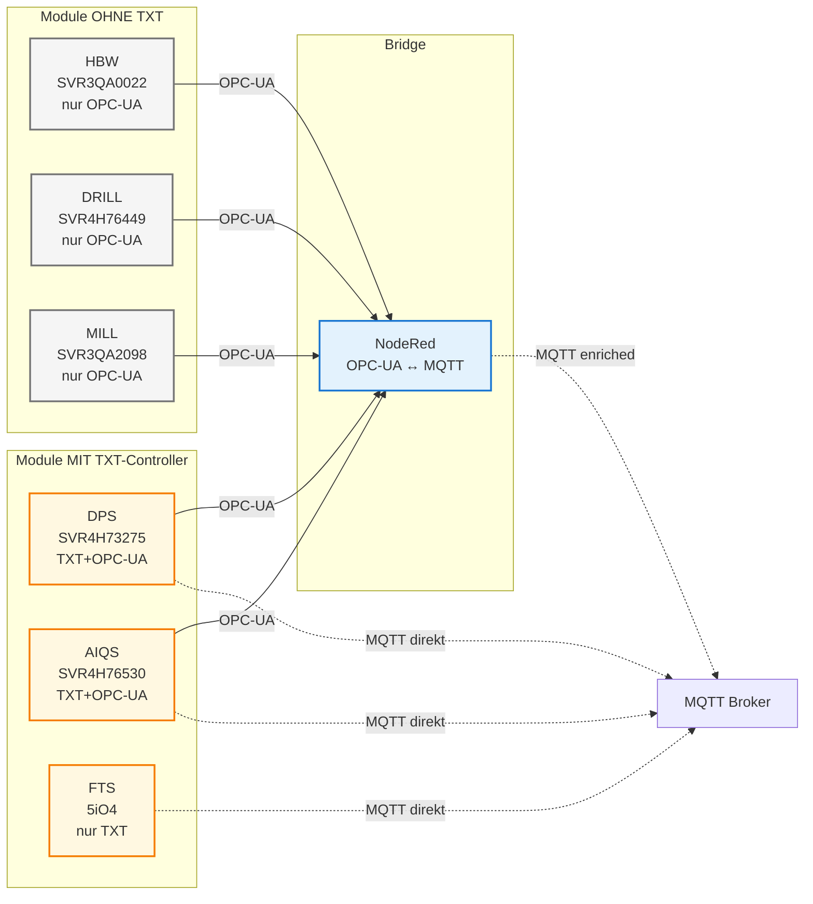

# 📋 Module Serial Mapping - Single Source of Truth

**Verifiziert durch:** Session Factsheets (auftrag-*.db) + Mosquitto Logs  
**Datum:** 2025-10-08

---

## 🎯 Module-Mapping (FINAL)



| Serial | Typ | TXT-Controller | OPC-UA Server | IP (TXT) | IP (OPC-UA) | Manufacturer |
|--------|-----|----------------|---------------|----------|-------------|--------------|
| **SVR4H73275** | **DPS** | ✅ | ✅ | 192.168.0.102 | 192.168.0.90 | Fischertechnik |
| **SVR4H76530** | **AIQS** | ✅ | ✅ | 192.168.0.103 | 192.168.0.70 | Fischertechnik |
| **5iO4** | **FTS** | ✅ | ❌ | 192.168.0.104 | - | - |
| SVR3QA0022 | HBW | ❌ | ✅ | - | 192.168.0.80 | Fischertechnik |
| SVR4H76449 | DRILL | ❌ | ✅ | - | 192.168.0.50 | Fischertechnik |
| SVR3QA2098 | MILL | ❌ | ✅ | - | 192.168.0.40 | Fischertechnik |

### Legende:
- **TXT-Controller:** Fischertechnik TXT 4.0 mit MQTT-Fähigkeit
- **OPC-UA Server:** Siemens S7-1200 SPS
- **IP (TXT):** WLAN, DHCP-vergeben (variabel)
- **IP (OPC-UA):** LAN, statisch

---

## 📡 MQTT Will Message Topics

**Zweck:** Connection-Status-Monitoring (automatisch bei Disconnect)

| Controller | Serial/Typ | Will Message Topic | Payload Size | QoS | Retain |
|------------|-----------|-------------------|--------------|-----|--------|
| **TXT-FTS** | 5iO4 (FTS) | `fts/v1/ff/5iO4/connection` | 212 bytes | 1 | Yes |
| **TXT-DPS** | SVR4H73275 (DPS) | `module/v1/ff/NodeRed/SVR4H73275/connection` | 184 bytes | 1 | Yes |
| **TXT-AIQS** | SVR4H76530 (AIQS) | `module/v1/ff/NodeRed/SVR4H76530/connection` | 208 bytes | 1 | Yes |

**Pattern:**
```
Connect → Will Message registriert → Normal Operation → Disconnect → Will Message published
```

---

## 🔌 MQTT Client-IDs

| Komponente | Client-ID | IP | Rolle |
|------------|-----------|----|----|
| TXT-FTS | `auto-F6DFC829` | 192.168.0.105 | Transport Control |
| TXT-DPS | `auto-AC941349` | 192.168.0.102 | Distribution Control |
| TXT-AIQS | `auto-B9109AD9` | 192.168.0.103 | Quality Control |
| NodeRed (SUB) | `nodered_abe9e421b6fe3efd` | 172.18.0.4 | Monitoring & Processing |
| NodeRed (PUB) | `nodered_94dca81c69366ec4` | 172.18.0.4 | Command Publishing |
| Dashboard | `mqttjs_bba12050` | 172.18.0.5 | User Interface |

---

## 🏷️ Module Full Names

| Serial | Full Name | Version | Firmware |
|--------|-----------|---------|----------|
| SVR3QA0022 | High Bay Warehouse (HBW) | 1.3.0 | MOD-FF22+HBW+24V |
| SVR4H76449 | DRILL Station | 1.3.0 | - |
| SVR3QA2098 | MILL Station | 1.3.0 | - |
| SVR4H73275 | Delivery & Pickup Station (DPS) | 1.6.0 | - |
| SVR4H76530 | AI Quality System (AIQS) | 1.3.0 | AIQS24 |
| 5iO4 | Fahrerloses Transportsystem (FTS) | 1.1.0+git250d287 | - |

---

## 📊 Module-Typen Kategorisierung

### Module OHNE TXT-Controller
**Kommunikation:** Nur OPC-UA → NodeRed übernimmt MQTT

| Serial | Typ | OPC-UA Port | NodeRed Topics |
|--------|-----|-------------|----------------|
| SVR3QA0022 | HBW | 192.168.0.80:4840 | `module/v1/ff/SVR3QA0022/*` |
| SVR4H76449 | DRILL | 192.168.0.50:4840 | `module/v1/ff/SVR4H76449/*` |
| SVR3QA2098 | MILL | 192.168.0.40:4840 | `module/v1/ff/SVR3QA2098/*` |

**Pattern:**
```
Modul (OPC-UA) ↔ NodeRed ↔ MQTT Broker
```

### Module MIT TXT-Controller
**Kommunikation:** OPC-UA + MQTT (doppelt!)

| Serial | Typ | TXT-IP | OPC-UA IP | Topics (Direkt) | Topics (NodeRed) |
|--------|-----|--------|-----------|-----------------|------------------|
| SVR4H73275 | DPS | 192.168.0.102 | 192.168.0.90:4840 | `module/v1/ff/SVR4H73275/*` | `module/v1/ff/NodeRed/SVR4H73275/*` |
| SVR4H76530 | AIQS | 192.168.0.103 | 192.168.0.70:4840 | `module/v1/ff/SVR4H76530/*` | `module/v1/ff/NodeRed/SVR4H76530/*` |

**Pattern:**
```
Modul TXT (MQTT) → MQTT Broker (RAW State)
Modul SPS (OPC-UA) ↔ NodeRed → MQTT Broker (Enriched State mit orderId)
```

### FTS (NUR TXT-Controller)
**Kommunikation:** Nur MQTT (KEIN OPC-UA!)

| Serial | Typ | TXT-IP | Topics |
|--------|-----|--------|--------|
| 5iO4 | FTS | 192.168.0.104 | `fts/v1/ff/5iO4/*` |

**Pattern:**
```
FTS TXT (MQTT) ↔ MQTT Broker ↔ CCU-Backend
```

---

## 🔍 Verwendung dieser Referenz

### **Frage: Welches Modul hat Serial SVR4H73275?**
→ **DPS**

### **Frage: Hat FTS einen OPC-UA Server?**
→ **NEIN**, nur TXT-Controller mit MQTT

### **Frage: Welche Will Message hat TXT-DPS?**
→ `module/v1/ff/NodeRed/SVR4H73275/connection`

### **Frage: Warum gibt es zwei Topics für DPS/AIQS?**
→ TXT sendet RAW (`module/v1/ff/<serial>/*`), NodeRed sendet ENRICHED (`module/v1/ff/NodeRed/<serial>/*`)

---

## 📖 Quellen

### Session Factsheets:
```sql
sqlite3 data/omf-data/sessions/auftrag-blau_1.db "
  SELECT topic, 
         json_extract(payload, '$.serialNumber'), 
         json_extract(payload, '$.typeSpecification.moduleClass') 
  FROM mqtt_messages 
  WHERE topic LIKE '%factsheet%'
"
```

### Mosquitto Logs:
```
docs/06-integrations/mosquitto/startup-analysis-corrected-final-2025-09-28.md
```

### Hardware-Dokumentation:
```
docs/06-integrations/APS-Ecosystem/system-overview.md (Netzwerk-IPs)
```

---

**Status:** Verifizierte Single Source of Truth ✅

