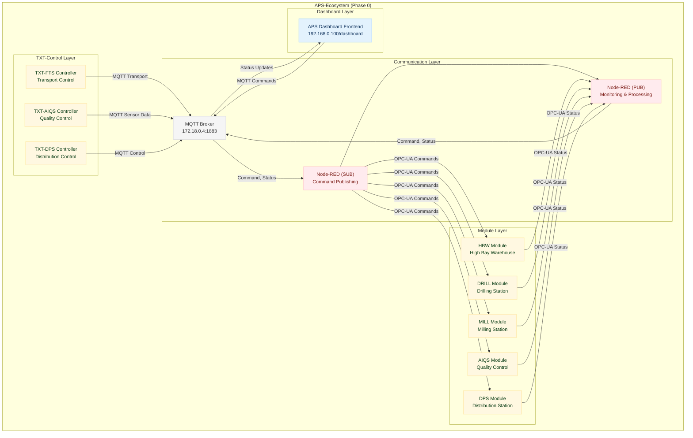
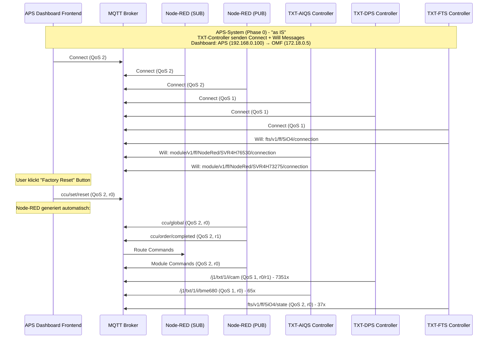
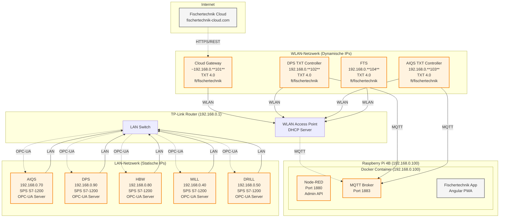

# APS-System Overview - Phase 0 "as IS"

## 🏗️ **System-Architektur**

Das Fischertechnik APS-System besteht aus mehreren autonomen Komponenten, die über MQTT kommunizieren:



## 🔄 **MQTT-Kommunikations-Flow**



## 🎯 **Kern-Komponenten**

### **1. APS Dashboard Frontend**
- **Zugang:** `http://192.168.0.100/dashboard`
- **Routing:** 192.168.0.100 → 172.18.0.5 (Docker-Networking)
- **Client-ID:** `mqttjs_bba12050`
- **Rolle:** Benutzer-Interface für APS-Steuerung
- **Detaillierte Dokumentation:** [APS System Overview](./aps-system-overview.md) - Offizielle Fischertechnik Beschreibung

### **2. MQTT Broker**
- **IP:** 172.18.0.4:1883
- **Rolle:** Zentrale Message-Routing-Infrastruktur
- **Verantwortlich:** Message-Routing zwischen allen APS-Komponenten

### **3. Node-RED (Dual-Instanz)**
- **SUB-Instanz:** `nodered_abe9e421b6fe3efd` - Monitoring & Processing
- **PUB-Instanz:** `nodered_94dca81c69366ec4` - Command Publishing
- **Rolle:** MQTT ↔ OPC-UA Vermittler
- **Verantwortlich:** 
  - MQTT-Befehle zu OPC-UA-Calls übersetzen
  - OPC-UA-Daten zu MQTT-Status aggregieren
  - Modul-spezifische State-Machine implementieren
- **Detaillierte Dokumentation:** [APS-NodeRED](../APS-NodeRED/README.md)

### **4. TXT-Controller**
- **TXT-FTS:** `auto-F6DFC829` (192.168.0.105) - Transport Control
- **TXT-AIQS:** `auto-B9109AD9` (192.168.0.103) - Quality Control  
- **TXT-DPS:** `auto-AC941349` (192.168.0.102) - Distribution Control
- **Rolle:** Fischertechnik-Controller für spezifische Module
- **Verantwortlich:** Sensor-Daten und einfache Steuerung
- **Detaillierte Dokumentation:** [TXT-Controller](../TXT-*/README.md) - TXT-DPS, TXT-AIQS, TXT-FTS

### **5. Production Modules**
- **MILL Module:** Milling Operations (192.168.0.40:4840)
- **DRILL Module:** Drilling Operations (192.168.0.50:4840)
- **AIQS Module:** Quality Control (192.168.0.70:4840)
- **DPS Module:** Distribution Station (192.168.0.90:4840)
- **HBW Module:** High Bay Warehouse (192.168.0.80:4840)
- **OVEN Module:** Heating Operations (192.168.0.60:4840)
- **Rolle:** Physische Produktionsmodule
- **Verantwortlich:** OPC-UA Hardware-Steuerung
- **Detaillierte Dokumentation:** [APS-NodeRED](../APS-NodeRED/flows.md) - Flow-Patterns und State-Machine

## 📊 **MQTT-Topic-Struktur**

```
# System Commands
ccu/set/reset          # Factory Reset (User Action)
ccu/global             # Global Reset (Node-RED generated)
ccu/order/completed    # Order Completion (Node-RED generated)

# Module Commands
module/v1/ff/{serial_number}/{action}  # Module Control
module/v1/ff/{serial_number}/state     # Module Status

# Transport System
fts/v1/ff/5iO4/state        # FTS Status
fts/v1/ff/5iO4/connection   # FTS Connection Status

# Sensor Data
/j1/txt/1/i/cam        # Camera Data (DPS)
/j1/txt/1/i/bme680     # Environmental Sensor (AIQS)
```

## 🔍 **QoS-Patterns**

- **QoS 0:** Test-Nachrichten (at most once)
- **QoS 1:** Sensor-Daten, Status-Updates (at least once)  
- **QoS 2:** System-Commands, Module-Commands (exactly once)

## 🔄 **Retain-Flags**

- **r0:** Kein Retain (normale Nachrichten)
- **r1:** Retain (letzte Nachricht wird gespeichert)

## 🚨 **Will Messages**

**Was passiert bei Disconnect:**
- **Topic:** `fts/v1/ff/5iO4/connection` (FTS) oder `module/v1/ff/NodeRed/SVR4H73275/connection` (Module)
- **Payload:** Wahrscheinlich `{"status": "disconnected"}` oder `{"connected": false}`
- **QoS:** 1 (at least once)
- **Retain:** 1 (letzte Nachricht wird gespeichert)
- **Zweck:** Dashboard erkennt sofort, wenn TXT-Controller offline geht

## 📝 **Wichtige Erkenntnisse**

1. **TXT-Controller senden immer Connect + Will Messages** ✅
2. **Node-RED arbeitet mit Dual-Instanzen** (SUB/PUB getrennt) ✅
3. **Factory Reset löst automatisch `ccu/global` aus** ✅
4. **Dashboard-Routing über Docker-Networking** ✅
5. **QoS-Patterns sind konsistent** ✅

---

## 🏭 **Netzwerk-Architektur (Phase 0: Fischertechnik "as IS")**



## 🔐 **Zugangsdaten & Sicherheit**

### SSH-Zugang (alle TXT Controller)
- **Username**: `ft`
- **Password**: `fischertechnik`

### Node-RED Admin API
- **URL**: `http://192.168.0.100:1880`
- **Backup-Endpoint**: `/flows` (JSON-Export)

### MQTT-Broker
- **Host**: `192.168.0.100` (Raspberry Pi)
- **Port**: `1883`

## ⚠️ **Sicherheitshinweise**
- WLAN ist unverschlüsselt
- SSH-Passwörter sind Standard
- MQTT läuft unverschlüsselt
- Keine Firewall-Regeln konfiguriert

## 📡 **Kommunikations-Protokolle**

### MQTT (Message Queuing Telemetry Transport)
- **Port**: 1883 (unverschlüsselt)
- **QoS**: 0 für Telemetrie, 1 für Befehle
- **Retain**: False (keine persistenten Nachrichten)

### OPC-UA (Open Platform Communications Unified Architecture)
- **Port**: 4840 (Standard)
- **Sicherheit**: Keine Verschlüsselung
- **Verwendung**: Modul-spezifische Steuerung

### HTTPS/REST
- **Port**: 443 (verschlüsselt)
- **Verwendung**: Cloud-Kommunikation, API-Zugriff

## 🏗️ **Hardware-Übersicht**

### TXT 4.0 Controller
- **Betriebssystem**: Linux
- **SSH**: Port 22
- **Web-Interface**: Port 80
- **Verwendung**: Cloud Gateway, DPS, FTS

### SPS S7-1200 Controller
- **Betriebssystem**: Siemens TIA Portal
- **OPC-UA Server**: Port 4840
- **Verwendung**: AIQS-Module (6x)

### TP-Link TL-WR902AC Router
- **WLAN**: Unverschlüsselt
- **LAN**: Statische IPs für Module
- **DHCP**: Dynamische IPs für TXT Controller

## 🔄 **IP-Adress-Management**

### Raspberry Pi 4B (Zentral)
```
Raspberry Pi: 192.168.0.100 (statisch)
├── Docker Container: 192.168.0.100
│   ├── Node-RED: Port 1880
│   ├── MQTT Broker: Port 1883
│   └── Fischertechnik App: Angular PWA
└── TP-Link Router: 192.168.0.1 (Gateway)
```

### Statische IPs (LAN)
```
AIQS: 192.168.0.70 (1 Modul)
DPS: 192.168.0.90 (1 Modul)
HBW: 192.168.0.80 (1 Modul)
MILL: 192.168.0.40 (1 Modul)
DRILL: 192.168.0.50 (1 Modul)
```

### Dynamische IPs (WLAN)
```
Cloud Gateway: ~192.168.0.101 (normalerweise, kann sich ändern)
DPS TXT Controller: 192.168.0.102 (normalerweise, wenn kein anderer Client)
AIQS TXT Controller: 192.168.0.103 (normalerweise, wenn kein anderer Client)
FTS: 192.168.0.104 (normalerweise, wenn kein anderer Client)
```

**Hinweis**: 
- **Statische IPs** sind fest zugewiesen und ändern sich nicht
- **Dynamische IPs** können sich durch DHCP und Race Conditions ändern
- **`~`** bedeutet "normalerweise" oder "häufig"
- **TXT Controller** bekommen normalerweise 192.168.0.102-104, wenn kein anderer Client sich anmeldet

---

**"Phase 0: APS as IS - Das Fischertechnik-System verstehen"** 🎯
