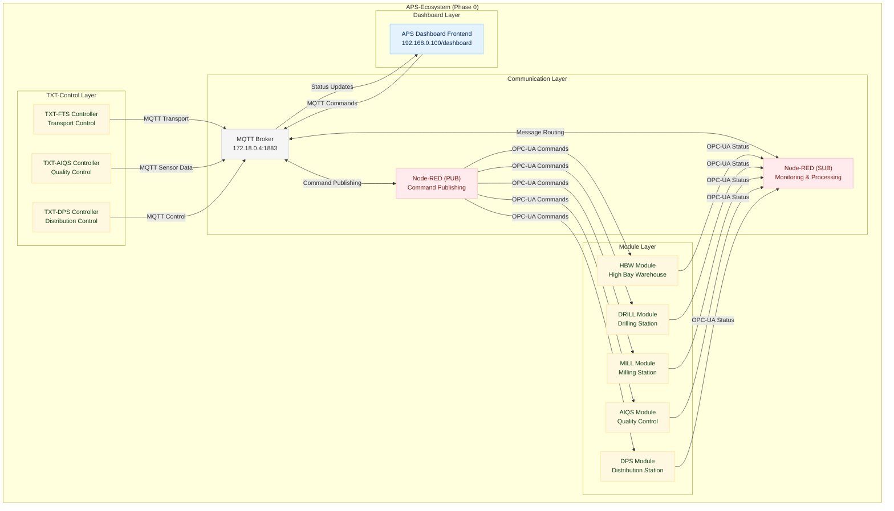

# APS-System Overview - Phase 0 "as IS"

## 🏗️ **System-Architektur**

Das Fischertechnik APS-System besteht aus mehreren autonomen Komponenten, die über MQTT kommunizieren:



## 🔄 **MQTT-Kommunikations-Flow**

```mermaid
sequenceDiagram
    participant DASHBOARD as APS Dashboard Frontend
    participant MQTT_BROKER as MQTT Broker
    participant NODERED_SUB as Node-RED (SUB)
    participant NODERED_PUB as Node-RED (PUB)
    participant TXT_AIQS as TXT-AIQS Controller
    participant TXT_DPS as TXT-DPS Controller
    participant TXT_FTS as TXT-FTS Controller
    
    Note over DASHBOARD,TXT_FTS: APS-System (Phase 0) - "as IS"<br/>TXT-Controller senden Connect + Will Messages<br/>Dashboard: APS (192.168.0.100) → OMF (172.18.0.5)
    
    %% Initiale Verbindungen
    DASHBOARD->>MQTT_BROKER: Connect (QoS 2)
    NODERED_SUB->>MQTT_BROKER: Connect (QoS 2)
    NODERED_PUB->>MQTT_BROKER: Connect (QoS 2)
    TXT_AIQS->>MQTT_BROKER: Connect (QoS 1)
    TXT_DPS->>MQTT_BROKER: Connect (QoS 1)
    TXT_FTS->>MQTT_BROKER: Connect (QoS 1)
    
    %% Will Messages (Connection Status)
    TXT_FTS->>MQTT_BROKER: Will: fts/v1/ff/5iO4/connection
    TXT_AIQS->>MQTT_BROKER: Will: module/v1/ff/NodeRed/SVR4H76530/connection
    TXT_DPS->>MQTT_BROKER: Will: module/v1/ff/NodeRed/SVR4H73275/connection
    
    %% UI-Interaktionen (16:25:37)
    Note over DASHBOARD: User klickt "Factory Reset" Button
    DASHBOARD->>MQTT_BROKER: ccu/set/reset (QoS 2, r0)
    Note over DASHBOARD: Node-RED generiert automatisch:
    NODERED_PUB->>MQTT_BROKER: ccu/global (QoS 2, r0)
    NODERED_PUB->>MQTT_BROKER: ccu/order/completed (QoS 2, r1)
    
    %% Node-RED Processing
    MQTT_BROKER->>NODERED_SUB: Route Commands
    NODERED_PUB->>MQTT_BROKER: Module Commands (QoS 2, r0)
    
    %% TXT-Controller Telemetry
    TXT_DPS->>MQTT_BROKER: /j1/txt/1/i/cam (QoS 1, r0/r1) - 7351x
    TXT_AIQS->>MQTT_BROKER: /j1/txt/1/i/bme680 (QoS 1, r0) - 65x
    TXT_FTS->>MQTT_BROKER: fts/v1/ff/5iO4/state (QoS 2, r0) - 37x
```



## 🎯 **Kern-Komponenten**

### **1. APS Dashboard Frontend**
- **Zugang:** `http://192.168.0.100/dashboard`
- **Routing:** 192.168.0.100 → 172.18.0.5 (Docker-Networking)
- **Client-ID:** `mqttjs_bba12050`
- **Rolle:** Benutzer-Interface für APS-Steuerung
- **Detaillierte Dokumentation:** [APS System Overview](./aps-system-overview.md) - Offizielle Fischertechnik Beschreibung

### **2. MQTT Broker**
- **IP:** 172.18.0.4:1883
- **Rolle:** Zentrale Message-Routing-Infrastruktur
- **Verantwortlich:** Message-Routing zwischen allen APS-Komponenten

### **3. Node-RED (Dual-Instanz)**
- **SUB-Instanz:** `nodered_abe9e421b6fe3efd` - Monitoring & Processing
- **PUB-Instanz:** `nodered_94dca81c69366ec4` - Command Publishing
- **Rolle:** MQTT ↔ OPC-UA Vermittler
- **Verantwortlich:** 
  - MQTT-Befehle zu OPC-UA-Calls übersetzen
  - OPC-UA-Daten zu MQTT-Status aggregieren
  - Modul-spezifische State-Machine implementieren
- **Detaillierte Dokumentation:** [APS-NodeRED](../APS-NodeRED/README.md)

### **4. TXT-Controller**
- **TXT-FTS:** `auto-F6DFC829` (192.168.0.105) - Transport Control
- **TXT-AIQS:** `auto-B9109AD9` (192.168.0.103) - Quality Control  
- **TXT-DPS:** `auto-AC941349` (192.168.0.102) - Distribution Control
- **Rolle:** Fischertechnik-Controller für spezifische Module
- **Verantwortlich:** Sensor-Daten und einfache Steuerung
- **Detaillierte Dokumentation:** [TXT-Controller](../TXT-*/README.md) - TXT-DPS, TXT-AIQS, TXT-FTS

### **5. Production Modules**
- **MILL Module:** Milling Operations (192.168.0.40:4840)
- **DRILL Module:** Drilling Operations (192.168.0.50:4840)
- **AIQS Module:** Quality Control (192.168.0.70:4840)
- **DPS Module:** Distribution Station (192.168.0.90:4840)
- **HBW Module:** High Bay Warehouse (192.168.0.80:4840)
- **OVEN Module:** Heating Operations (192.168.0.60:4840)
- **Rolle:** Physische Produktionsmodule
- **Verantwortlich:** OPC-UA Hardware-Steuerung
- **Detaillierte Dokumentation:** [APS-NodeRED](../APS-NodeRED/flows.md) - Flow-Patterns und State-Machine

## 📊 **MQTT-Topic-Struktur**

```
# System Commands
ccu/set/reset          # Factory Reset (User Action)
ccu/global             # Global Reset (Node-RED generated)
ccu/order/completed    # Order Completion (Node-RED generated)

# Module Commands
module/v1/ff/{serial_number}/{action}  # Module Control
module/v1/ff/{serial_number}/state     # Module Status

# Transport System
fts/v1/ff/5iO4/state        # FTS Status
fts/v1/ff/5iO4/connection   # FTS Connection Status

# Sensor Data
/j1/txt/1/i/cam        # Camera Data (DPS)
/j1/txt/1/i/bme680     # Environmental Sensor (AIQS)
```

## 🔍 **QoS-Patterns**

- **QoS 0:** Test-Nachrichten (at most once)
- **QoS 1:** Sensor-Daten, Status-Updates (at least once)  
- **QoS 2:** System-Commands, Module-Commands (exactly once)

## 🔄 **Retain-Flags**

- **r0:** Kein Retain (normale Nachrichten)
- **r1:** Retain (letzte Nachricht wird gespeichert)

## 🚨 **Will Messages**

**Was passiert bei Disconnect:**
- **Topic:** `fts/v1/ff/5iO4/connection` (FTS) oder `module/v1/ff/NodeRed/SVR4H73275/connection` (Module)
- **Payload:** Wahrscheinlich `{"status": "disconnected"}` oder `{"connected": false}`
- **QoS:** 1 (at least once)
- **Retain:** 1 (letzte Nachricht wird gespeichert)
- **Zweck:** Dashboard erkennt sofort, wenn TXT-Controller offline geht

## 📝 **Wichtige Erkenntnisse**

1. **TXT-Controller senden immer Connect + Will Messages** ✅
2. **Node-RED arbeitet mit Dual-Instanzen** (SUB/PUB getrennt) ✅
3. **Factory Reset löst automatisch `ccu/global` aus** ✅
4. **Dashboard-Routing über Docker-Networking** ✅
5. **QoS-Patterns sind konsistent** ✅

---

**"Phase 0: APS as IS - Das Fischertechnik-System verstehen"** 🎯
