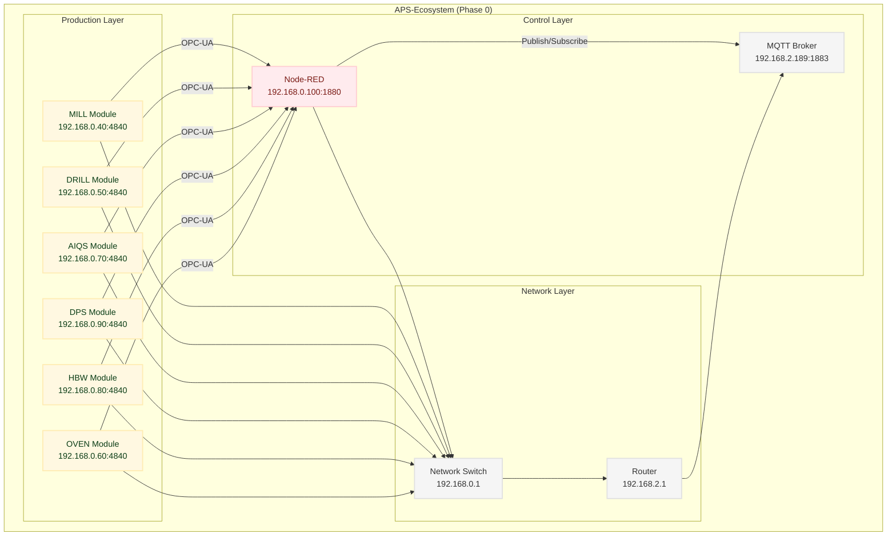
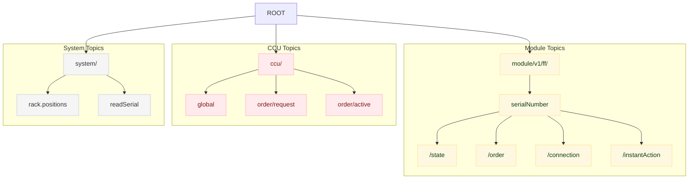

# 🔴 Node-RED Integration Documentation

> 📖 **Zentrale Referenz:** [00-REFERENCE](../00-REFERENCE/README.md) - Verifizierte APS-Architektur
> 
> **NodeRed-Rolle:** OPC-UA ↔ MQTT Bridge für MILL/DRILL/HBW Module
> 
> **NICHT:** Order-Management, UUID-Generation (das macht CCU-Backend!)

Diese Sektion enthält die umfassende Dokumentation der Node-RED Flows der Fischertechnik Agile Production Simulation (APS).


## System Overview



## 🔗 Integration Management

- **[Node-RED Integration](../../../integrations/APS-NodeRED/README.md)** - Backup, Restore und Management
- **[Integration Guide](./integration-guide.md)** - Detaillierte Setup-Anleitung

> **🔗 Verwandte Systeme:**
> - **[APS-CCU](../APS-CCU/README.md)** - Fischertechnik Agile Production Simulation
> - **[TXT-FTS VDA 5050](../TXT-FTS/README.md)** - Fahrerloses Transportsystem
> - **[System Context](../../02-architecture/system-context.md)** - Gesamtarchitektur

## 📋 Documentation Index

### [Flows](./flows.md)
- Tab structure and organization
- Module-specific flows (MILL, DRILL, OVEN, AIQS, HBW, DPS)
- Flow grouping and organization
- Detailed flow analysis and implementation
- Node-RED flow patterns and best practices
- State diagrams and pseudocode

### [OPC UA Nodes](./opc-ua-nodes.md)
- OPC UA NodeIds and state transitions
- Connection states and error handling
- Module-specific OPC UA implementations

### [State Machine](./state-machine.md)
- VDA 5050 compliant state transitions
- Action states: PENDING → RUNNING → FINISHED/FAILED
- Connection states: ONLINE/OFFLINE/CONNECTIONBROKEN
- Error handling and recovery

### [Integration Guide](./integration-guide.md)
- Backup and restore procedures
- SSH and Admin API management
- Troubleshooting and maintenance

### [System Architecture](../../02-architecture/system-context.md)
- Gesamtarchitektur und System-Kontext
- Verlinkung zur zentralen Architektur-Dokumentation

## 🔧 Quick Reference

### System Components
- **6 Production Modules** (MILL, DRILL, AIQS, DPS, HBW, OVEN)
- **Node-RED Central Control Unit** (Raspberry Pi)
- **MQTT Broker** (Message Routing)
- **OPC-UA Network** (Module Communication)

### Key Files
- `flows.json` - Main Node-RED configuration
- `settings.js` - Node-RED settings
- Environment variables for configuration

### Access Points
- **Node-RED UI**: `http://192.168.0.100:1880/`
- **SSH Access**: `ff22` / `ff22+`
- **MQTT Topics**: `module/v1/ff/{serialNumber}/{action}`

### Network Details
- **Node-RED**: 192.168.0.100:1880
- **MQTT Broker**: 192.168.2.189:1883
- **OPC-UA Modules**: 192.168.0.40-90:4840

## 📊 **MQTT-Topic-Hierarchie**



## 🚀 Getting Started

1. **Review Architecture** - Understand the overall system design
2. **Study Flows** - Learn how modules are organized
3. **Understand States** - Master the state machine logic
4. **Practice Development** - Follow development guidelines

---

## 📁 Current Node-RED Structure

Diese Dokumentation beschreibt die **aktuelle Fischertechnik APS Node-RED Struktur** vor der OMF Dashboard Integration. Die tatsächliche Integration und Anpassungen sind Teil des "großen Projektes" und werden separat dokumentiert.

### Current System Structure
```
integrations/APS-NodeRED/       # Aktuelle Node-RED Backups
├── backups/                    # flows.json Backups
├── project/                    # Node-RED Projekt-Dateien
└── scripts/                    # Management Scripts

docs/06-integrations/APS-NodeRED/  # Dokumentation der IST-Struktur
├── README.md                   # Diese Datei
├── flows.md                    # Alle Flow-Details
├── opc-ua-nodes.md             # OPC UA NodeIds und States
├── state-machine.md            # State Machine Dokumentation
└── integration-guide.md        # Backup/Restore Anleitung
```

> **⚠️ Hinweis:** Diese Dokumentation beschreibt das **IST-System** (Fischertechnik APS). Die zukünftige Integration mit dem OMF Dashboard und eventuelle Anpassungen werden im Rahmen des "großen Projektes" geplant und dokumentiert.

---

*For technical support, contact the ORBIS Development Team*