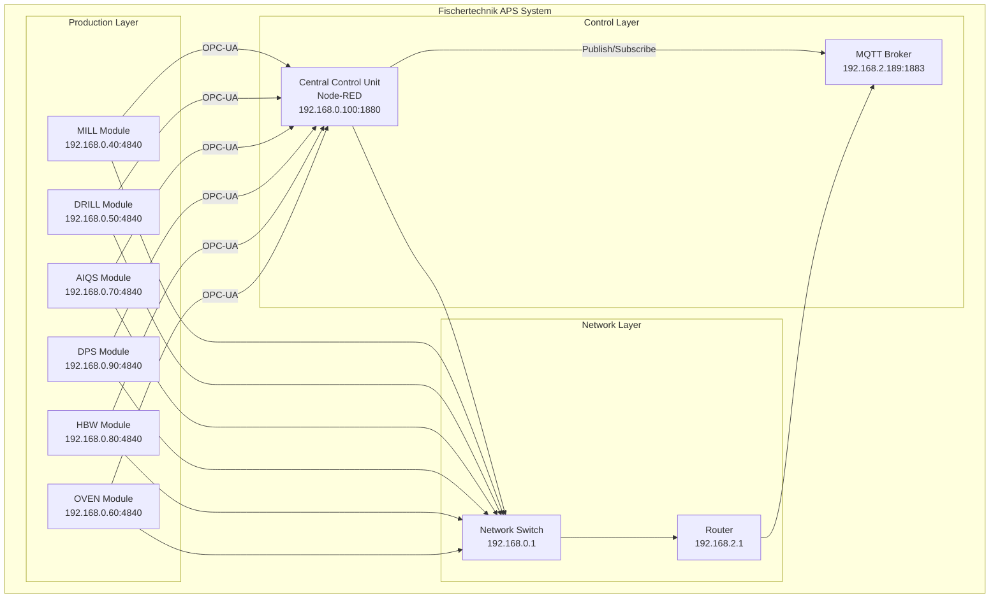

# System Architecture - Fischertechnik APS

## Overview

Die Fischertechnik Agile Production Simulation (APS) ist ein modulares Produktionssystem, das aus mehreren autonomen Produktionsmodulen besteht. Jedes Modul kann unabhängig arbeiten und über OPC-UA und MQTT mit der zentralen Steuerung kommunizieren.

## System Components

### Production Modules

#### MILL Module
- **Function**: Milling operations on workpieces
- **States**: IDLE, PICKBUSY, MILLBUSY, WAITING_AFTER_MILL, DROPBUSY
- **Commands**: PICK, MILL, DROP
- **OPC-UA Server**: 192.168.0.40:4840

#### DRILL Module
- **Function**: Drilling operations on workpieces
- **States**: IDLE, PICKBUSY, DRILLBUSY, WAITING_AFTER_DRILL, DROPBUSY
- **Commands**: PICK, DRILL, DROP
- **OPC-UA Server**: 192.168.0.50:4840

#### AIQS Module
- **Function**: AI Quality System with firing operations
- **States**: IDLE, PICKBUSY, FIREBUSY, WAITING_AFTER_FIRE, DROPBUSY
- **Commands**: PICK, FIRE, DROP
- **OPC-UA Server**: 192.168.0.70:4840

#### DPS Module
- **Function**: Distribution and Picking Station
- **States**: IDLE, PICKBUSY, DROPBUSY
- **Commands**: PICK, DROP
- **OPC-UA Server**: 192.168.0.90:4840

#### HBW Module
- **Function**: High Bay Warehouse for storage
- **States**: IDLE, PICKBUSY, DROPBUSY
- **Commands**: PICK, DROP
- **OPC-UA Server**: 192.168.0.80:4840

#### OVEN Module
- **Function**: Heating operations (optional)
- **States**: IDLE, PICKBUSY, FIREBUSY, WAITING_AFTER_FIRE, DROPBUSY
- **Commands**: PICK, FIRE, DROP
- **OPC-UA Server**: 192.168.0.60:4840

### Control Layer

#### Central Control Unit (CCU)
- **Hardware**: Raspberry Pi
- **Software**: Node-RED
- **IP Address**: 192.168.0.100
- **Web Interface**: http://192.168.0.100:1880/
- **SSH Access**: ff22@192.168.0.100 (Password: ff22+)

#### MQTT Broker
- **IP Address**: 192.168.2.189
- **Port**: 1883
- **Protocol**: MQTT 3.1.1
- **Authentication**: None (local network)

## Communication Architecture

### OPC-UA Communication
- **Protocol**: OPC-UA over TCP
- **Port**: 4840
- **NodeId Format**: ns=4;i={number}
- **Data Types**: Boolean, Integer, String
- **Security**: None (local network)

### MQTT Communication
- **Protocol**: MQTT 3.1.1
- **Port**: 1883
- **Topic Structure**: module/v1/ff/{serialNumber}/{action}
- **QoS**: 0 (at most once)
- **Retain**: false

## System Architecture Diagram

## Data Flow

### Order Processing Flow
1. **Order Reception**: Orders received via MQTT
2. **Order Distribution**: CCU distributes orders to appropriate modules
3. **Module Execution**: Modules execute operations via OPC-UA
4. **Status Updates**: Modules report status via MQTT
5. **Order Completion**: CCU tracks order completion

### State Management Flow
1. **State Monitoring**: CCU monitors module states via OPC-UA
2. **State Transitions**: Modules transition between states
3. **State Broadcasting**: State changes broadcast via MQTT
4. **State Persistence**: States stored in Node-RED flows

## Network Configuration

### IP Address Allocation
- **192.168.0.1**: Network Switch
- **192.168.0.40**: MILL Module
- **192.168.0.50**: DRILL Module
- **192.168.0.60**: OVEN Module
- **192.168.0.70**: AIQS Module
- **192.168.0.80**: HBW Module
- **192.168.0.90**: DPS Module
- **192.168.0.100**: Central Control Unit
- **192.168.2.189**: MQTT Broker

### Port Configuration
- **1880**: Node-RED Web Interface
- **1883**: MQTT Broker
- **4840**: OPC-UA Servers
- **22**: SSH Access

## Security Considerations

### Network Security
- **Local Network**: All communication within local network
- **No Internet Access**: System isolated from internet
- **No Authentication**: MQTT and OPC-UA without authentication
- **SSH Access**: Password-based authentication only

### Operational Security
- **Backup Procedures**: Regular backup of flows.json and settings.js
- **Access Control**: Limited SSH access to CCU
- **Monitoring**: Basic system monitoring via Node-RED
- **Error Handling**: Comprehensive error handling in flows

## Maintenance and Support

### Regular Maintenance
- **Daily**: System status check
- **Weekly**: Backup verification
- **Monthly**: System updates and cleanup
- **Quarterly**: Hardware inspection

### Troubleshooting
- **Connection Issues**: Check network connectivity
- **OPC-UA Problems**: Verify server status and NodeIds
- **MQTT Issues**: Check broker status and topics
- **Performance**: Monitor CPU and memory usage

### Support Contacts
- **Technical Support**: ORBIS Development Team
- **Hardware Support**: Fischertechnik Support
- **Network Support**: Local IT Administrator

## Future Enhancements

### Planned Improvements
- **Authentication**: Add MQTT and OPC-UA authentication
- **Monitoring**: Enhanced system monitoring
- **Backup**: Automated backup procedures
- **Security**: Network security improvements

### Integration Possibilities
- **ERP Systems**: Integration with enterprise systems
- **SCADA Systems**: Integration with supervisory systems
- **Cloud Services**: Optional cloud connectivity
- **Mobile Access**: Mobile device access

---

*This documentation describes the Fischertechnik APS system architecture before OMF Dashboard integration.*
