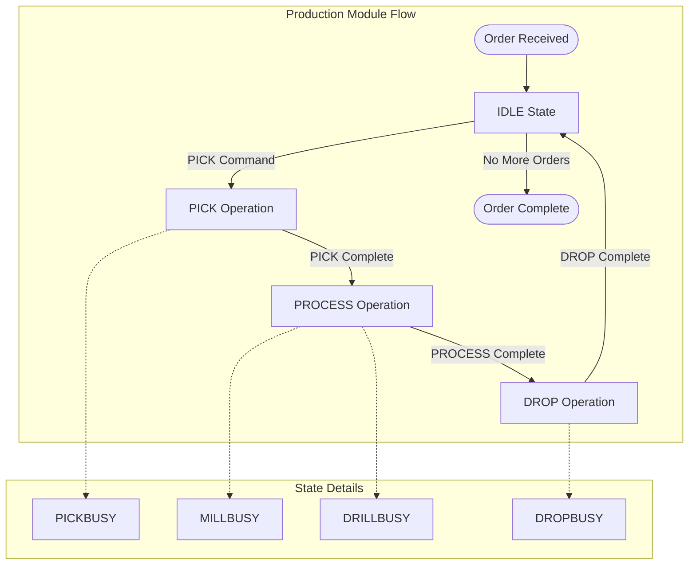

# Node-RED Flows Detailed - Fischertechnik APS

## Detailed Flow Analysis

### System Statistics

- **Total Flows**: 1428
- **Function Nodes**: 402
- **Tabs**: 25

### Module Analysis

### Flow Patterns

#### State Management Pattern

```javascript
// State transition example
if (flow.get('moduleState') == 'IDLE') {
    flow.set('moduleState', 'PICKBUSY');
    // Execute PICK operation
}
```

#### OPC-UA Communication Pattern

```javascript
// OPC-UA write example
msg.payload = {
    nodeId: 'ns=4;i=5',
    value: 'PICK'
};
return msg;
```

#### MQTT Messaging Pattern

```javascript
// MQTT topic construction
msg.topic = flow.get('$parent.MQTT_topic') + '/state';
msg.payload = flow.get('moduleState');
return msg;
```

## Production Flow Diagram


