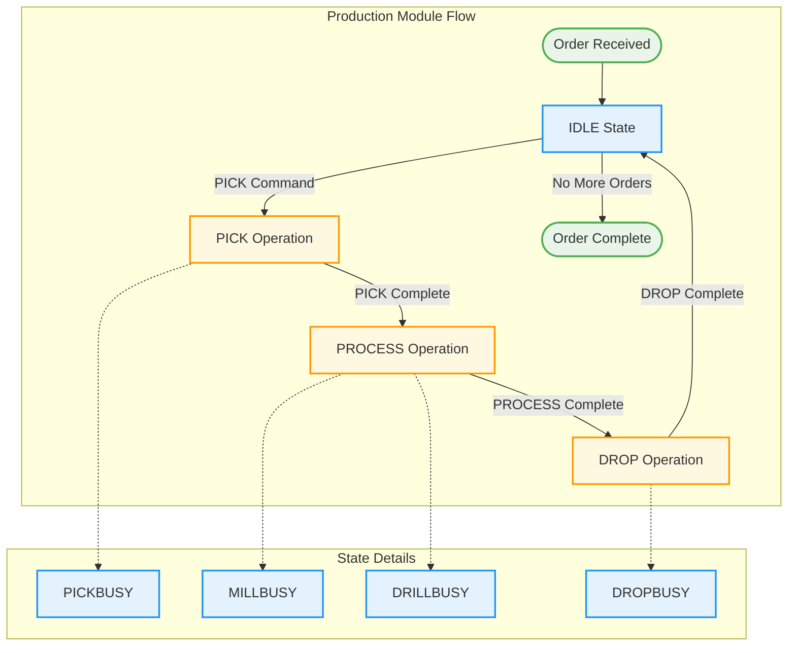
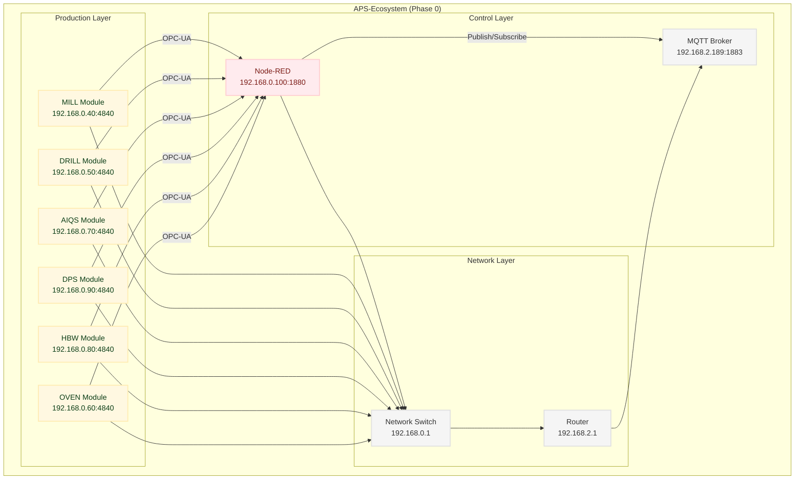

# Node-RED Flows - Fischertechnik APS

## Overview

Die Node-RED Flows der Fischertechnik Agile Production Simulation (APS) sind in Tabs organisiert.
Jeder Tab repräsentiert ein Produktionsmodul oder eine Systemkomponente.

## Tab Structure

### Production Modules

### System Components

- **NodeRed Init** - System initialization
- **Global Functions** - Shared functionality
- **MQTT Configuration** - Message broker setup

## Flow Organization

### Module-Specific Flows

Jedes Produktionsmodul hat eigene Flows für:
- State management
- Command processing
- OPC-UA communication
- MQTT messaging

### Shared Flows

- Order processing
- Status monitoring
- Error handling
- System configuration

## 📊 **Detailed Flow Analysis**

### System Statistics
- **Total Flows**: 1428
- **Function Nodes**: 402
- **Tabs**: 25

### Flow Patterns

#### State Management Pattern
```javascript
// State transition example
if (flow.get('moduleState') == 'IDLE') {
    flow.set('moduleState', 'PICKBUSY');
    // Execute PICK operation
}
```

#### OPC-UA Communication Pattern
```javascript
// OPC-UA write example
msg.payload = {
    nodeId: 'ns=4;i=5',
    value: 'PICK'
};
return msg;
```

#### MQTT Messaging Pattern
```javascript
// MQTT topic construction
msg.topic = flow.get('$parent.MQTT_topic') + '/state';
msg.payload = flow.get('moduleState');
return msg;
```

## 🔄 **Production Flow Diagram**



## System Architecture


