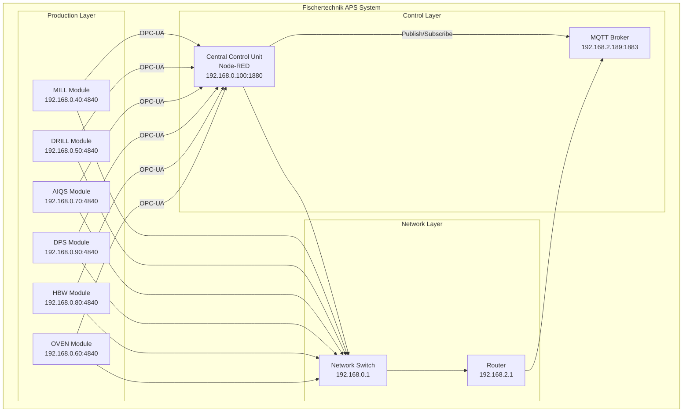

# Node-RED Flows - Fischertechnik APS

## Overview

Die Node-RED Flows der Fischertechnik Agile Production Simulation (APS) sind in Tabs organisiert.
Jeder Tab repräsentiert ein Produktionsmodul oder eine Systemkomponente.

## Tab Structure

### Production Modules

### System Components

- **NodeRed Init** - System initialization
- **Global Functions** - Shared functionality
- **MQTT Configuration** - Message broker setup

## Flow Organization

### Module-Specific Flows

Jedes Produktionsmodul hat eigene Flows für:
- State management
- Command processing
- OPC-UA communication
- MQTT messaging

### Shared Flows

- Order processing
- Status monitoring
- Error handling
- System configuration

## System Architecture

