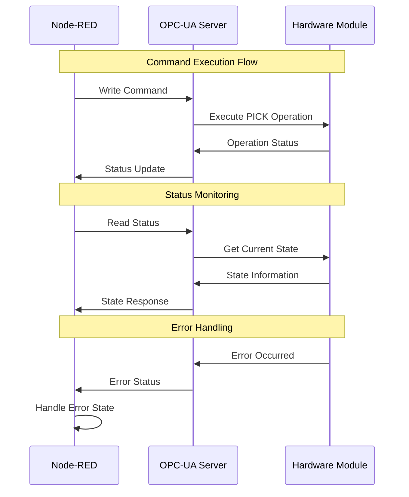

# OPC-UA Nodes - Fischertechnik APS

## Overview

Die Fischertechnik APS verwendet OPC-UA für die Kommunikation mit den Hardware-Modulen.
Jedes Modul hat einen OPC-UA Server, der über standardisierte NodeIds angesprochen wird.

## NodeId Structure

Alle NodeIds folgen dem Schema: `ns=4;i={number}`

### Hardware Control NodeIds

- **ns=4;i=5** - Hardware Control
- **ns=4;i=52** - Hardware Control
- **ns=4;i=56** - Hardware Control
- **ns=4;i=6** - Hardware Control

### Status Monitoring NodeIds

- **ns=4;i=10** - Status Monitoring
- **ns=4;i=11** - Status Monitoring
- **ns=4;i=12** - Status Monitoring
- **ns=4;i=13** - Status Monitoring
- **ns=4;i=14** - Status Monitoring
- **ns=4;i=15** - Status Monitoring
- **ns=4;i=16** - Status Monitoring
- **ns=4;i=18** - Status Monitoring
- **ns=4;i=19** - Status Monitoring
- **ns=4;i=20** - Status Monitoring
- **ns=4;i=21** - Status Monitoring
- **ns=4;i=22** - Status Monitoring
- **ns=4;i=23** - Status Monitoring
- **ns=4;i=244** - Status Monitoring
- **ns=4;i=245** - Status Monitoring
- **ns=4;i=248** - Status Monitoring
- **ns=4;i=249** - Status Monitoring
- **ns=4;i=25** - Status Monitoring
- **ns=4;i=251** - Status Monitoring
- **ns=4;i=255** - Status Monitoring
- **ns=4;i=257** - Status Monitoring
- **ns=4;i=259** - Status Monitoring
- **ns=4;i=316** - Status Monitoring
- **ns=4;i=38** - Status Monitoring
- **ns=4;i=39** - Status Monitoring
- **ns=4;i=4** - Status Monitoring
- **ns=4;i=40** - Status Monitoring
- **ns=4;i=42** - Status Monitoring
- **ns=4;i=7** - Status Monitoring
- **ns=4;i=8** - Status Monitoring
- **ns=4;i=9** - Status Monitoring

## Communication Flow

## Module-Specific Implementations

## Error Handling

### Connection States

- **ONLINE** - Module connected and operational
- **OFFLINE** - Module disconnected
- **CONNECTIONBROKEN** - Connection lost during operation

### Error Recovery

1. **Connection Monitoring** - Continuous status checks
2. **Automatic Reconnection** - Retry failed connections
3. **State Recovery** - Restore module state after reconnection
4. **Error Logging** - Log all connection issues
