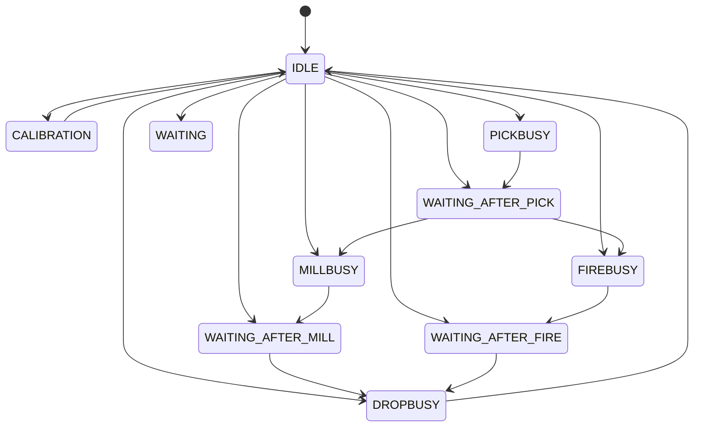
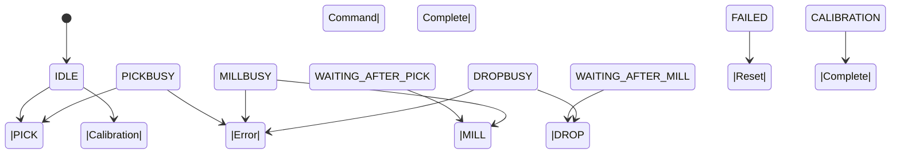
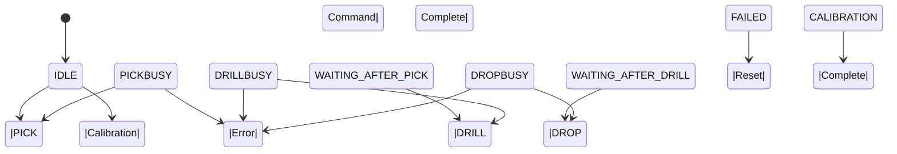
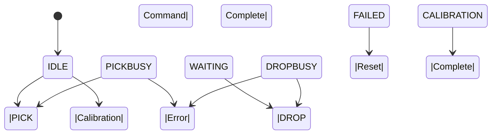

# State Machine - Fischertechnik APS

## Overview

Die Fischertechnik APS implementiert eine VDA 5050-konforme State Machine.
Jedes Produktionsmodul durchläuft definierte Zustände und Übergänge.

## State Diagram

## Module States

### Primary States

- **CALIBRATION** - Module is in calibration mode
- **DROPBUSY** - Module is executing DROP operation
- **FIREBUSY** - Module is executing FIRE operation
- **IDLE** - Module is idle and ready for commands
- **MILLBUSY** - Module is executing MILL operation
- **PICKBUSY** - Module is executing PICK operation
- **WAITING** - Module is waiting for next operation
- **WAITING_AFTER_FIRE** - Module waiting after FIRE completion
- **WAITING_AFTER_MILL** - Module waiting after MILL completion
- **WAITING_AFTER_PICK** - Module waiting after PICK completion

## Action States

### VDA 5050 Compliant

- **FAILED** - Action failed with error
- **FINISHED** - Action completed successfully
- **PENDING** - Action is queued and waiting to start
- **RUNNING** - Action is currently executing

## Commands

### Available Commands

- **CALIBRATION** - Calibrate module to reference position
- **DRILL** - Execute drilling operation on workpiece
- **DROP** - Drop workpiece to output position
- **FIRE** - Execute firing operation (AIQS module)
- **MILL** - Execute milling operation on workpiece
- **PICK** - Pick up workpiece from input position

## State Transitions

### Typical Production Flow

1. **IDLE** → **PICKBUSY** (Start PICK operation)
2. **PICKBUSY** → **WAITING_AFTER_PICK** (PICK completed)
3. **WAITING_AFTER_PICK** → **MILLBUSY** (Start MILL operation)
4. **MILLBUSY** → **WAITING_AFTER_MILL** (MILL completed)
5. **WAITING_AFTER_MILL** → **DROPBUSY** (Start DROP operation)
6. **DROPBUSY** → **IDLE** (DROP completed)

## Error Handling

### Error States

- **FAILED** - Operation failed
- **CONNECTIONBROKEN** - OPC-UA connection lost
- **TIMEOUT** - Operation timeout

### Recovery Procedures

1. **State Reset** - Return to IDLE state
2. **Connection Retry** - Reconnect to OPC-UA server
3. **Operation Retry** - Retry failed operation
4. **Error Logging** - Log error details

## MILL Module Status Transitions

## DRILL Module Status Transitions

## AIQS Module Status Transitions

## DPS Module Status Transitions

## HBW Module Status Transitions

## OVEN Module Status Transitions

## FTS (Fahrerloses Transportsystem) - 5iO4

### FTS State Machine Behavior

#### findInitialDockPosition
- **Verfügbarkeit**: Nur nach Initialisierung verfügbar
- **Verhalten**: Wird nach Ausführung deaktiviert
- **Zweck**: Initiale Positionsfindung für FTS
- **Fischertechnik-Dashboard**: Button wird nach Initialisierung deaktiviert

#### startCharging / stopCharging
- **Verhalten**: Gegenseitig ausschließend
- **Zustandsautomat**: 
  - Wenn `startCharging` aktiv → `stopCharging` verfügbar, `startCharging` deaktiviert
  - Wenn `stopCharging` aktiv → `startCharging` verfügbar, `stopCharging` deaktiviert
- **Zweck**: Verhindert gleichzeitige Ladung und Ladestopp

#### factsheetRequest
- **Verfügbarkeit**: Immer verfügbar
- **Zweck**: Status-Abfrage für dynamische Button-Aktivierung
- **Zukunft**: Wird für Status-Verwaltung verwendet

### FTS Implementation Notes

#### Current Status
- Alle FTS-Befehle sind immer verfügbar (einfache Implementierung)
- Keine Status-Verwaltung implementiert

#### Planned Extensions
- **Status-Verwaltung**: Dynamische Button-Aktivierung basierend auf FTS-Status
- **Zustandsautomat**: Implementierung der gegenseitigen Ausschließung
- **Initialisierung**: Automatische Deaktivierung nach `findInitialDockPosition`

## Module Control Patterns

### Direct Control Commands (DRILL, MILL, AIQS, FTS)
- **Standard-Sequenz**: PICK → PROCESS → DROP
- **orderUpdateId**: Inkrementell pro Modul
- **Verfügbarkeit**: Alle Befehle immer verfügbar
- **MQTT Control**: ✅ Verfügbar

### Event-triggered Modules (HBW, DPS)
- **HBW**: Wird durch Bestellungen getriggert (nicht direkte Befehle)
- **DPS**: Wird durch manuellen Wareneingang getriggert (nicht direkte Befehle)
- **MQTT Control**: ❌ Nicht verfügbar (keine direkten Befehle)

### Unsupported Modules (CHRG)
- **CHRG**: Befehle machen keinen Sinn
- **MQTT Control**: ❌ Entfernt

## Factory Reset

### Behavior
- **Verfügbarkeit**: Immer verfügbar
- **Optionen**: `withStorage` (HBW-Storage löschen/behalten)
- **Warnung**: Bei `withStorage=true` wird HBW-Storage gelöscht

### Implementation Notes
- **Template-basiert**: Verwendet `message_template_manager`
- **MQTT-Integration**: Über bewährte `send_mqtt_message_direct`
