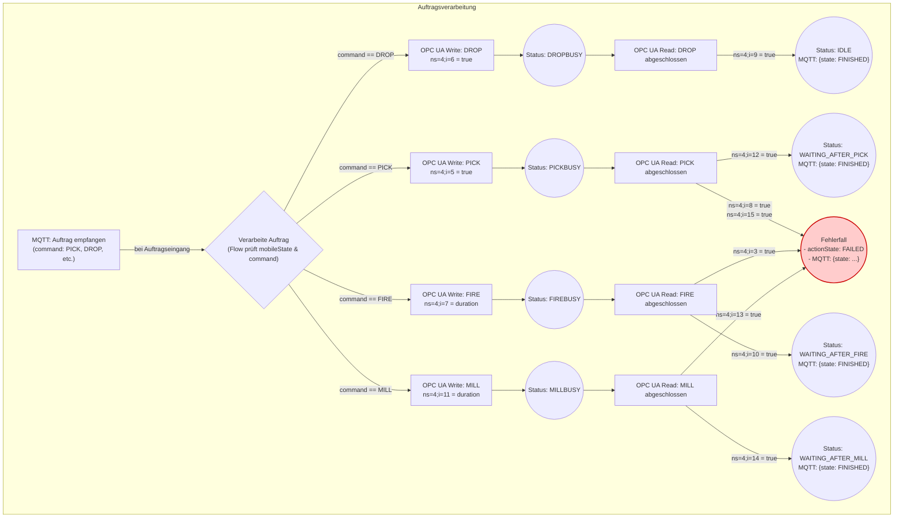

# FTS Steuerung in Node-Red

> ⚠️ **VERIFIKATION AUSSTEHEND**: Diese Dokumentation basiert auf einer Hypothese und wurde noch nicht verifiziert. Die beschriebenen FTS-Steuerungslogik und VDA 5050-Implementierung müssen noch getestet und validiert werden.

> **🔗 Verwandte Dokumentation:**
> - **[APS Overview](../aps/README.md)** - Fischertechnik Agile Production Simulation
> - **[Node-RED Integration](../node-red/README.md)** - Gateway zwischen OPC-UA und MQTT
> - **[Architektur-Übersicht](../../02-architecture/README.md)** – Gesamtarchitektur

Die Steuerung des fahrerlosen Transportsystems (FTS) bzw. Automated Guided Vehicle (AGV) nach dem VDA 5050 Standard erfolgt über MQTT-Topics (`fts/v1/ff/5iO4/*`).

**Wichtig:** Das FTS hat einen TXT-Controller (KEIN OPC-UA Server) und kommuniziert ausschließlich via MQTT mit dem CCU-Backend.

Hier sind die wesentlichen Punkte zusammengefasst:

## 🚗 FTS-Steuerung nach VDA 5050 – Überblick

### 1. Auftragsverarbeitung

FTS-Aufträge werden vom **CCU-Backend** erstellt und via MQTT an das FTS gesendet.

**Technische Details:**
- **Topic:** `fts/v1/ff/5iO4/order`
- **Sender:** CCU-Backend (`modules/fts/navigation/navigation.js`)
- **Protokoll:** MQTT (QoS 2)
- **KEIN OPC-UA beteiligt!**

Die Aufträge enthalten Informationen wie:
- Zielpositionen (TO_CAMERA, TO_NIO_BIN, TO_PICKUP, etc.)
- Bewegungsbefehle (PICK, DROP, etc.)
- Metadaten wie duration, position, references.

### 2. VDA 5050-konforme Kommunikation

Die Struktur der Nachrichten und Zustände folgt dem VDA 5050-Standard:
- **Order:** enthält orderId, orderUpdateId, actionState, loads, errors.
- **State:** wird regelmäßig über MQTT publiziert (z. B. msg.topic = MQTT_topic + "/state").
- **InstantActions:** wie startCalibration, stopCalibration, resetCalibration.

### 3. Zustandsüberwachung

Zustände wie PICKBUSY, DROPBUSY, WAITING_AFTER_PICK, etc. werden im Flow gespeichert.

Erfolgreiche oder fehlerhafte Ausführungen führen zu Statusänderungen (FINISHED, FAILED).

Diese Zustände werden über MQTT veröffentlicht und können vom VDA 5050 Master interpretiert werden.

### 4. Kalibrierung und Referenzdaten

Es gibt spezielle Funktionen zur Kalibrierung (startCalibration, setCalibrationValues, etc.).

Diese Aktionen werden ebenfalls als InstantActions im VDA 5050-Format verarbeitet.

## 🔄 Beispielhafter Ablauf

1. Order empfangen (z. B. PICK an Position TO_PICKUP)
2. Order schreiben via OPC UA
3. FTS fährt zur Position
4. Statusänderung auf PICKBUSY
5. Nach erfolgreichem Abschluss: WAITING_AFTER_PICK → FINISHED
6. State wird über MQTT publiziert

## 📡 Technologien im Einsatz

- **MQTT:** zur Kommunikation mit dem FTS (Commands & Status im VDA 5050-Format)
- **TXT-Controller:** FTS-Hardware-Steuerung (KEIN OPC-UA)
- **CCU-Backend:** zur Orchestrierung der FTS-Navigation
- **VDA 5050:** als Kommunikationsstandard für AGV-Integration

**Hinweis:** Im Gegensatz zu den Produktions-Modulen (MILL, DRILL, HBW) hat das FTS **keinen OPC-UA Server**. Die Steuerung erfolgt ausschließlich via MQTT über den TXT-Controller.

## Flussdiagramm

> ⚠️ **HINWEIS:** Das folgende Diagramm ist **VERALTET und FALSCH** für FTS!
> 
> Es beschreibt die **Modul-Steuerung** (MILL, DRILL) via OPC-UA, **NICHT** die FTS-Steuerung.
> 
> **FTS hat KEIN OPC-UA!** Die FTS-Steuerung erfolgt via MQTT vom CCU-Backend.
> 
> **Korrektes FTS-Flow:**
> ```
> CCU-Backend → fts/v1/ff/5iO4/order (MQTT, QoS 2)
>       ↓
> FTS TXT-Controller empfängt Order
>       ↓
> FTS führt Navigation aus
>       ↓
> FTS → fts/v1/ff/5iO4/state (MQTT Status-Updates)
> ```
> 
> **TODO:** Diagramm durch korrektes FTS-MQTT-Flow ersetzen



## Pseudocode der Auftragsverarbeitung

Dieser Code beschreibt eine Funktion, die aufgerufen wird, wenn ein neuer MQTT-Auftrag eintrifft.

```pseudocode
// Funktion wird bei Eingang einer neuen MQTT-Nachricht aufgerufen
FUNKTION handle_mqtt_command(command, duration):

  // Schritt 1: Prüfe den eingegangenen Befehl
  FALLS command == "DROP":
    // Prozess für "DROP" starten
    OPC_UA_Write(ns=4, i=6, wert=true)
    Set_Status("DROPBUSY")

    // Warten auf Abschlussmeldung
    ergebnis_drop = OPC_UA_Read(ns=4, i=9)
    WENN ergebnis_drop == true:
      Set_Status("IDLE")
      MQTT_Publish(state="FINISHED")
    SONST:
      // Fehlerbehandlung für DROP (im Diagramm nicht spezifiziert)
      Set_Status("Fehlerfall")
      MQTT_Publish(state="FAILED")
    ENDE WENN

  SONST FALLS command == "PICK":
    // Prozess für "PICK" starten
    OPC_UA_Write(ns=4, i=5, wert=true)
    Set_Status("PICKBUSY")

    // Warten auf Abschlussmeldung und Fehler prüfen
    ergebnis_pick_ok = OPC_UA_Read(ns=4, i=12)
    ergebnis_pick_fehler1 = OPC_UA_Read(ns=4, i=8)
    ergebnis_pick_fehler2 = OPC_UA_Read(ns=4, i=15)

    WENN ergebnis_pick_ok == true:
      Set_Status("WAITING_AFTER_PICK")
      MQTT_Publish(state="FINISHED")
    SONST WENN ergebnis_pick_fehler1 == true ODER ergebnis_pick_fehler2 == true:
      Set_Status("Fehlerfall")
      MQTT_Publish(state="FAILED", actionState="FAILED")
    ENDE WENN

  SONST FALLS command == "FIRE":
    // Prozess für "FIRE" starten
    OPC_UA_Write(ns=4, i=7, wert=duration)
    Set_Status("FIREBUSY")

    // Warten auf Abschlussmeldung und Fehler prüfen
    ergebnis_fire_ok = OPC_UA_Read(ns=4, i=10)
    ergebnis_fire_fehler = OPC_UA_Read(ns=4, i=3)

    WENN ergebnis_fire_ok == true:
      Set_Status("WAITING_AFTER_FIRE")
      MQTT_Publish(state="FINISHED")
    SONST WENN ergebnis_fire_fehler == true:
      Set_Status("Fehlerfall")
      MQTT_Publish(state="FAILED", actionState="FAILED")
    ENDE WENN

  SONST FALLS command == "MILL":
    // Prozess für "MILL" starten
    OPC_UA_Write(ns=4, i=11, wert=duration)
    Set_Status("MILLBUSY")

    // Warten auf Abschlussmeldung und Fehler prüfen
    ergebnis_mill_ok = OPC_UA_Read(ns=4, i=14)
    ergebnis_mill_fehler = OPC_UA_Read(ns=4, i=13)

    WENN ergebnis_mill_ok == true:
      Set_Status("WAITING_AFTER_MILL")
      MQTT_Publish(state="FINISHED")
    SONST WENN ergebnis_mill_fehler == true:
      Set_Status("Fehlerfall")
      MQTT_Publish(state="FAILED", actionState="FAILED")
    ENDE WENN

ENDE FUNKTION
```

## 🧭 Ablaufbeschreibung

1. **MQTT-Eingang:** Ein Auftrag mit einem command (z. B. PICK, DROP, MILL, FIRE) wird empfangen.
2. **Verarbeitung:** Der Flow prüft den aktuellen moduleState und entscheidet, ob der Auftrag ausgeführt werden kann.
3. **OPC UA Write:** Der entsprechende Befehl wird an das FTS gesendet (z. B. ns=4;i=5 = true für PICK).
4. **BUSY-Zustand:** Das Modul wechselt in einen BUSY-Zustand (z. B. PICKBUSY).
5. **OPC UA Read:** Das System überwacht den Abschluss der Aktion über bestimmte Nodes.
6. **Statuswechsel:**
   - Bei Erfolg: z. B. WAITING_AFTER_PICK, IDLE, WAITING_AFTER_MILL, WAITING_AFTER_FIRE
   - Bei Fehler: actionState.state = FAILED
7. **MQTT-Statusmeldung:** Der neue Zustand wird über MQTT veröffentlicht (/state).