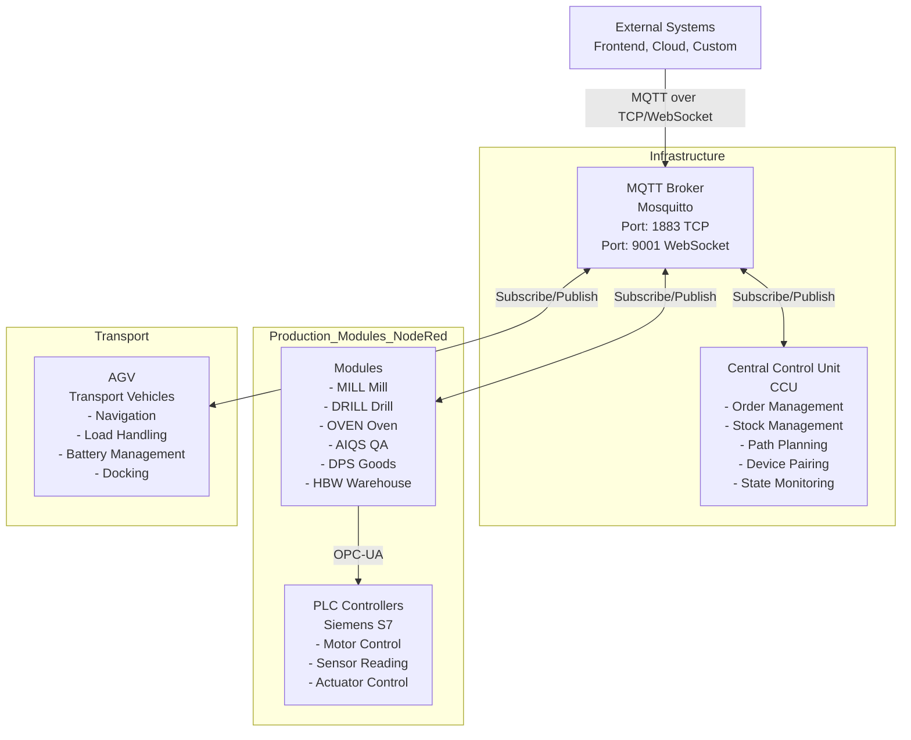
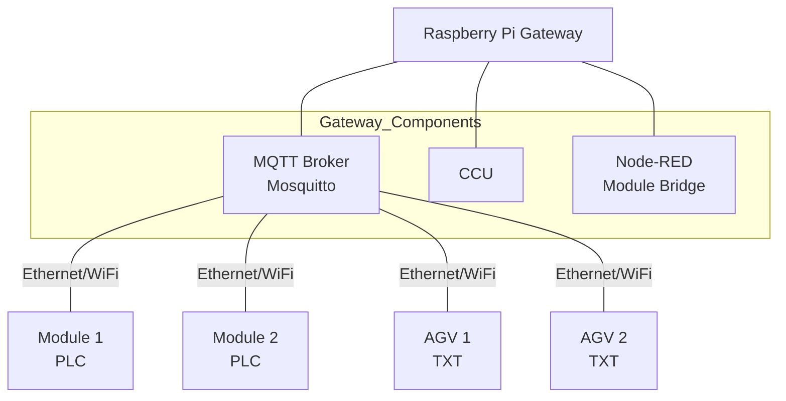
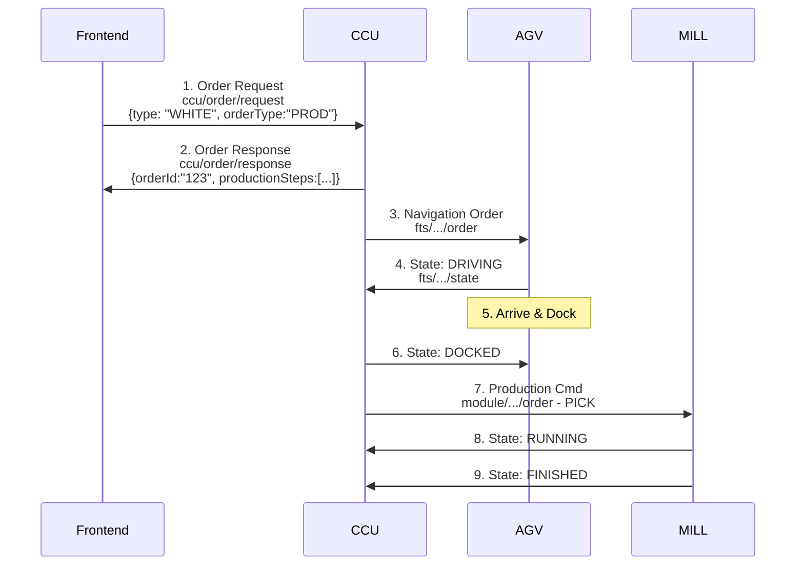
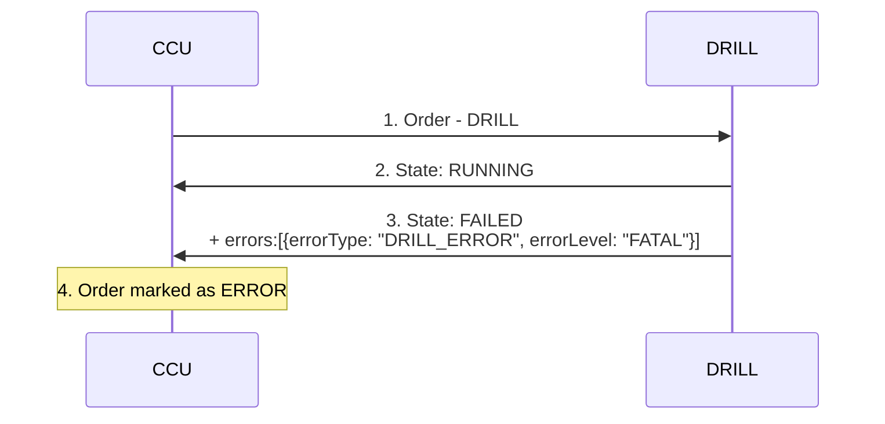
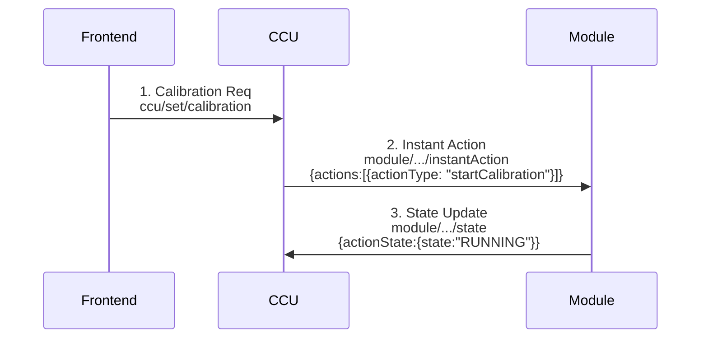

# 2. System Architecture and Overview

## 2.1 System Architecture

The APS uses a centralized MQTT-based architecture with the following main components:



### Component Roles

#### MQTT Broker (Mosquitto)
- **Central Message Router**: All communication flows through the broker
- **Port 1883**: Standard MQTT TCP connection
- **Port 9001**: WebSocket connection for browser-based clients
- **Credentials**: Username `default`, Password `default` (development)
- **Retained Messages**: Stores last state for each device
- **Last Will and Testament (LWT)**: Automatic disconnect notifications

#### Central Control Unit (CCU)
The CCU is the brain of the factory, responsible for:
- **Order Management**: Receives, validates, and tracks production orders
- **Production Planning**: Generates sequences of actions for each order
- **Resource Allocation**: Assigns tasks to available modules and AGVs
- **Path Planning**: Calculates navigation routes for AGVs
- **State Monitoring**: Tracks status of all devices in real-time
- **Stock Management**: Manages workpiece inventory
- **Device Pairing**: Handles connection and discovery of modules
- **Error Handling**: Responds to errors and manages recovery

**Implementation**: Node.js/TypeScript application

#### Production Modules
Physical manufacturing stations that perform specific operations:
- **MILL**: Milling operations
- **DRILL**: Drilling operations
- **OVEN**: Heat treatment/baking
- **AIQS**: Automated quality inspection
- **DPS**: Goods receipt/delivery with NFC reader
- **HBW**: High-bay warehouse for storage

**Implementation**: 
- **PLC Layer**: Siemens S7 controllers for hardware control (programmed via TIA Portal)
- **OPC-UA Server**: Runs on PLC for protocol conversion
- **Node-RED**: Bridges OPC-UA to MQTT

#### AGV (Automated Guided Vehicle)
Automated guided vehicles that transport workpieces:
- Navigate between modules
- Dock at modules for load exchange
- Manage battery charging
- Support up to 3 simultaneous loads

**Implementation**: TXT 4.0 controllers running custom software (developed with [ROBO Pro Coding App](https://www.fischertechnik.de/de-de/apps-und-software#apps))

#### Cloud Gateway (CGW)
Bridges local factory MQTT to fischertechnik cloud:
- Forwards relevant topics to cloud
- Enables remote monitoring
- Handles cloud authentication

### Network Architecture



## 2.2 Overview of Message Flows

### Topic Hierarchy

The factory uses three main topic namespaces:

#### 1. CCU Topics (`ccu/...`)
Global factory control and coordination:
- `ccu/global` - Global commands (system reset)
- `ccu/order/*` - Order management (request, response, active, completed, cancel)
- `ccu/state/*` - Global state (stock, flows, layout, config, logs)
- `ccu/set/*` - Configuration changes (layout, flows, calibration)
- `ccu/pairing/*` - Device discovery and pairing

#### 2. Module Topics (`module/v1/ff/<serial>/...`)
Production module communication:
- `.../state` - Module publishes current status
- `.../order` - CCU publishes production commands
- `.../instantAction` - CCU sends immediate commands
- `.../connection` - Online/offline status (LWT)
- `.../factsheet` - Static device capabilities

#### 3. AGV Topics (`fts/v1/ff/<serial>/...`)
Transport vehicle communication:
- `.../state` - AGV publishes position and status
- `.../order` - CCU publishes navigation orders
- `.../instantAction` - CCU sends immediate commands
- `.../connection` - Online/offline status (LWT)
- `.../factsheet` - Static device capabilities

### Message Type Classification

#### Control Messages (Commands)
**Direction**: CCU → Devices  
**QoS Level**: QoS 2 (exactly once delivery)  
**Retained**: No (transient commands)

- **Order Messages**: Production tasks and navigation routes
  - `module/v1/ff/<serial>/order`
  - `fts/v1/ff/<serial>/order`
  - QoS 2 ensures critical commands are never lost
  
- **Instant Actions**: Immediate commands that override normal operation
  - `module/v1/ff/<serial>/instantAction`
  - `fts/v1/ff/<serial>/instantAction`
  - QoS 2 for safety-critical instant actions
  
- **Configuration**: System-level settings
  - `ccu/set/*`
  - QoS 2 for configuration changes

#### Status Messages (Telemetry)
**Direction**: Devices → CCU (and observers)  
**QoS Level**: QoS 1 or QoS 2 depending on topic  
**Retained**: Yes (for state persistence)

- **State Updates**: Current device status
  - `module/v1/ff/<serial>/state`
  - `fts/v1/ff/<serial>/state`
  - QoS 2 on subscription, QoS 1 for publish
  - Retained to preserve last known state
  - **Event-driven only** - no periodic 30-second refresh
  - Published only when state actually changes
  
- **Connection Status**: Online/offline (retained + LWT)
  - `module/v1/ff/<serial>/connection`
  - `fts/v1/ff/<serial>/connection`
  - Retained for immediate connection status on client connect
  
- **Factory State**: Global information from CCU
  - `ccu/state/*` (stock, layout, config, flows)
  - Retained with QoS 1 for UI state persistence
  - "All values displayed in the UI have to be retained to survive a reload"

#### Information Messages
**Direction**: Bidirectional  
**QoS Level**: QoS 1 or QoS 2  
**Retained**: Yes (for device capabilities and order tracking)

- **Factsheets**: Device capabilities (published on startup)
  - `module/v1/ff/<serial>/factsheet`
  - `fts/v1/ff/<serial>/factsheet`
  - Retained so new clients can discover capabilities
  
- **Order Lifecycle**: Order status and history
  - `ccu/order/response` - QoS 1, not retained
  - `ccu/order/active` - QoS 2, retained
  - `ccu/order/completed` - QoS 2, retained
  - `ccu/order/cancel` - QoS 2, not retained (only cancels ENQUEUED orders)
  - Active/completed retained for tracking across sessions

### QoS and Retained Message Strategy

**QoS Selection Rationale**:
- **QoS 2 (Exactly Once)**: Commands that must never be duplicated or lost
  - Production orders - duplicate execution would waste materials
  - Instant actions - safety-critical commands
  - Active/completed orders - accurate tracking required
  
- **QoS 1 (At Least Once)**: Status updates where duplication is acceptable
  - State messages - latest value matters, not delivery count
  - Layout/config updates - idempotent operations
  - Stock information - eventually consistent is sufficient

**Retained Message Benefits**:
- UI displays current state immediately on load
- New devices/clients see factory state without waiting
- Connection status survives broker restarts
- Device capabilities available for discovery

**State Update Optimization**:
- No periodic state refresh (VDA5050 typically sends every 30s)
- State published only on actual changes
- Reduces MQTT traffic by ~95% compared to periodic updates
- Retained messages ensure latest state is always available

## 2.3 Detailed Message Flow Examples

### Example 1: Production Order Flow



### Example 2: Error Handling Flow




## 2.4 Subscription Patterns

### CCU Subscriptions
### Example 3: Instant Action Flow



```
fts/v1/ff/<own-serial>/order          # Navigation orders
fts/v1/ff/<own-serial>/instantAction  # Immediate actions
```

### External System Subscriptions (Monitoring)

For read-only monitoring, subscribe to:

```
ccu/state/#                # All CCU state
ccu/order/active           # Active orders
ccu/order/completed        # Completed orders
module/v1/ff/+/state       # All module states
fts/v1/ff/+/state          # All AGV states
```

## Next Steps

- Continue to [UI Integration](03-ui-integration.md) to understand how applications interact with the system
- See [OPC-UA Relationship](04-opcua-relationship.md) for interface integration details
- Jump to [Module Documentation](06-modules.md) for specific commands
