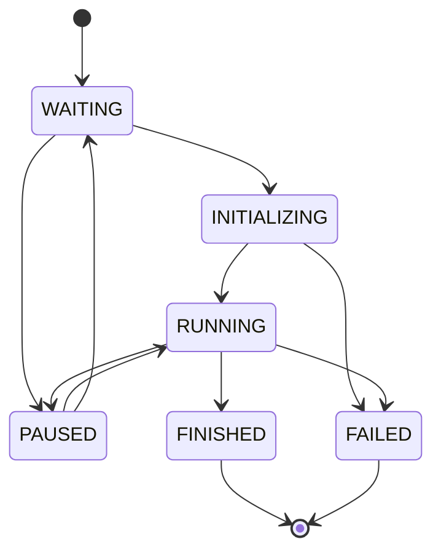

# 5. Message Structure and VDA5050

## Table of Contents
- [5.1 General Message Structure](#51-general-message-structure)
- [5.2 Common Header Fields](#52-common-header-fields)
- [5.3 Modifications to VDA5050 Standard](#53-modifications-to-vda5050-standard)
- [5.4 Message Types](#54-message-types)
- [5.5 Action State Lifecycle](#55-action-state-lifecycle)
- [5.6 Error Structure](#56-error-structure)
- [5.7 Load Structure](#57-load-structure)
- [5.8 CCU-Specific Messages](#58-ccu-specific-messages)

## 5.1 General Message Structure

The APS uses a modified VDA5050 protocol transmitted as JSON payloads over MQTT.

### Key Principles

1. **Protocol Format**: Strictly JSON (UTF-8 encoded).
2. **Timestamps**: ISO 8601 format (`YYYY-MM-DDTHH:mm:ss.sssZ`) is mandatory.
3. **Unique IDs**: UUIDs (`headerId`, `orderId`, `actionId`) ensure traceability.
4. **Sequence Numbers**: `headerId` and `orderUpdateId` enforce message ordering.
5. **State Machines**: Actions follow defined VDA5050 state transitions.
6. **Error Reporting**: Structured error arrays with severity levels.

## 5.2 Common Header Fields

Most messages include standard header fields:

### Header Field Reference

| Field | Type | Required | Description |
|-------|------|----------|-------------|
| `headerId` | Integer | Optional | Incrementing sequence number for this device |
| `timestamp` | Date (ISO 8601) | Yes | When the message was created |
| `serialNumber` | String | Yes | Unique identifier of the device |
| `manufacturer` | String | Optional | Device manufacturer (e.g., "fischertechnik") |
| `version` | String | Optional | Software version of the device |

### Example Header
```json
{
  "headerId": 42,
  "timestamp": "2024-12-08T10:30:00.000Z",
  "serialNumber": "MILL001",
  "manufacturer": "fischertechnik",
  "version": "1.2.3"
}
```

## 5.3 Modifications to VDA5050 Standard

The APS extends and modifies VDA5050 in several ways:

### 1. Applied to Production Modules
**Standard VDA5050**: Designed for AGVs (Automated Guided Vehicles) only  
**APS**: Applied to all production modules (MILL, DRILL, OVEN, etc.)

### 2. MQTT QoS and Retained Messages
**QoS Strategy**:
- **QoS 2** (exactly once): Critical commands (orders, instant actions, settings)
- **QoS 1** (at least once): State updates, layout, stock information
- **Rationale**: Ensures command reliability while optimizing state update performance

**Retained Message Usage**:
- **State topics**: `connection`, `factsheet`, `state` - retained for UI persistence
- **CCU topics**: `active_orders`, `completed_orders`, `stock`, `layout`, `config` - all retained
- **Purpose**: UI can display current state even after page reload without waiting for next update
- **Implementation**: Published with `{ qos: 2, retain: true }` for critical data

### 3. State Message Behavior
**Standard VDA5050**: State messages sent periodically (typically every 30 seconds)  
**APS**: 
- State messages are **event-driven only** - sent only on state changes
- No periodic 30-second refresh
- Retained messages ensure state persistence without repetition
- Reduces MQTT traffic significantly

### 4. Custom Action Types
**Added Actions**: 
- `DRILL` - Drilling operation
- `MILL` - Milling operation
- `FIRE` - Oven heating operation
- `CHECK_QUALITY` - Quality inspection
- `PICK` - Pickup workpiece
- `DROP` - Drop workpiece

### 5. Additional Topics
**Standard VDA5050**: AGV-specific topics  
**APS Additions**:
- `ccu/*` - Factory-wide control topics
- Calibration topics
- Stock management topics
- Factory layout topics

### 6. Instant Actions Extension
**Standard VDA5050**: Limited instant actions  
**APS Additions**:
- Calibration actions (`startCalibration`, `stopCalibration`, etc.)
- Storage management (`SET_STORAGE`)
- Status LED control (`setStatusLED`)
- Initial positioning (`findInitialDockPosition`)
- **Note**: Order cancellation (`cancelOrder`) is NOT an instant action - use `ccu/order/cancel` topic instead

### 7. Metadata Extensions
Custom metadata types:
- `DurationMetadata` - Production duration
- `StoreMetadata` - Storage information
- `DeliveryMetadata` - Workpiece history for NFC
- `CalibrationMetadata` - Calibration parameters

### 8. Workpiece Tracking
**Addition**: Complete workpiece lifecycle tracking with:
- Unique workpiece IDs
- Processing history
- NFC position codes
- Quality status

### 9. Node and Edge Structures
**Standard VDA5050**: Uses `nodeId` and `edgeId` fields  
**APS**: 
- `NodeState` and `EdgeState` are empty type definitions
- Navigation uses simplified `id` field instead of `nodeId`/`edgeId`
- Node IDs correspond to module serial numbers for docking positions

### 10. Custom ActionState Fields
**Standard VDA5050**: Basic action status tracking  
**APS Extensions**:
- `id`: Unique action identifier
- `timestamp`: Action state update time
- `state`: Current state (WAITING, INITIALIZING, RUNNING, PAUSED, FINISHED, FAILED)
- `command`: The command type being executed
- `result`: Optional result data (PASSED, FAILED, metadata)
- `metadata`: Command-specific parameters

## 5.4 Message Types

### 4.4.1 Order Messages

Orders are sent from CCU to devices to initiate actions.

#### Module Order (Production Command)

**Topic**: `module/v1/ff/<serial>/order`

```json
{
  "timestamp": "2024-12-08T10:30:00.000Z",
  "serialNumber": "DRILL001",
  "orderId": "order-abc-123",
  "orderUpdateId": 1,
  "action": {
    "id": "action-def-456",
    "command": "DRILL",
    "metadata": {
      "duration": 5
    }
  }
}
```

**Fields**:
- `timestamp`: When the order was created
- `serialNumber`: Target module serial number
- `orderId`: Unique order identifier
- `orderUpdateId`: Sequence number for this order
- `action`: The action to perform
  - `id`: Unique action identifier
  - `command`: Action type (enum: `ModuleCommandType`)
  - `metadata`: Optional action-specific data

#### AGV Order (Navigation Command)

**Topic**: `fts/v1/ff/<serial>/order`

AGV orders are more complex, containing navigation paths with nodes and edges. (Detailed structure omitted for brevity; see AGV-specific documentation.)

### 4.4.2 State Messages

Devices continuously publish their state to inform the CCU of their status.

#### Module State

**Topic**: `module/v1/ff/<serial>/state`

```json
{
  "headerId": 42,
  "timestamp": "2024-12-08T10:30:05.000Z",
  "serialNumber": "DRILL001",
  "type": "DRILL",
  "orderId": "order-abc-123",
  "orderUpdateId": 1,
  "paused": false,
  "actionState": {
    "id": "action-def-456",
    "timestamp": "2024-12-08T10:30:05.000Z",
    "state": "FINISHED",
    "command": "DRILL",
    "result": "PASSED"
  },
  "errors": [],
  "loads": [
    {
      "loadId": "workpiece-789",
      "loadType": "WHITE",
      "loadPosition": "MODULE"
    }
  ],
  "operatingMode": "AUTOMATIC"
}
```

**Key Fields**:
- `headerId`: Increments with each state message
- `type`: Module type (enum: `ModuleType`)
- `orderId`: Current order being executed (empty string if idle)
- `orderUpdateId`: Must match the order's sequence number
- `paused`: Whether the module is paused
- `actionState`: Current action status (or `null` if idle)
- `errors`: Array of errors (see Error Structure below)
- `loads`: Current workpieces on the module
- `operatingMode`: `AUTOMATIC` or `TEACHIN` (calibration mode)

#### AGV State

**Topic**: `fts/v1/ff/<serial>/state`

```json
{
  "headerId": 15,
  "timestamp": "2024-12-08T10:30:10.000Z",
  "serialNumber": "AGV001",
  "orderId": "order-abc-123",
  "orderUpdateId": 2,
  "lastNodeId": "MILL001",
  "lastNodeSequenceId": 3,
  "nodeStates": [],
  "edgeStates": [],
  "driving": false,
  "waitingForLoadHandling": true,
  "paused": false,
  "batteryState": {
    "charging": false,
    "percentage": 85,
    "currentVoltage": 12.5
  },
  "errors": [],
  "load": [
    {
      "loadId": "workpiece-789",
      "loadType": "WHITE",
      "loadPosition": "2"
    }
  ],
  "actionState": {
    "id": "action-xyz-999",
    "timestamp": "2024-12-08T10:30:10.000Z",
    "state": "FINISHED",
    "command": "DOCK"
  }
}
```

**Key AGV Fields**:
- `lastNodeId`: Serial number of the module the AGV is at or has left
- `lastNodeSequenceId`: Sequence of the node in the current order
- `driving`: Whether the AGV is currently moving
- `waitingForLoadHandling`: AGV is waiting for PICK/DROP operation
- `batteryState`: Battery information
- `load`: Up to 3 loads (positions "1", "2", "3")

### 4.4.3 Instant Action Messages

Instant actions are commands that can be executed immediately, often overriding normal operation.

**Topic**: `module/v1/ff/<serial>/instantAction` or `fts/v1/ff/<serial>/instantAction`

```json
{
  "serialNumber": "MILL001",
  "timestamp": "2024-12-08T11:00:00.000Z",
  "actions": [
    {
      "actionType": "startCalibration",
      "actionId": "instant-abc-123",
      "metadata": {
        "position": "HOME"
      }
    }
  ]
}
```

**Common Instant Action Types**:
- `factsheetRequest` - Request device capabilities
- `reset` - Reset the device
- `startCalibration` - Enter calibration mode
- `stopCalibration` - Exit calibration mode
- `setCalibrationValues` - Update calibration parameters
- `clearLoadHandler` - Clear AGV load handling state
- `findInitialDockPosition` - Initialize AGV position
- `SET_STORAGE` - Set HBW storage contents
- `setStatusLED` - Control status LEDs

### 4.4.4 Connection Messages

Connection messages use Last Will and Testament (LWT) to detect disconnections.

**Topic**: `module/v1/ff/<serial>/connection` or `fts/v1/ff/<serial>/connection`

**Online Message** (published on connect, retained):
```json
{
  "headerId": 1,
  "timestamp": "2024-12-08T09:00:00.000Z",
  "version": "1.2.3",
  "ip": "192.168.0.100",
  "manufacturer": "fischertechnik",
  "serialNumber": "MILL001",
  "connectionState": "ONLINE"
}
```

**Offline Message** (LWT, published automatically on disconnect):
```json
{
  "headerId": 1,
  "timestamp": "2024-12-08T09:00:00.000Z",
  "version": "1.2.3",
  "ip": "192.168.0.100",
  "manufacturer": "fischertechnik",
  "serialNumber": "MILL001",
  "connectionState": "OFFLINE"
}
```

### 4.4.5 Factsheet Messages

Factsheets describe device capabilities, published once on startup.

**Topic**: `module/v1/ff/<serial>/factsheet` or `fts/v1/ff/<serial>/factsheet`

```json
{
  "headerId": 1,
  "timestamp": "2024-12-08T09:00:00.000Z",
  "version": "1.2.3",
  "manufacturer": "fischertechnik",
  "serialNumber": "MILL001",
  "typeSpecification": {
    "seriesName": "FutureFac tory 24V",
    "moduleClass": "MILL"
  },
  "protocolFeatures": {
    "moduleActions": [
      {
        "actionType": "PICK"
      },
      {
        "actionType": "MILL",
        "actionParameters": {
          "parameterName": "duration",
          "parameterType": "number",
          "parameterDescription": "Milling duration in seconds"
        }
      },
      {
        "actionType": "DROP"
      }
    ],
    "moduleParameters": {
      "clearModuleOnPick": true
    }
  }
}
```

## 5.5 Action State Lifecycle

Actions follow a defined state machine:



### State Descriptions

| State | Description | Next States |
|-------|-------------|-------------|
| `WAITING` | Action created but not started | `INITIALIZING`, `PAUSED` |
| `INITIALIZING` | Preparing to execute | `RUNNING`, `FAILED` |
| `RUNNING` | Currently executing | `FINISHED`, `FAILED`, `PAUSED` |
| `PAUSED` | Temporarily stopped | `RUNNING`, `WAITING` |
| `FINISHED` | Completed successfully | N/A (terminal) |
| `FAILED` | Error occurred | N/A (terminal) |

### Action State Fields

```typescript
{
  "id": "action-uuid",           // Unique action ID
  "timestamp": "2024-...",        // Time of this state change
  "state": "FINISHED",            // Current state (enum)
  "command": "DRILL",             // Action type
  "result": "PASSED",             // Optional: result for multi-outcome actions
  "metadata": {...}               // Optional: additional data
}
```

### Result Values

For actions with multiple outcomes (e.g., quality check):

| Action | Possible Results |
|--------|------------------|
| `CHECK_QUALITY` | `PASSED`, `FAILED` |
| Most other actions | Not set (success implied by FINISHED state) |

## 5.6 Error Structure

Errors are reported in a structured array:

```json
{
  "errors": [
    {
      "errorType": "DRILL_ERROR",
      "timestamp": "2024-12-08T10:31:00.000Z",
      "errorLevel": "FATAL",
      "errorReferences": [
        {
          "referenceKey": "sensor",
          "referenceValue": "light_barrier_blocked"
        }
      ]
    }
  ]
}
```

### Error Levels

- `WARNING`: Non-critical issue, operation can continue
- `FATAL`: Critical error, action failed

### Common Error Types

| Module | Error Type | Description |
|--------|-----------|-------------|
| All | `PICK_ERROR` | Failed to pick up workpiece |
| All | `DROP_ERROR` | Failed to drop workpiece |
| DRILL | `DRILL_ERROR` | Drilling operation failed |
| MILL | `MILL_ERROR` | Milling operation failed |
| OVEN | `FIRE_ERROR` | Heating operation failed |
| AIQS | `CHECK_QUALITY_ERROR` | Quality check failed |
| AGV | `COLLISION` | Collision detected |
| AGV | `ACTION_DISMISSED` | Action cancelled |

## 5.7 Load Structure

Loads represent workpieces currently on a device:

```json
{
  "loads": [
    {
      "loadId": "workpiece-123",
      "loadType": "WHITE",
      "loadPosition": "MODULE",
      "loadTimestamp": 1702034700
    }
  ]
}
```

**Fields**:
- `loadId`: Unique workpiece identifier (UUID or null)
- `loadType`: Workpiece color (`WHITE`, `BLUE`, `RED`, or null)
- `loadPosition`: Where the load is located
  - Modules: `"MODULE"` or null
  - AGV: `"1"`, `"2"`, or `"3"` (loading bay)
- `loadTimestamp`: Unix timestamp when loaded (optional)

## 5.8 CCU-Specific Messages

### Order Request

**Topic**: `ccu/order/request`

```json
{
  "type": "WHITE",
  "timestamp": "2024-12-08T10:00:00.000Z",
  "orderType": "PRODUCTION"
}
```

or for storage:

```json
{
  "type": "BLUE",
  "timestamp": "2024-12-08T10:00:00.000Z",
  "orderType": "STORAGE",
  "workpieceId": "workpiece-123"
}
```

### Order Response

**Topic**: `ccu/order/response`

```json
{
  "orderType": "PRODUCTION",
  "type": "WHITE",
  "timestamp": "2024-12-08T10:00:00.000Z",
  "orderId": "order-abc-123",
  "productionSteps": [
    {
      "id": "step-1",
      "type": "NAVIGATION",
      "source": "START",
      "target": "MILL",
      "state": "ENQUEUED"
    },
    {
      "id": "step-2",
      "type": "MANUFACTURE",
      "moduleType": "MILL",
      "command": "PICK",
      "dependentActionId": "step-1",
      "state": "ENQUEUED"
    }
  ],
  "state": "ENQUEUED",
  "receivedAt": "2024-12-08T10:00:00.500Z"
}
```

### Active Orders

**Topic**: `ccu/order/active` (retained)

```json
[
  {
    "orderId": "order-abc-123",
    "type": "WHITE",
    "orderType": "PRODUCTION",
    "state": "IN_PROGRESS",
    "startedAt": "2024-12-08T10:00:01.000Z",
    "productionSteps": [...]
  }
]
```

### Order Cancellation

**Topic**: `ccu/order/cancel`

**Important**: Only orders in `ENQUEUED` state can be cancelled. Once an order reaches `IN_PROGRESS` (first module command sent), cancellation is no longer possible.

```json
["order-abc-123", "order-def-456"]
```

**Behavior**:
- `ENQUEUED` orders: Cancelled immediately, moved to `ccu/order/completed` with state `CANCELLED`
- `IN_PROGRESS` orders: Cancellation request ignored, order continues execution
- No error or confirmation is sent for ignored cancellation requests

**Use Case**: Cancel queued production requests before they start execution.

See [AGV Module Documentation](06-modules/agv.md#order-cancellation) for complete details.

### Factory State

**Topic**: `ccu/state/stock`

```json
{
  "ts": "2024-12-08T10:00:00.000Z",
  "stockItems": [
    {
      "workpiece": {
        "id": "workpiece-001",
        "type": "WHITE",
        "state": "RAW"
      },
      "location": "HBW",
      "hbw": "1-1"
    }
  ]
}
```

## Next Steps

- See [Module Documentation](06-modules.md) for command examples
- Review [Calibration](07-calibration.md) for instant action details
- Check [Manual Intervention](08-manual-intervention.md) for important warnings
