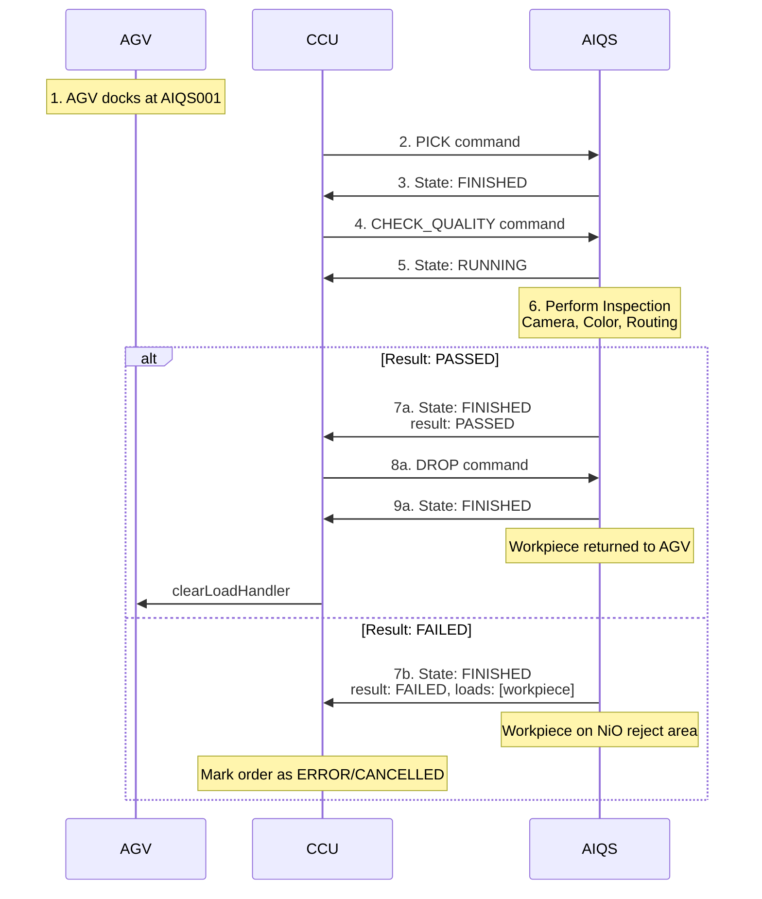

# 6.5 Quality Control with AI (AIQS)

## Overview

The AIQS (Quality Control with AI) module performs automated quality inspection using a camera and color sensor. It checks workpiece color and quality, then routes workpieces based on the result.

**Module Type**: `AIQS`  
**Serial Number**: Cleaned variant of the SPS serial number

## Supported Commands

| Command | Purpose | Result Values | Duration |
|---------|---------|---------------|----------|
| `PICK` | Pick workpiece from AGV | N/A | ~3 seconds |
| `CHECK_QUALITY` | Inspect workpiece quality and color | `PASSED`, `FAILED` | ~3 seconds (fixed) |
| `DROP` | Return workpiece to AGV | N/A | ~3 seconds |

## Supported Instant Actions

| Action | Purpose | Metadata | Description |
|--------|---------|----------|-------------|
| `factsheetRequest` | Request module info | None | Triggers publication of factsheet message |
| `reset` | Reset module | None | Return module to initial state |
| `startCalibration` | Enter calibration mode | None | Switch operating mode to TEACHIN |
| `stopCalibration` | Exit calibration mode | None | Switch operating mode to AUTOMATIC |
| `setCalibrationValues`| Update calibration | Calibration data | Update internal position values |

## MQTT Topics

Standard module topics:
- Subscribe: `module/v1/ff/<serial>/order`, `module/v1/ff/<serial>/instantAction`
- Publish: `module/v1/ff/<serial>/state`, `module/v1/ff/<serial>/connection`, `module/v1/ff/<serial>/factsheet`

## Command Example: CHECK_QUALITY

**Command**:
```json
{
  "timestamp": "2024-12-08T12:00:00.000Z",
  "serialNumber": "AIQS001",
  "orderId": "order-check-456",
  "orderUpdateId": 1,
  "action": {
    "id": "check-action-789",
    "command": "CHECK_QUALITY"
  }
}
```

**State Response** (Running):
```json
{
  "headerId": 51,
  "timestamp": "2024-12-08T12:00:01.000Z",
  "serialNumber": "AIQS001",
  "type": "AIQS",
  "orderId": "order-check-456",
  "orderUpdateId": 1,
  "paused": false,
  "actionState": {
    "id": "check-action-789",
    "timestamp": "2024-12-08T12:00:01.000Z",
    "state": "RUNNING",
    "command": "CHECK_QUALITY"
  },
  "errors": [],
  "loads": []
}
```

### Result: PASSED

Workpiece passed inspection and is returned to AGV:

```json
{
  "headerId": 52,
  "timestamp": "2024-12-08T12:00:04.000Z",
  "serialNumber": "AIQS001",
  "type": "AIQS",
  "orderId": "order-check-456",
  "orderUpdateId": 1,
  "paused": false,
  "actionState": {
    "id": "check-action-789",
    "timestamp": "2024-12-08T12:00:04.000Z",
    "state": "FINISHED",
    "command": "CHECK_QUALITY",
    "result": "PASSED"
  },
  "errors": [],
  "loads": []
}
```

### Result: FAILED

Workpiece failed inspection and is routed to NiO (Not in Order) chute:

```json
{
  "headerId": 52,
  "timestamp": "2024-12-08T12:00:04.000Z",
  "serialNumber": "AIQS001",
  "type": "AIQS",
  "orderId": "order-check-456",
  "orderUpdateId": 1,
  "paused": false,
  "actionState": {
    "id": "check-action-789",
    "timestamp": "2024-12-08T12:00:04.000Z",
    "state": "FINISHED",
    "command": "CHECK_QUALITY",
    "result": "FAILED"
  },
  "errors": [],
  "loads": [
    {
      "loadType": "WHITE",
      "loadPosition": "MODULE"
    }
  ]
}
```

When result is `FAILED`, the workpiece remains on the module's reject conveyor (NiO). The process ends here for this workpiece.

## Quality Check Process

1. **Pickup**: Module picks workpiece from AGV (via PICK command)
2. **Camera Inspection**: Checks for physical defects
3. **Color Detection**: Verifies correct color
4. **Routing**:
   - **PASSED**: Returns to AGV via main conveyor
   - **FAILED**: Routes to NiO chute (reject area)

## Hardware Details

### PLC I/O
**Inputs**: Light barriers, suction sensors, camera sensor, color sensor, encoder  
**Outputs**: Conveyor (bidirectional, PWM), suction actuator, compressor, camera lighting

## Errors

- `CHECK_QUALITY_ERROR` - Inspection failed (sensor fault)
- `PICK_ERROR` - Failed to retrieve rejected workpiece

## Special Considerations

**Result Handling**:
- **PASSED**: Workpiece is ready to be dropped back to AGV (send DROP command).
- **FAILED**: Workpiece is routed to NiO chute. The AGV is not used again for this order.

## Complete Quality Check Flow



## Related Documentation

- [System Architecture](../02-architecture.md)
- [General Module Overview](../06-modules.md)
- [Message Structure](../05-message-structure.md)
- [Calibration](../07-calibration.md)
- [Manual Intervention](../08-manual-intervention.md)

## Internal Communication (Node-RED to TXT)

The AIQS module uses a secondary TXT controller internally for camera operations. This controller communicates with the main Node-RED instance via a dedicated MQTT interface.

### Topic Structure

The internal communication uses a nested topic structure: `module/v1/ff/{DEVICEID}/{internal-TXT-DEVICEID}/...`

### Internal Order Message

There is only one supported internal order: `CHECK_QUALITY`.

**Topic**: `module/v1/ff/{DEVICEID}/{internal-TXT-DEVICEID}/order`

```json
{
  "serialNumber": "{internal-TXT-DEVICEID}",
  "orderId": "SOME_ID",
  "orderUpdateId": 2,
  "timestamp": "2023-02-02T13:58:06Z",
  "action": {
    "timestamp": "2023-02-02T13:58:06Z",
    "command": "CHECK_QUALITY",
    "id": "ID#2",
    "metadata": {
      "type": "COLOR",
      "workpieceId": "some_ID"
    }
  }
}
```

### Internal State Message

**Topic**: `module/v1/ff/{DEVICEID}/{internal-TXT-DEVICEID}/state`

```json
{
  "serialNumber": "{internal-TXT-DEVICEID}",
  "orderId": "SOME_ID",
  "orderUpdateId": 1,
  "timestamp": "2023-02-02T13:57:06Z",
  "actionState": {
    "command": "CHECK_QUALITY",
    "id": "ID#1",
    "metadata": {
      "result": "PASSED"
    }
  }
}
```

**Result Values**: `PASSED` or `FAILED`.

### Internal Connection Status

**Topic**: `module/v1/ff/NodeRed/cam/connection`

```json
{
  "headerId": 2,
  "timestamp": "2023-02-20T14:59:18.900084Z",
  "version": "1.0.0",
  "manufacturer": "Fischertechnik",
  "serialNumber": "{internal-TXT-DEVICEID}",
  "connectionState": "ONLINE"
}
```

**States**: `ONLINE`, `OFFLINE`, `CONNECTIONBROKEN`.

### Internal Factsheet

**Topic**: `module/v1/ff/{DEVICEID}/{internal-TXT-DEVICEID}/factsheet`

```json
{
    "timestamp": "2023-02-02T13:58:06Z",
    "headerId": 1,
    "manufacturer": "Fischertechnik",
    "protocolFeatures": {
        "moduleActions": [
            {
                "actionParameters": [
                    {
                        "parameterName": "type",
                        "parameterDescription": "Type of workpiece to process",
                        "parameterType": "string",
                        "isOptional": true
                    }
                ],
                "actionType": "CHECK_QUALITY"
            }
        ]
    },
    "localizationParameters": {},
    "serialNumber": "{internal-TXT-DEVICEID}",
    "version": "1.0.0",
    "typeSpecification": {
        "seriesName": "MOD-FF22+AIQS+24V+CAMERATXT",
        "moduleClass": "internal_TXT"
    }
}
```

### Internal Instant Actions

**Topic**: `module/v1/ff/{DEVICEID}/{internal-TXT-DEVICEID}/instantAction`

```json
{
  "serialNumber": "{internal-TXT-DEVICEID}",
  "timestamp": "2023-02-02T13:58:06Z",
  "actions": [
    {
      "actionId": "SOME_ID",
      "actionType": "factsheetRequest",
      "metadata": {}
    }
  ]
}
```

## OPC UA Variables

| Variable Name | Description | Type |
|---|---|---|
| `model` | Model name | STRING |
| `stat__idle` | Status: System is idle | BOOL |
| `cmd__pick` | Command: Pick operation | BOOL |
| `cmd__drop` | Command: Drop operation | BOOL |
| `cmd__good` | Command: Good operation | BOOL |
| `cmd__bad` | Command: Bad operation | BOOL |
| `stat__pickFinished` | Status: Pick process finished | BOOL |
| `stat__dropFinished` | Status: Drop process finished | BOOL |
| `stat__badFinished` | Status: Bad process finished | BOOL |
| `stat__goodFinished` | Status: Good process finished | BOOL |
| `stat__pickFailed` | Status: Pick process failed | BOOL |
| `stat__moveToCameraFinished` | Status: Move to camera finished | BOOL |
| `cmd__moveToCamera` | Command: Move to camera | BOOL |
| `stat__dropFailed` | Status: Drop process failed | BOOL |
| `cmd__calibrate` | Command: Calibrate | BOOL |
| `stat__calibActive` | Status: Calibration active | BOOL |
| `cmd__stop` | Command: Stop operation | BOOL |
| `stat__calibFinished` | Status: Calibration finished | BOOL |
| `cmd__default` | Command: Reset to factory settings | BOOL |
| `stat__defaultFinished` | Status: Reset to factory settings finished | BOOL |
| `cmd__moveForward` | Command: Move forward | BOOL |
| `cmd__moveTime` | Command: Move time | TIME |
| `stat__moveFinished` | Status: Move finished | BOOL |
| `cmd__moveBackward` | Command: Move backward | BOOL |
| `stat__moveBackFinished` | Status: Move backward finished | BOOL |
| `cal__cameraTime` | Calibration time for camera | TIME |
| `cal__badTime` | Calibration time for bad operation | TIME |
| `cal__processEndTime` | Calibration time for process end | TIME |
| `cal__midLightGateTime` | Calibration time to position the workpiece centrally in the light gate | TIME |
| `stat__dropActive` | Status: Drop process active | BOOL |
| `stat__pickActive` | Status: Pick process active | BOOL |
| `stat__goodActive` | Status: Good process active | BOOL |
| `stat__badActive` | Status: Bad process active | BOOL |
| `stat__moveToCameraActive` | Status: Move to camera active | BOOL |
| `cal__gripperDownTime` | Calibration time for gripper down | TIME |
| `cal__vacuumReleaseTime` | Calibration time for vacuum release | TIME |
| `version` | Versioning | STRING |
| `cal__prePhotoTime` | Calibration time before taking photo | TIME |
| `cal__vacuumGenerateTime` | Calibration time for vacuum generation | TIME |
| `cal__preFaultCheckTime` | Calibration time before fault check | TIME |
| `cal__defCameraTime` | Default calibration time for camera | TIME |
| `cal__defBadTime` | Default calibration time for bad operation | TIME |
| `cal__defProcessEndTime` | Default calibration time for process end | TIME |
| `cal__defMidLightGateTime` | Default calibration time to position the workpiece centrally in the light gate | TIME |
| `cal__defPrePhotoTime` | Default calibration time before taking photo | TIME |
| `cal__defGripperDownTime` | Default calibration time for gripper down | TIME |
| `cal__defVacuumReleaseTime` | Default calibration time for vacuum release | TIME |
| `cal__defPreFaultCheckTime` | Default calibration time before fault check | TIME |
| `cal__defVacuumGenerateTime` | Default calibration time for vacuum generation | TIME |
