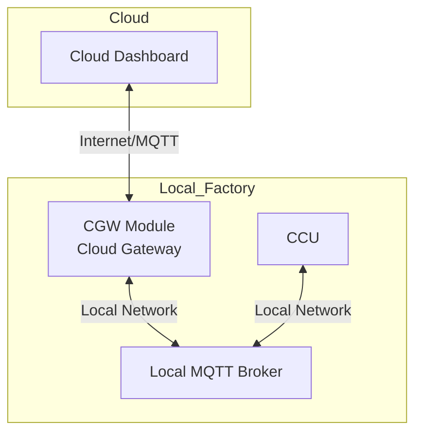

# 6.9 Cloud Gateway (CGW)

## Overview

The Cloud Gateway (CGW) bridges the local factory MQTT broker with the fischertechnik Cloud, enabling remote monitoring and control. It acts as a bidirectional MQTT message forwarder.

**Module Type**: CGW (special infrastructure component)  
**Serial Number**: Cleaned variant of the SPS serial number  
**Function**: MQTT bridge, not a production module

## 6.9 Architecture

The CGW acts as a bridge between the local factory network and the cloud.



## Topic Forwarding Rules

The CGW selectively forwards topics between local and cloud brokers.

### From Local Broker to Cloud

Messages from the factory are forwarded to the cloud with prefix `/j1/txt/<cloud-controller-id>/`:

| Local Topic | Cloud Topic |
|-------------|-------------|
| `ccu/order/response` | `/j1/txt/<id>/ccu/order/response` |
| `ccu/order/active` | `/j1/txt/<id>/ccu/order/active` |
| `ccu/order/completed` | `/j1/txt/<id>/ccu/order/completed` |
| `ccu/pairing/state` | `/j1/txt/<id>/ccu/pairing/state` |
| `ccu/state/#` | `/j1/txt/<id>/ccu/state/#` |
| `fts/v1/ff/+/connection` | `/j1/txt/<id>/fts/v1/ff/+/connection` |
| `fts/v1/ff/+/state` | `/j1/txt/<id>/fts/v1/ff/+/state` |
| `fts/v1/ff/+/factsheet` | `/j1/txt/<id>/fts/v1/ff/+/factsheet` |
| `module/v1/ff/+/connection` | `/j1/txt/<id>/module/v1/ff/+/connection` |
| `module/v1/ff/+/state` | `/j1/txt/<id>/module/v1/ff/+/state` |
| `module/v1/ff/+/factsheet` | `/j1/txt/<id>/module/v1/ff/+/factsheet` |

Additionally, dashboard-related topics:
| `/j1/txt/1/f/i/#` | `/j1/txt/<id>/f/i/#` |
| `/j1/txt/1/i/#` | `/j1/txt/<id>/i/#` |

### From Cloud to Local Broker

Messages from the cloud are forwarded to the local broker with prefix removed:

| Cloud Topic | Local Topic |
|-------------|-------------|
| `/j1/txt/<id>/ccu/order/request` | `ccu/order/request` |
| `/j1/txt/<id>/ccu/order/cancel` | `ccu/order/cancel` |
| `/j1/txt/<id>/ccu/pairing/pair_fts` | `ccu/pairing/pair_fts` |
| `/j1/txt/<id>/ccu/set/#` | `ccu/set/#` |

Dashboard-related topics:
| `/j1/txt/<id>/f/o/#` | `/j1/txt/1/f/o/#` |
| `/j1/txt/<id>/o/broadcast` | `/j1/txt/1/o/broadcast` |
| `/j1/txt/<id>/o/ptu` | `/j1/txt/1/o/ptu` |
| `/j1/txt/<id>/c/#` | `/j1/txt/1/c/#` |

## Configuration

The CGW is configured through:

1. **fischertechnik Cloud Pairing**: 
   - Performed via TXT Controller UI
   - Generates cloud credentials
   - Assigns `<cloud-controller-id>`

2. **Local Broker Configuration**:
   - Hardcoded in `data/config.json` inside `.ft` project
   - Contains local broker IP and credentials

**Example config.json**:
```json
{
  "mqtt": {
    "localBroker": {
      "host": "192.168.0.100",
      "port": 1883,
      "username": "default",
      "password": "default"
    },
    "deviceId": "CGW001"
  }
}
```

## Cloud Controller ID

The `<cloud-controller-id>` is obtained during the fischertechnik Cloud pairing process:
- Unique identifier for this factory instance in the cloud
- Used as topic prefix for all cloud messages
- Replaced with local ID `1` for dashboard compatibility

## Use Cases

### Remote Monitoring

External systems can monitor the factory via cloud topics:
- Subscribe to `/j1/txt/<id>/ccu/state/#` for factory state
- Subscribe to `/j1/txt/<id>/module/v1/ff/+/state` for module states
- Subscribe to `/j1/txt/<id>/fts/v1/ff/+/state` for AGV positions

### Remote Control

Send commands through the cloud:
- Publish to `/j1/txt/<id>/ccu/order/request` to create orders
- Publish to `/j1/txt/<id>/ccu/set/#` for configuration changes

### Dashboard Access

The fischertechnik dashboard can connect remotely:
- Uses special `/j1/txt/<id>/f/o/#` and `/c/#` topics
- CGW translates between cloud ID and local ID `1`

## MQTT Topics (CGW Itself)

The CGW does not publish state like production modules. However, it appears in the system with:

**Connection Topic**: `module/v1/ff/<serial>/connection`

**Online Message**:
```json
{
  "headerId": 1,
  "timestamp": "2024-12-08T09:00:00.000Z",
  "version": "1.0.0",
  "ip": "192.168.0.50",
  "manufacturer": "fischertechnik",
  "serialNumber": "CGW001",
  "connectionState": "ONLINE"
}
```

## Security Considerations

### Local Network

- Local MQTT typically uses simple authentication (`default`/`default`)
- ⚠️ Not intended for public exposure
- Should be on isolated factory network

### Cloud Connection

- TLS encryption for cloud communication
- Authenticated via fischertechnik Cloud credentials
- Credentials generated during pairing process

### Topic Filtering

- CGW only forwards specific topics
- Prevents unintended message leakage
- Maintains separation between local and cloud concerns

## Operational Notes

### Requirements

Both credentials must be configured:
1. **Local Broker**: IP and login hardcoded in config
2. **Cloud Credentials**: Generated via TXT Controller pairing UI

### Startup

On startup, CGW:
1. Connects to local MQTT broker
2. Connects to fischertechnik Cloud MQTT broker
3. Subscribes to relevant topics on both brokers
4. Begins forwarding messages

### Error Handling

If connection fails:
- CGW retries connection automatically
- Messages may be lost during disconnection
- No local queueing of cloud-bound messages

### Debugging

To debug CGW operation:
- Monitor both local and cloud brokers
- Check topic prefixes are correct
- Verify CGW connection status
- Review CGW logs on TXT Controller

## Limitations

1. **No State Buffering**: Messages lost during disconnection are not recovered
2. **One-Way Real-Time**: Not designed for request-response patterns
3. **Topic Whitelist**: Only predefined topics are forwarded
4. **No Message Transformation**: Messages are forwarded as-is (except topic prefix)

## Development and Testing

### Local Testing Without Cloud

For development without cloud connection:
- Disable CGW
- Use local MQTT broker only
- All functionality works locally

### Cloud Testing

For testing cloud integration:
- Use MQTT client to connect to cloud broker
- Subscribe to `/j1/txt/<id>/#` to see all forwarded messages
- Publish to `/j1/txt/<id>/ccu/order/request` to test remote control

## Related Documentation

- [System Architecture](../02-architecture.md)
- [General Module Overview](../06-modules.md)
- [Message Structure](../05-message-structure.md)
- [Calibration](../07-calibration.md)
- [Manual Intervention](../08-manual-intervention.md)
