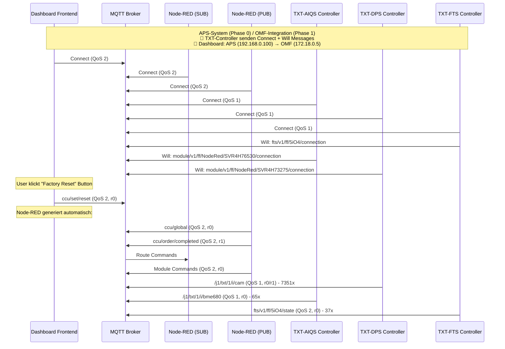
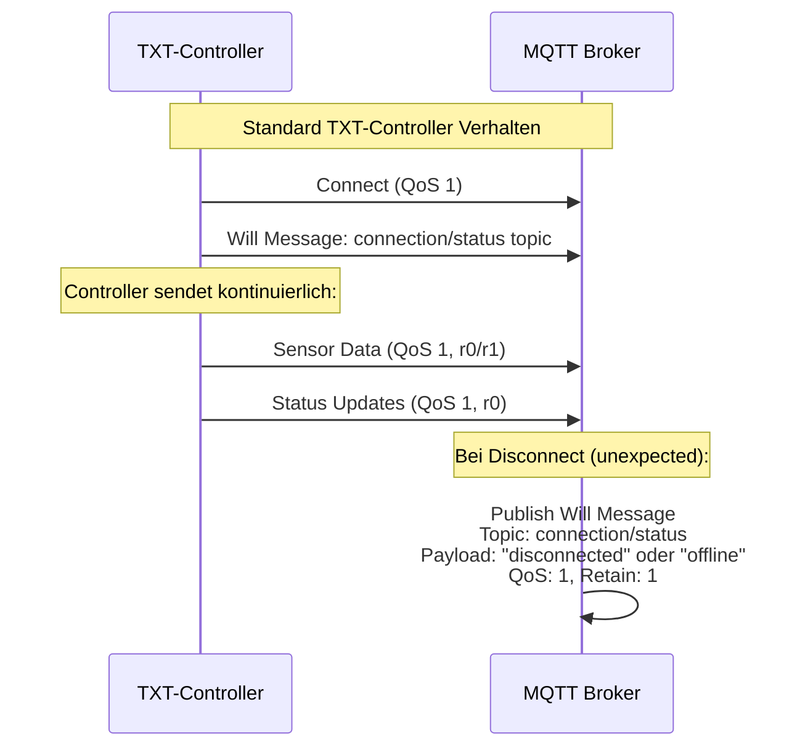
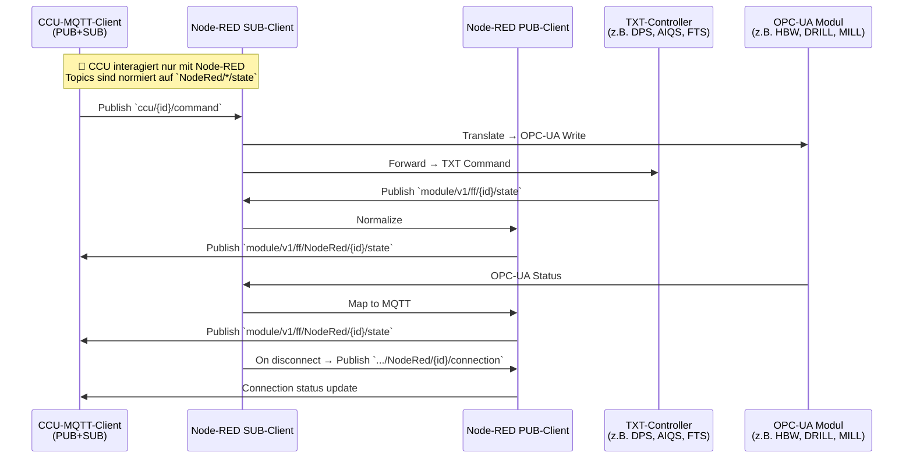

# PUB/SUB Pattern Analysis - APS Ecosystem 2025-09-28

## 🎯 **Ziel: Verständnis der MQTT-Kommunikationsmuster für Software-Ersatz**

**Datum:** 28. September 2025  
**Basis:** Mosquitto Log Analysis + Registry v2  
**Zweck:** Implementierung selektiver MQTT-Clients als Fischertechnik-Software-Ersatz

---

## 📊 **PUB/SUB-PATTERNS AUS DER ANALYSE**

### **1. CCU Dashboard (Frontend)**
```yaml
Role: "Command Publisher + State Subscriber"
Pattern: "Dashboard → System"
Published Topics:
  - ccu/set/reset (Factory Reset)
  - ccu/global (Global Reset)
  - ccu/state/* (Dashboard States)
  - module/v1/ff/+/instantAction (Module Commands)
  - /j1/txt/1/f/i/* (TXT Commands)
  - /j1/txt/1/c/* (TXT Control)
  - /j1/txt/1/o/* (TXT Output)

Subscribed Topics:
  - module/v1/ff/+/state (Module States)
  - module/v1/ff/NodeRed/+/state (Normalized States)
  - fts/v1/ff/+/state (FTS States)
  - /j1/txt/1/f/o/* (TXT Responses)
  - /j1/txt/1/i/* (TXT Sensor Data)
```

### **2. Node-RED SUB (Command Processor)**
```yaml
Role: "Command Subscriber + Internal Processor"
Pattern: "System Commands → OPC-UA Bridge"
Subscribed Topics:
  - ccu/global (Global Reset)
  - ccu/set/reset (Factory Reset)
  - module/v1/ff/+/instantAction (Module Commands)
  - module/v1/ff/+/state (Module States)
  - fts/v1/ff/+/state (FTS States)

Published Topics: [] # Nur interner Verarbeitung
```

### **3. Node-RED PUB (State Normalizer)**
```yaml
Role: "State Publisher + Feedback Generator"
Pattern: "Normalized States → Dashboard"
Published Topics:
  - module/v1/ff/NodeRed/+/state (Normalized Module States)
  - module/v1/ff/NodeRed/+/connection (Module Connections)
  - module/v1/ff/NodeRed/+/factsheet (Module Factsheets)
  - ccu/global (Global Reset Feedback)
  - ccu/order/completed (Order Completion)

Subscribed Topics: [] # Nur interner Verarbeitung
```

### **4. TXT-FTS (Transport Controller)**
```yaml
Role: "FTS State Publisher + Order Subscriber"
Pattern: "FTS ↔ System"
Published Topics:
  - fts/v1/ff/5iO4/state (FTS Status)
  - fts/v1/ff/5iO4/connection (FTS Connection)
  - fts/v1/ff/5iO4/factsheet (FTS Info)

Subscribed Topics:
  - fts/v1/ff/5iO4/order (FTS Commands)
```

### **5. TXT-AIQS (Quality Controller)**
```yaml
Role: "Sensor Publisher + Command Subscriber"
Pattern: "Sensor Data → System + DPS Integration"
Published Topics:
  - /j1/txt/1/i/cam (Camera Data)
  - /j1/txt/1/i/ldr (Light Sensor)
  - /j1/txt/1/i/bme680 (Environmental Sensor)
  - /j1/txt/1/i/broadcast (Broadcast Data)
  - /j1/txt/1/f/o/* (Function Output)
  - module/v1/ff/NodeRed/SVR4H73275/state (DPS Integration)
  - module/v1/ff/NodeRed/SVR4H73275/connection (DPS Connection)

Subscribed Topics:
  - /j1/txt/1/c/* (Control Commands)
  - /j1/txt/1/f/i/* (Function Input)
  - /j1/txt/1/o/* (Output Commands)
```

### **6. TXT-DPS (Distribution Controller)**
```yaml
Role: "Order Subscriber + Sensor Subscriber"
Pattern: "System Commands → Distribution Logic"
Published Topics: [] # Nur interne Verarbeitung

Subscribed Topics:
  - ccu/pairing/state (Pairing Status)
  - ccu/order/active (Active Orders)
  - ccu/order/completed (Order Completion)
  - /j1/txt/1/i/* (Sensor Data from TXT-AIQS)
```

### **7. TXT-CGW (Central Gateway)**
```yaml
Role: "Node-RED Status Publisher"
Pattern: "Gateway Status → System"
Published Topics:
  - module/v1/ff/NodeRed/status (Node-RED Status)

Subscribed Topics: [] # Nur Status-Publishing
```

---

## 🔄 **KOMMUNIKATIONSFLOWS**

### **Command Flow:**
```
Dashboard → ccu/set/reset → Node-RED SUB → OPC-UA Modules
Dashboard → module/v1/ff/+/instantAction → Node-RED SUB → OPC-UA
Dashboard → /j1/txt/1/f/i/* → TXT-Controller
```

### **State Flow:**
```
TXT-Controller → /j1/txt/1/i/* → Dashboard
OPC-UA Modules → module/v1/ff/+/state → Node-RED SUB → Node-RED PUB → module/v1/ff/NodeRed/+/state → Dashboard
FTS → fts/v1/ff/+/state → Dashboard
```

### **Integration Flow:**
```
TXT-AIQS → module/v1/ff/NodeRed/SVR4H73275/state (DPS Integration)
TXT-CGW → module/v1/ff/NodeRed/status (System Status)
```

---

## 🎯 **MQTT-CLIENT-IMPLEMENTIERUNG**

### **Selektive Subscriptions:**
- **Pattern-basierte Filter:** `module/v1/ff/+/state`, `ccu/set/*`
- **Rollen-spezifische Topics:** Nur relevante Topics pro Client
- **QoS/Retain-Parameter:** Aus Registry v2 übernommen

### **Message-Handling:**
- **Command Processing:** TXT-Controller reagieren auf spezifische Commands
- **State Publishing:** Regelmäßige Status-Updates
- **Integration Logic:** TXT-AIQS integriert DPS-Modul

### **System-Architektur:**
- **Dashboard:** Zentrale Command-Quelle
- **Node-RED:** Command-Processing + State-Normalization
- **TXT-Controller:** Hardware-spezifische Logik
- **Module Integration:** Über Serial-Mapping

---

## ✅ **ERKENNTNISSE FÜR SOFTWARE-ERSATZ**

### **1. Klare Rollenverteilung:**
- Jeder Client hat spezifische PUB/SUB-Patterns
- Keine Überlappungen in Publisher-Rollen
- Logische Topic-Hierarchien

### **2. Integration-Patterns:**
- TXT-AIQS integriert DPS-Modul über Node-RED Topics
- TXT-CGW publiziert System-Status
- Node-RED normalisiert alle Module-States

### **3. Command-Flow:**
- Dashboard → Node-RED → OPC-UA (für Module)
- Dashboard → TXT-Controller (direkt für TXT)
- FTS hat eigene Command-Struktur

### **4. State-Flow:**
- TXT-Controller → Dashboard (Sensor-Daten)
- OPC-UA → Node-RED → Dashboard (Module-States)
- FTS → Dashboard (Transport-States)

---

## 🚀 **NÄCHSTE SCHRITTE FÜR IMPLEMENTIERUNG**

1. **MQTT-Client-Templates** basierend auf Registry v2
2. **Pattern-basierte Subscription-Logic**
3. **Message-Routing** nach Client-Rollen
4. **Integration-Tests** mit echten Topics
5. **Performance-Optimierung** für große Topic-Mengen

---

## 📊 **MQTT-KOMMUNIKATIONSDIAGRAMME**

### **Hauptdiagramm: APS-System Kommunikation**



### **TXT-Controller Connect Pattern (Detail)**



### **CCU ↔ Node-RED SUB/PUB ↔ Module**



---

## 📋 **TOPIC-MAPPING-TABELLE**

| Modul / Typ | Ursprünglicher Sender | Node-RED SUB empfängt | Node-RED PUB publiziert (normalisiert) | CCU SUB abonniert | CCU PUB sendet |
|-------------|----------------------|----------------------|----------------------------------------|-------------------|----------------|
| **DPS (TXT)** | TXT-DPS → `module/v1/ff/SVR4H73275/state` | ✅ `.../state` vom TXT | `module/v1/ff/NodeRed/SVR4H73275/state` | `NodeRed/SVR4H73275/state` | `ccu/set/reset`, `ccu/global` |
| **AIQS (TXT)** | TXT-AIQS → `module/v1/ff/SVR4H76530/state` | ✅ `.../state` vom TXT | `module/v1/ff/NodeRed/SVR4H76530/state` | `NodeRed/SVR4H76530/state` | `ccu/set/reset`, `ccu/global` |
| **FTS (TXT)** | TXT-FTS → `fts/v1/ff/5iO4/state` | ✅ `fts/.../state` vom TXT | `fts/v1/ff/NodeRed/5iO4/state` (falls normalisiert) | `fts/v1/ff/5iO4/state` | `ccu/set/reset`, `ccu/global` |
| **HBW (OPC-UA)** | OPC-UA (kein MQTT) | Status via OPC-UA → Node-RED | `module/v1/ff/NodeRed/SVR3QA0022/state` | `NodeRed/SVR3QA0022/state` | `ccu/set/reset`, `ccu/global` |
| **DRILL (OPC-UA)** | OPC-UA | ✅ OPC-UA Poll | `module/v1/ff/NodeRed/SVR4H76449/state` | `NodeRed/SVR4H76449/state` | `ccu/set/reset`, `ccu/global` |
| **MILL (OPC-UA)** | OPC-UA | ✅ OPC-UA Poll | `module/v1/ff/NodeRed/SVR3QA2098/state` | `NodeRed/SVR3QA2098/state` | `ccu/set/reset`, `ccu/global` |

---

## 🎯 **ARCHITEKTUR-VORTEILE**

### **1. Einheitliches Interface:**
- **CCU kennt nur `NodeRed/*/state` Topics**
- **Entkopplung:** CCU ist unabhängig von Hardware-Details
- **Normalisierung:** Alle Module-States haben das gleiche Pattern

### **2. Skalierbarkeit:**
- **Neue Module können einfach hinzugefügt werden**
- **Topic-Struktur ist konsistent und vorhersagbar**
- **Wartbarkeit durch einheitliche Schemas**

### **3. QoS-Patterns:**
- **QoS 0:** Test-Nachrichten (at most once)
- **QoS 1:** Sensor-Daten, Status-Updates (at least once)  
- **QoS 2:** System-Commands, Module-Commands (exactly once)

### **4. Retain-Flags:**
- **r0:** Kein Retain (normale Nachrichten)
- **r1:** Retain (letzte Nachricht wird gespeichert)

---

## 🔍 **WILL MESSAGE DETAILS**

**Was passiert bei Disconnect:**
- **Topic:** `fts/v1/ff/5iO4/connection` (FTS) oder `module/v1/ff/NodeRed/SVR4H73275/connection` (Module)
- **Payload:** Wahrscheinlich `{"status": "disconnected"}` oder `{"connected": false}`
- **QoS:** 1 (at least once)
- **Retain:** 1 (letzte Nachricht wird gespeichert)
- **Zweck:** Dashboard erkennt sofort, wenn TXT-Controller offline geht

**Beispiel aus Log:**
```
Will message specified (212 bytes) (r1, q1).
    fts/v1/ff/5iO4/connection
```

**Das bedeutet:** Wenn der TXT-Controller unerwartet disconnectet, sendet der Broker automatisch eine "disconnected"-Nachricht an alle Subscriber, damit das Dashboard sofort weiß: "Module ist nicht mehr connected!" 🚨

---

*Erstellt: 28. September 2025*  
*Basis: Mosquitto Log Analysis + Registry v2 + MQTT-Diagramme*  
*Zweck: Software-Ersatz für Fischertechnik-Komponenten*
