# MQTT Pub/Sub Diagrams

## Overview

Graphische Darstellung der MQTT-Kommunikationsmuster in der APS-Modellfabrik basierend auf der Log-Analyse vom 18. September 2025.

## 1. High-Level System Overview

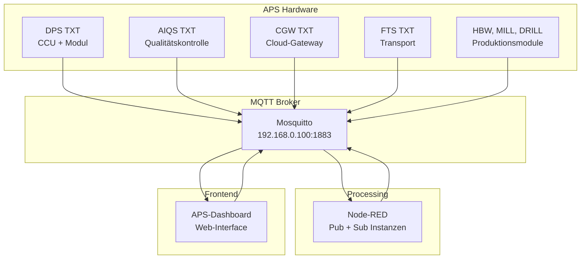

## 2. Detailed System Architecture

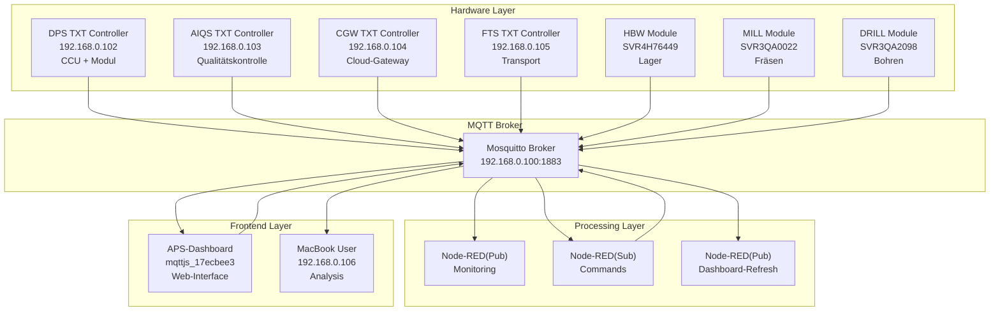

## 3. High-Level Communication Flow

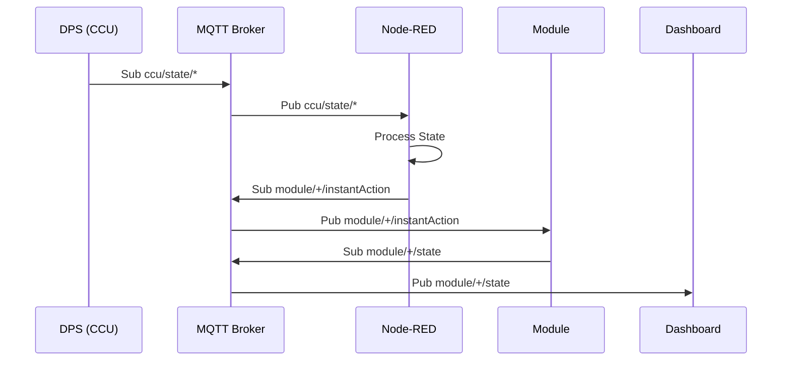

## 4. Detailed Pub/Sub Communication Flow

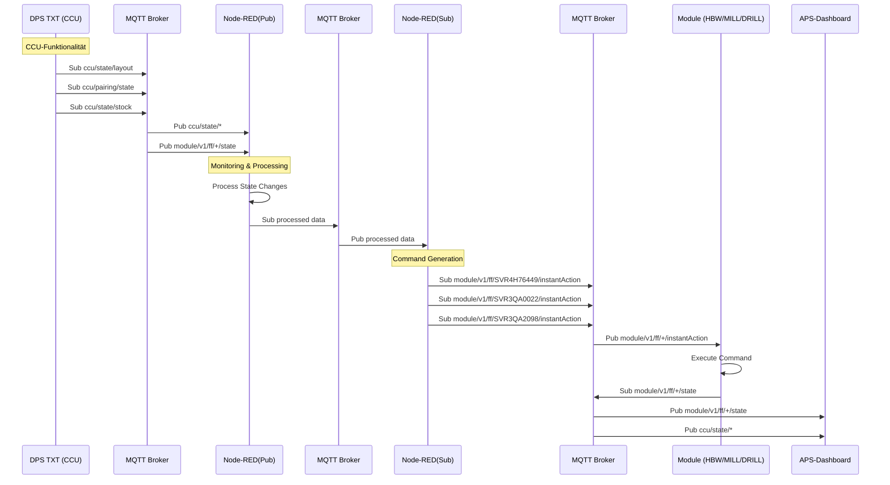

## 5. Node-RED Dual Role Architecture

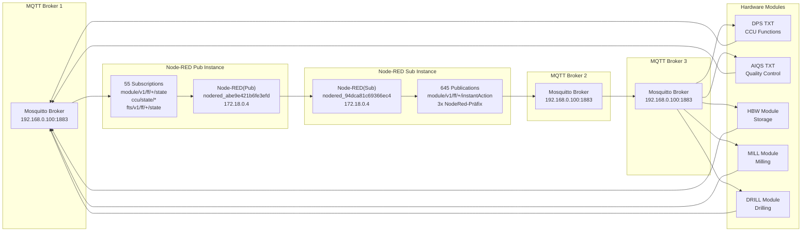

## 6. Node-RED Dual Role Architecture

Das folgende Diagramm verdeutlicht die **duale Rolle von Node-RED** als Pub und Sub mit gerichtetem Graphen von links nach rechts:

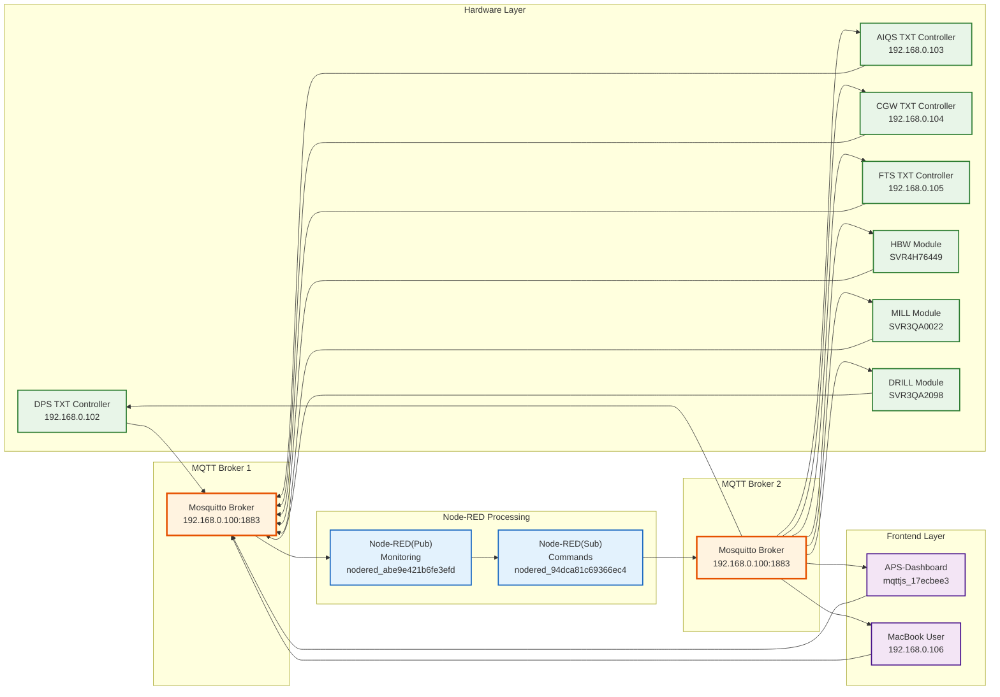

## 7. Order Processing Flow

Das folgende Sequenzdiagramm zeigt den Ablauf der Bestellabwicklung im System basierend auf den gesicherten MQTT-Analyse-Erkenntnissen:

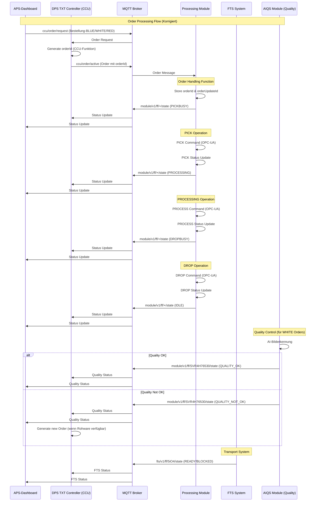

## 8. High-Level Topic Flow

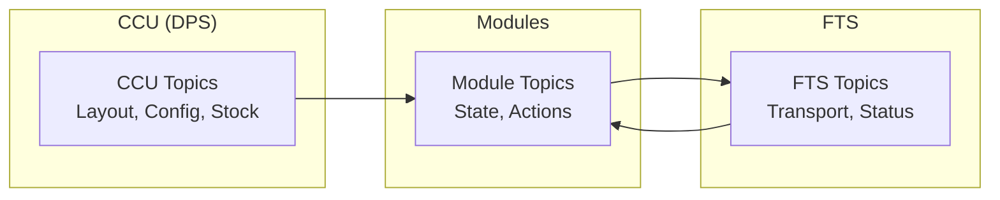

## 9. Topic Flow Patterns

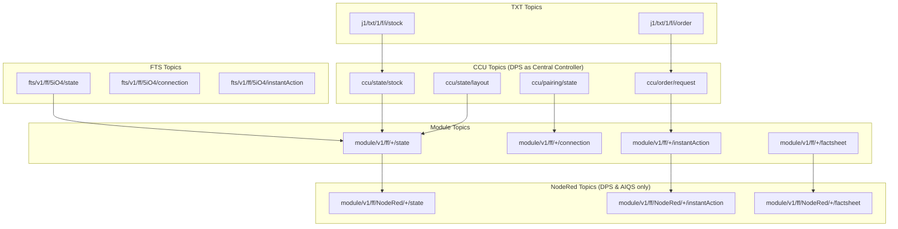

## 10. High-Level Load Type Flow

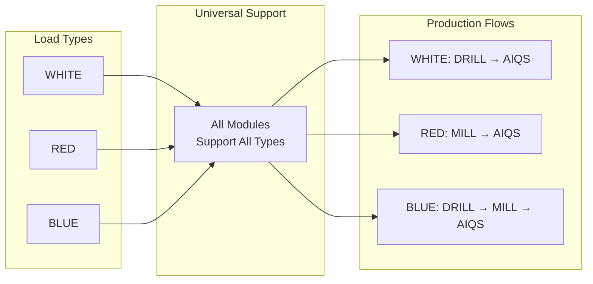

## 11. Load Type Processing Flow

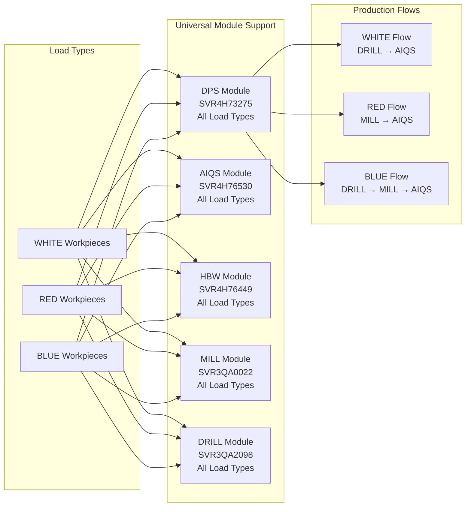

## 12. High-Level Camera System

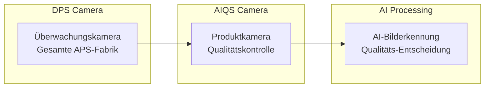

## 13. Camera System Architecture

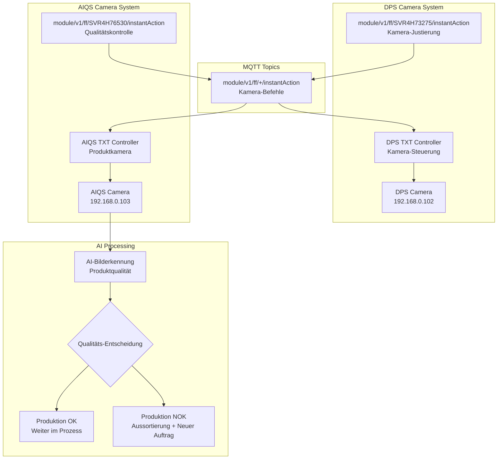

## 14. High-Level FTS States

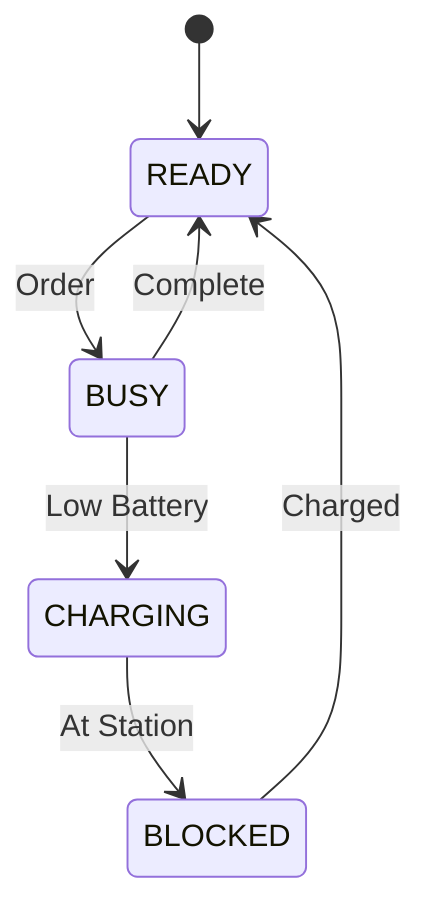

## 15. FTS State Management

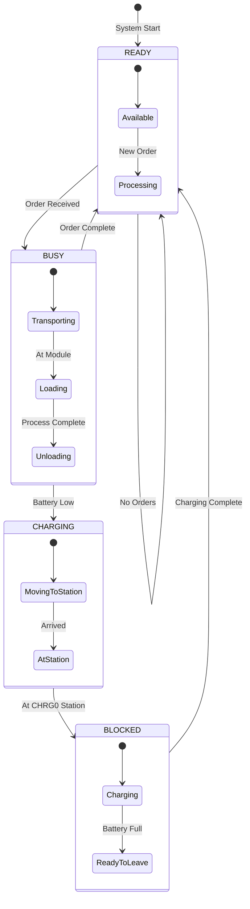

---

*Erstellt: 18. September 2025*  
*Basiert auf: Mosquitto-Log-Analyse (15:59-16:24)*  
*Status: Vollständige Pub/Sub-Diagramme erstellt*
