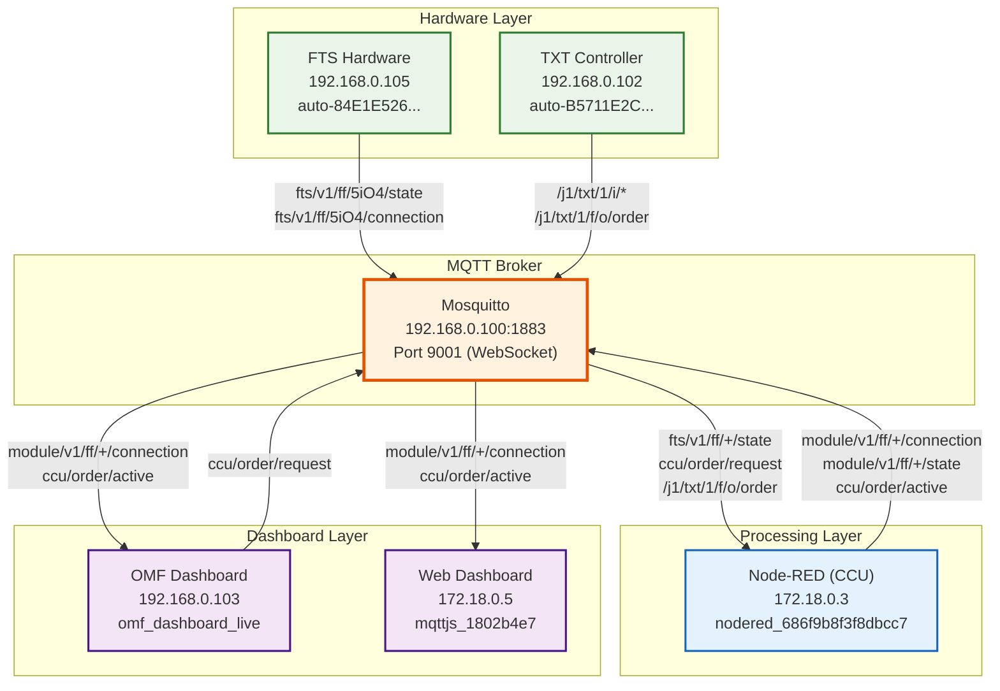
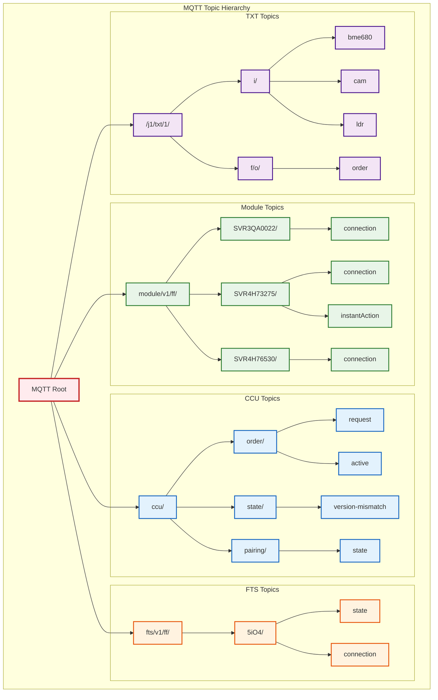
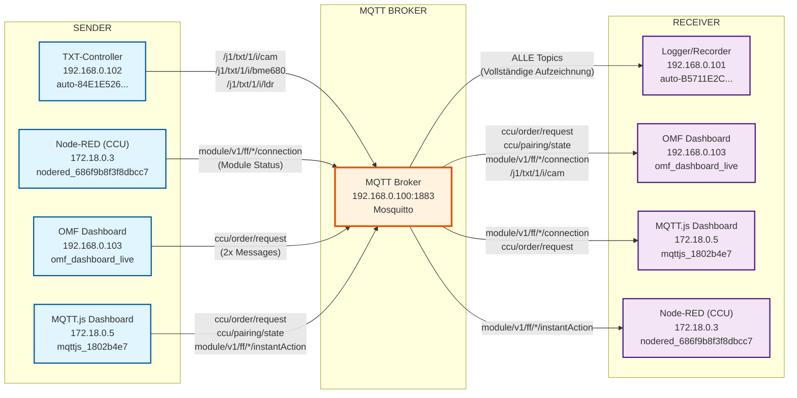
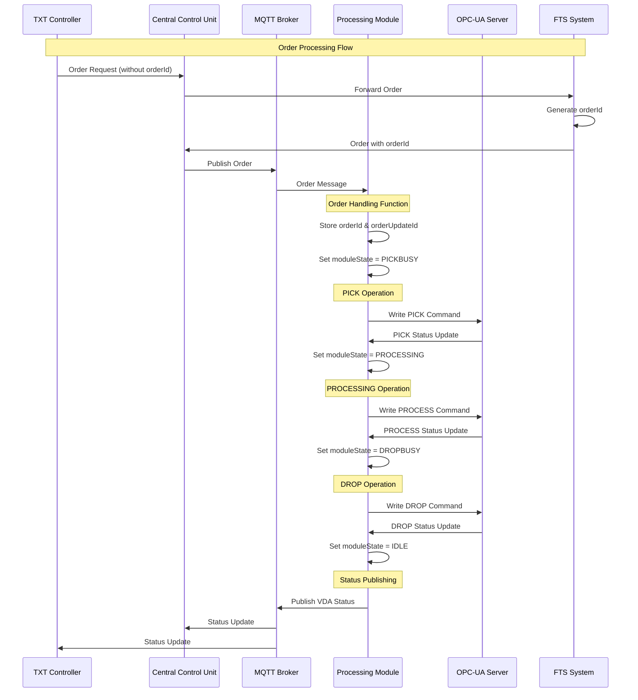
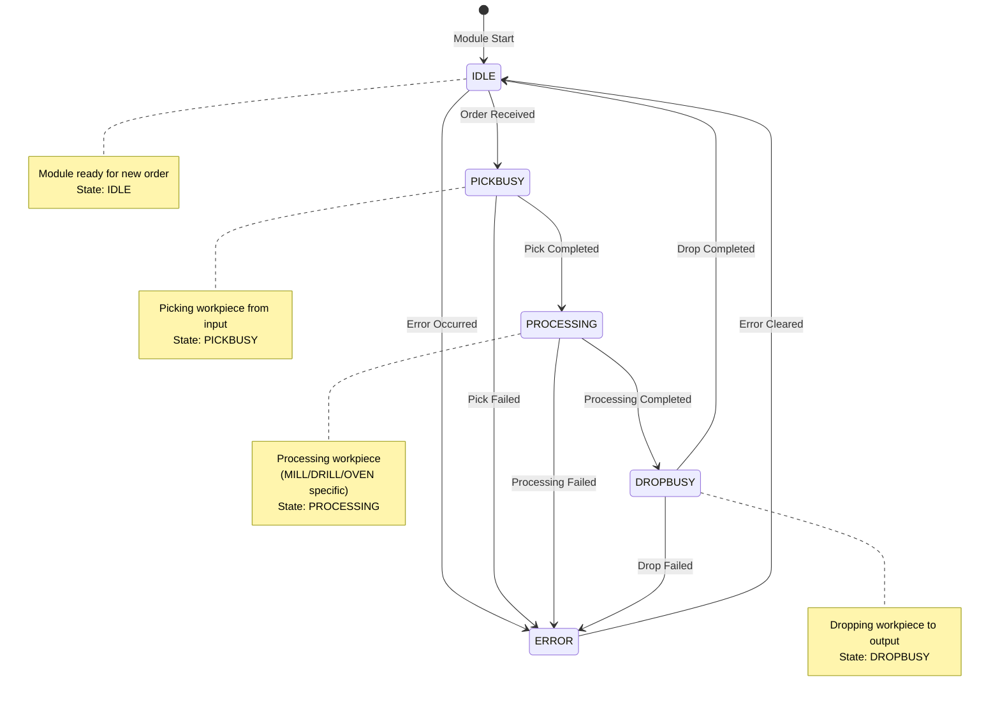

# MQTT Diagrams

⚠️ **WARNUNG**: Diese Dokumentation wurde automatisch erstellt und enthält fehlerbehaftete Angaben. Die Diagramme zur Node-RED und Order-Processing gehören nicht zur MQTT-Dokumentation und sind an anderer Stelle zu beschreiben.

Diese Dokumentation enthält alle wichtigen Mermaid-Diagramme für das MQTT-System der ORBIS Modellfabrik. Die Diagramme zeigen die Architektur, Datenflüsse, Topic-Struktur und Zustandsübergänge des Systems.

## Übersicht der Diagramme

1. **MQTT Flow Diagram** - Systemarchitektur und Datenflüsse
2. **Topic Hierarchy** - MQTT-Topic-Struktur und -Organisation  
3. **Complete Data Flow Diagram** - Sender/Receiver-Pattern
4. **Order Processing Flow** - Sequenzdiagramm für Bestellabwicklung
5. **Node-RED Architecture** - Node-RED Flows und Modul-Architektur
6. **Module State Machine** - Zustandsübergänge der Verarbeitungsmodule

## MQTT Flow Diagram

## Topic Hierarchy

## Complete Data Flow Diagram

Das folgende Diagramm zeigt das Sender/Receiver-Pattern und die vollständigen Datenflüsse im MQTT-System:

## Order Processing Flow

Das folgende Sequenzdiagramm zeigt den Ablauf der Bestellabwicklung im System:

## Node-RED Architecture

Das folgende Diagramm zeigt die Node-RED Architektur mit allen 25 Tabs und Modulen:

```mermaid
graph TB
    subgraph "Node-RED Flows (25 Tabs)"
        subgraph "Processing Modules"
            MILL1[MILL #1<br/>192.168.0.40]
            MILL2[MILL #2<br/>192.168.0.41]
            MILL3[MILL #3<br/>192.168.0.42]
            MILL4[MILL #4<br/>192.168.0.43]
            MILL5[MILL #5<br/>192.168.0.44]
            
            DRILL1[DRILL #1<br/>192.168.0.50]
            DRILL2[DRILL #2<br/>192.168.0.51]
            DRILL3[DRILL #3<br/>192.168.0.52]
            DRILL4[DRILL #4<br/>192.168.0.53]
            DRILL5[DRILL #5<br/>192.168.0.54]
            
            OVEN1[OVEN #1<br/>192.168.0.60]
            OVEN2[OVEN #2<br/>192.168.0.61]
            OVEN3[OVEN #3<br/>192.168.0.62]
            OVEN4[OVEN #4<br/>192.168.0.63]
            OVEN5[OVEN #5<br/>192.168.0.64]
        end
        
        subgraph "Quality & Storage"
            AIQS1[AIQS #1<br/>192.168.0.70]
            AIQS2[AIQS #2<br/>192.168.0.71]
            AIQS3[AIQS #3<br/>192.168.0.72]
            AIQS4[AIQS #4<br/>192.168.0.73]
            AIQS5[AIQS #5<br/>192.168.0.74]
            
            HBW1[HBW #1<br/>192.168.0.80]
            HBW2[HBW #2<br/>192.168.0.81]
            HBW3[HBW #3<br/>192.168.0.82]
        end
        
        subgraph "Distribution"
            DPS[DPS<br/>192.168.0.90]
        end
        
        subgraph "Control"
            INIT[NodeRed Init<br/>Global Control]
        end
    end
    
    subgraph "OPC-UA Servers"
        MILL_OPC[MILL OPC-UA<br/>Port 4840]
        DRILL_OPC[DRILL OPC-UA<br/>Port 4840]
        OVEN_OPC[OVEN OPC-UA<br/>Port 4840]
        AIQS_OPC[AIQS OPC-UA<br/>Port 4840]
        HBW_OPC[HBW OPC-UA<br/>Port 4840]
        DPS_OPC[DPS OPC-UA<br/>Port 4840]
    end
    
    subgraph "MQTT Broker"
        MQTT[Local MQTT<br/>Port 1883/9001]
    end
    
    subgraph "External Systems"
        TXT[TXT Controllers]
        CCU[Central Control Unit]
        FRONTEND[Frontend<br/>Port 80]
    end
    
    %% OPC-UA Connections
    MILL1 -.-> MILL_OPC
    MILL2 -.-> MILL_OPC
    MILL3 -.-> MILL_OPC
    MILL4 -.-> MILL_OPC
    MILL5 -.-> MILL_OPC
    
    DRILL1 -.-> DRILL_OPC
    DRILL2 -.-> DRILL_OPC
    DRILL3 -.-> DRILL_OPC
    DRILL4 -.-> DRILL_OPC
    DRILL5 -.-> DRILL_OPC
    
    OVEN1 -.-> OVEN_OPC
    OVEN2 -.-> OVEN_OPC
    OVEN3 -.-> OVEN_OPC
    OVEN4 -.-> OVEN_OPC
    OVEN5 -.-> OVEN_OPC
    
    AIQS1 -.-> AIQS_OPC
    AIQS2 -.-> AIQS_OPC
    AIQS3 -.-> AIQS_OPC
    AIQS4 -.-> AIQS_OPC
    AIQS5 -.-> AIQS_OPC
    
    HBW1 -.-> HBW_OPC
    HBW2 -.-> HBW_OPC
    HBW3 -.-> HBW_OPC
    
    DPS -.-> DPS_OPC
    
    %% MQTT Connections
    MILL1 --> MQTT
    DRILL1 --> MQTT
    OVEN1 --> MQTT
    AIQS1 --> MQTT
    HBW1 --> MQTT
    DPS --> MQTT
    INIT --> MQTT
    
    %% External Connections
    TXT --> MQTT
    CCU --> MQTT
    FRONTEND --> MQTT
    
    %% Styling
    classDef processing fill:#e1f5fe
    classDef quality fill:#f3e5f5
    classDef storage fill:#e8f5e8
    classDef distribution fill:#fff3e0
    classDef control fill:#ffebee
    
    class MILL1,MILL2,MILL3,MILL4,MILL5,DRILL1,DRILL2,DRILL3,DRILL4,DRILL5,OVEN1,OVEN2,OVEN3,OVEN4,OVEN5 processing
    class AIQS1,AIQS2,AIQS3,AIQS4,AIQS5 quality
    class HBW1,HBW2,HBW3 storage
    class DPS distribution
    class INIT control
```

## Module State Machine

Das folgende State-Diagramm zeigt die Zustandsübergänge der Verarbeitungsmodule:

