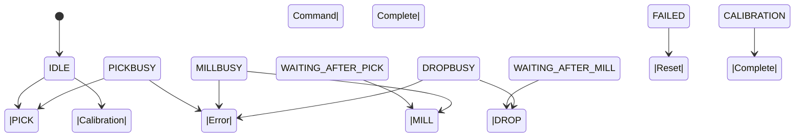
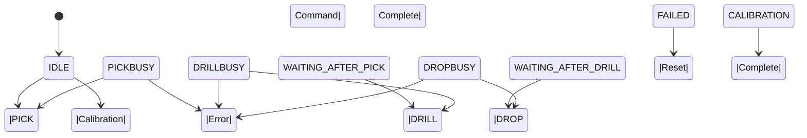
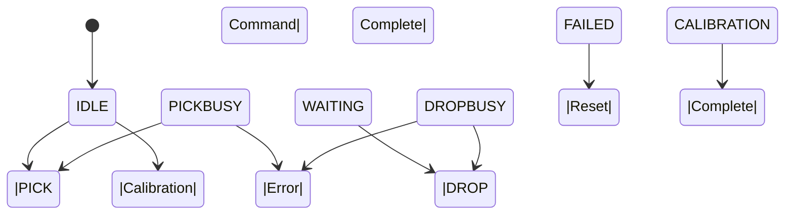
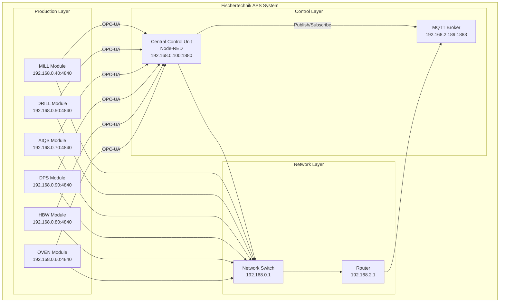
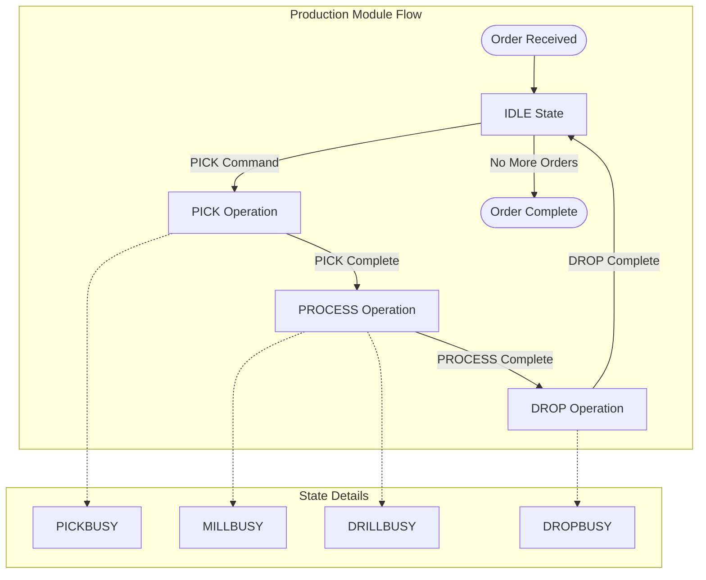
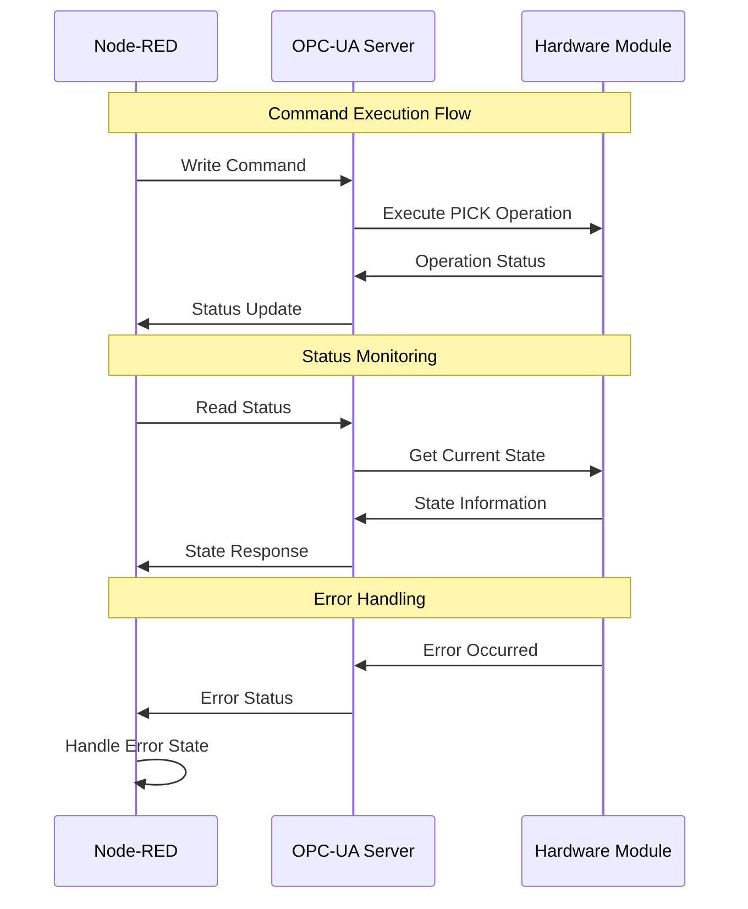
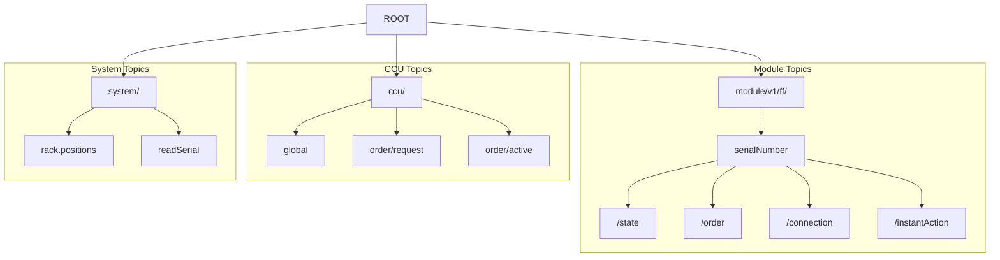

# Diagrams Overview - Fischertechnik APS

## Module Status Transition Diagrams

### MILL Module

### DRILL Module

### AIQS Module

### DPS Module

### HBW Module

### OVEN Module

## System Architecture

## Production Flow

## OPC-UA Communication

## MQTT Topic Hierarchy

