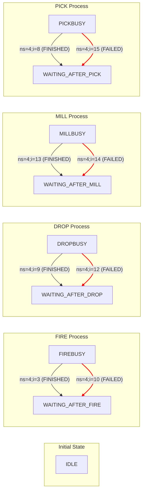
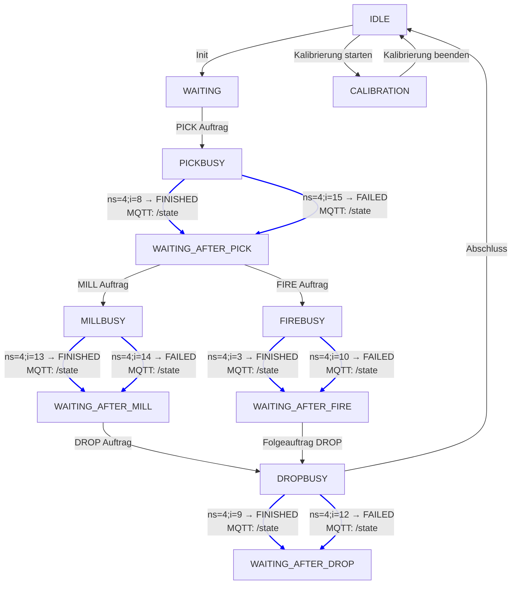

# OPC UA NodeIds

> ⚠️ **VERIFIKATION AUSSTEHEND**: Diese Dokumentation basiert auf einer Hypothese und wurde noch nicht verifiziert. Die beschriebenen OPC UA NodeIds und Zustandsübergänge müssen noch getestet und validiert werden.

Hier ist eine Tabelle mit den relevanten OPC UA NodeIds, die in den vda_status_finished-Funktionen verwendet werden, zusammen mit dem zugehörigen Maschinenzustand und der Bedeutung:

| NodeId | Aktion | Zustand bei Empfang | Ergebnisstatus | Beschreibung |
|--------|--------|---------------------|----------------|--------------|
| ns=4;i=8 | PICK | PICKBUSY | FINISHED | PICK erfolgreich abgeschlossen |
| ns=4;i=15 | PICK | PICKBUSY | FAILED | PICK fehlgeschlagen |
| ns=4;i=13 | MILL | MILLBUSY | FINISHED | MILL erfolgreich abgeschlossen |
| ns=4;i=14 | MILL | MILLBUSY | FAILED | MILL fehlgeschlagen |
| ns=4;i=9 | DROP | DROPBUSY | FINISHED | DROP erfolgreich abgeschlossen |
| ns=4;i=12 | DROP | DROPBUSY | FAILED | DROP fehlgeschlagen |
| ns=4;i=3 | FIRE | FIREBUSY | FINISHED | FIRE erfolgreich abgeschlossen |
| ns=4;i=10 | FIRE | FIREBUSY | FAILED | FIRE fehlgeschlagen |

Diese NodeIds werden in den jeweiligen vda_status_finished-Funktionen geprüft, um den Abschlussstatus einer Aktion zu erkennen und den moduleState sowie den actionState entsprechend zu aktualisieren.

## Zustandsdiagramme

### Einfaches Zustandsdiagramm

Hier ist das visuelle Zustandsdiagramm für die vda_status_finished-Funktionen im Node-RED Flow:

### Erweitertes Zustandsdiagramm mit MQTT-Statusmeldungen

## Erläuterung

Jeder Übergang basiert auf einem spezifischen OPC UA NodeId.
- Schwarze Pfeile zeigen erfolgreiche Übergänge (FINISHED).
- Rote Pfeile markieren Fehlerpfade (FAILED).
- Die Zustände wie PICKBUSY, MILLBUSY, DROPBUSY, FIREBUSY gehen jeweils in einen „WAITING_AFTER*"-Zustand über.

## Statusübergänge für actionState

Die Datei beschreibt eine Reihe von Statusübergängen für actionState innerhalb eines automatisierten Prozesses, der mit OPC UA (Open Platform Communications Unified Architecture) kommuniziert. Hier ist eine strukturierte Übersicht der wichtigsten Übergänge und Bedingungen:

### Allgemeine Struktur

Ein actionState enthält ein command (z. B. "PICK", "DROP", "MILL", "FIRE") und einen state (z. B. "FINISHED", "FAILED"). Die Übergänge hängen vom aktuellen moduleState ab, der den Zustand des Moduls beschreibt.

### Statusübergänge im Detail

#### 1. PICK

**Bedingung:** actionState.command == "PICK" und moduleState == "WAITING_AFTER_DROP"

**Aktion:**
- moduleState wird auf "PICKBUSY" gesetzt.
- OPC UA schreibt true auf Node ns=4;i=5.

#### 2. DROP

**Bedingung 1:** actionState.command == "DROP" und moduleState == "WAITING_AFTER_MILL"
**Bedingung 2:** actionState.command == "DROP" und moduleState == "WAITING_AFTER_FIRE"

**Aktion:**
- moduleState wird auf "DROPBUSY" gesetzt.
- OPC UA schreibt true auf Node ns=4;i=6.

#### 3. MILL

**Bedingung:** actionState.command == "MILL" und moduleState == "WAITING_AFTER_PICK"

**Aktion:**
- moduleState wird auf "MILLBUSY" gesetzt.
- Dauer wird aus metadata.duration gelesen (Standard: 2).
- OPC UA schreibt true und duration auf Nodes ns=4;i=4 und ns=4;i=11.

#### 4. FIRE

**Bedingung:** actionState.command == "FIRE" und moduleState == "WAITING_AFTER_PICK"

**Aktion:**
- moduleState wird auf "FIREBUSY" gesetzt.
- Dauer wird aus metadata.duration gelesen (Standard: 2).
- OPC UA schreibt true und duration auf Nodes ns=4;i=6 und ns=4;i=7.

### Erfolgreicher Abschluss

Wenn z. B. moduleState == "FIREBUSY" und ein bestimmter Node true meldet:
- moduleState → "WAITING_AFTER_FIRE"
- actionState.state → "FINISHED"
- state wird mit Zeitstempel, headerId, orderId, orderUpdateId, loads, errors aktualisiert.

### Fehlerfall

Wenn ein command nicht unterstützt wird oder Bedingungen nicht erfüllt sind:
- actionState.state → "FAILED"
- Fehlerobjekt wird im Flow gespeichert.
- state wird mit Fehlern und Zeitstempel aktualisiert.

### Zusätzliche Informationen

- actionState wird im Flow gespeichert.
- loads werden mit Typ und Dauer aktualisiert.
- orderUpdateId wird aktualisiert.
- MQTT-Nachrichten werden mit dem neuen state versendet.