# Chat-A: MQTT-Diagramme aktualisiert - Logische Komponenten-Namen
**Datum:** 24.09.2025  
**Chat:** Chat-A (Architektur & Dokumentation)  
**Status:** 🔄 In Bearbeitung

## 🎯 **Ziel:**
MQTT-Diagramme mit logischen Komponenten-Namen aktualisieren (nicht Client-IDs/IP-Adressen)

## 📋 **Logische Komponenten-Namen (basierend auf Mosquitto-Analyse):**

### **Client-ID → Logischer Name Mapping:**
- **`mqttjs_bba12050`** → **"APS Dashboard Frontend"** (UI-Interaktionen)
- **`mqttjs_8e5c7d5a`** → **"APS Dashboard Frontend (Alt)"** (Initiale Verbindung)
- **`nodered_abe9e421b6fe3efd`** → **"Node-RED (SUB)"** (Monitoring/Subscriber)
- **`nodered_94dca81c69366ec4`** → **"Node-RED (PUB)"** (Command/Publisher)
- **`auto-AC941349`** → **"DPS TXT Controller"** (Hardware-Interface)
- **`auto-B9109AD9`** → **"AIQS TXT Controller"** (Quality Control)
- **`auto-9BD9E2A9`** → **"AIQS TXT Controller (Alt)"** (Alternative Instanz)
- **`auto-F6DFC829`** → **"FTS TXT Controller"** (Transport System)
- **`auto-26CCDA7B`** → **"Test Client"** (Debug/Testing)
- **`auto-7AEBFF7F`** → **"Test Client (Alt)"** (Debug/Testing)
- **`auto-AF5C15BD`** → **"Test Client (MacBook)"** (User-Debug)
- **`auto-AC6F2CEE`** → **"Test Client (MacBook Alt)"** (User-Debug)

### **IP-Adressen → Logische Standorte:**
- **`172.18.0.5`** → **"Docker Network (Frontend)"**
- **`172.18.0.4`** → **"Docker Network (Node-RED)"**
- **`192.168.0.102`** → **"DPS Station"**
- **`192.168.0.103`** → **"AIQS Station"**
- **`192.168.0.104`** → **"AIQS Station (Alt)"**
- **`192.168.0.105`** → **"FTS Station"**
- **`192.168.0.106`** → **"User Workstation"**
- **`127.0.0.1`** → **"Localhost (Testing)"**

## 🔄 **Aktualisierte MQTT-Diagramme:**

### **Phase 0: Reines APS-Fischertechnik System (Analyse-Zeitraum)**

```mermaid
sequenceDiagram
    participant APS_FRONTEND as APS Dashboard Frontend
    participant MQTT_BROKER as MQTT Broker
    participant NODERED_SUB as Node-RED (SUB)
    participant NODERED_PUB as Node-RED (PUB)
    participant DPS_TXT as DPS TXT Controller
    participant AIQS_TXT as AIQS TXT Controller
    participant FTS_TXT as FTS TXT Controller
    participant TEST_CLIENT as Test Client
    
    Note over APS_FRONTEND,TEST_CLIENT: Phase 0: Reines APS-System<br/>🔸 Hellgrau: Fischertechnik-Komponenten<br/>🔸 Gelb: TXT-Controller (unverändert)
    
    %% Initiale Verbindungen
    APS_FRONTEND->>MQTT_BROKER: Connect (QoS 2)
    NODERED_SUB->>MQTT_BROKER: Connect (QoS 2)
    NODERED_PUB->>MQTT_BROKER: Connect (QoS 2)
    DPS_TXT->>MQTT_BROKER: Connect (QoS 1)
    AIQS_TXT->>MQTT_BROKER: Connect (QoS 1)
    FTS_TXT->>MQTT_BROKER: Connect (QoS 1)
    
    %% Will Messages
    FTS_TXT->>MQTT_BROKER: Will Message: fts/v1/ff/5iO4/connection
    AIQS_TXT->>MQTT_BROKER: Will Message: module/v1/ff/NodeRed/SVR4H76530/connection
    DPS_TXT->>MQTT_BROKER: Will Message: module/v1/ff/NodeRed/SVR4H73275/connection
    
    %% UI-Interaktionen (16:25:37)
    APS_FRONTEND->>MQTT_BROKER: ccu/set/reset (QoS 2, r0)
    APS_FRONTEND->>MQTT_BROKER: ccu/global (QoS 2, r0)
    APS_FRONTEND->>MQTT_BROKER: ccu/order/completed (QoS 2, r1)
    
    %% Node-RED Processing
    MQTT_BROKER->>NODERED_SUB: Route Commands
    NODERED_PUB->>MQTT_BROKER: Module Commands (QoS 2, r0)
    
    %% TXT-Controller Responses
    DPS_TXT->>MQTT_BROKER: /j1/txt/1/i/cam (QoS 1, r0/r1) - 7351x
    AIQS_TXT->>MQTT_BROKER: /j1/txt/1/i/bme680 (QoS 1, r0) - 65x
    FTS_TXT->>MQTT_BROKER: fts/v1/ff/5iO4/state (QoS 2, r0) - 37x
    
    %% Test-Phase (16:42-16:43)
    TEST_CLIENT->>MQTT_BROKER: test/topic (QoS 0, r0)
    TEST_CLIENT->>MQTT_BROKER: test/topic3 (QoS 0, r0)
```

### **Phase 1: APS-Integration in OMF Dashboard (Ziel)**

```mermaid
sequenceDiagram
    participant OMF_DASHBOARD as OMF Dashboard
    participant MQTT_BROKER as MQTT Broker
    participant NODERED_SUB as Node-RED (SUB)
    participant NODERED_PUB as Node-RED (PUB)
    participant DPS_TXT as DPS TXT Controller
    participant AIQS_TXT as AIQS TXT Controller
    participant FTS_TXT as FTS TXT Controller
    participant SESSION_MGR as Session Manager
    
    Note over OMF_DASHBOARD,SESSION_MGR: Phase 1: OMF-Integration<br/>🔸 Hellblau: OMF-Komponenten<br/>🔸 Gelb: TXT-Controller (unverändert)
    
    %% OMF Dashboard Integration
    OMF_DASHBOARD->>MQTT_BROKER: Registry-based Commands (QoS 1, r0)
    SESSION_MGR->>MQTT_BROKER: Replay Messages (QoS 1, r0)
    
    %% Node-RED Processing (unverändert)
    MQTT_BROKER->>NODERED_SUB: Route Commands
    NODERED_PUB->>MQTT_BROKER: Module Commands (QoS 2, r0)
    
    %% TXT-Controller Responses (unverändert)
    DPS_TXT->>MQTT_BROKER: /j1/txt/1/i/cam (QoS 1, r0/r1)
    AIQS_TXT->>MQTT_BROKER: /j1/txt/1/i/bme680 (QoS 1, r0)
    FTS_TXT->>MQTT_BROKER: fts/v1/ff/5iO4/state (QoS 2, r0)
    
    %% OMF Dashboard Updates
    MQTT_BROKER->>OMF_DASHBOARD: State Updates (QoS 1, r0)
    MQTT_BROKER->>SESSION_MGR: Record Messages (QoS 1, r0)
```

## 📊 **QoS-Patterns (basierend auf Mosquitto-Analyse):**

### **System-Befehle (QoS 2):**
- **`ccu/set/reset`** - Factory Reset
- **`ccu/global`** - Global Reset
- **`module/v1/ff/+/instantAction`** - Module Commands

### **Status-Updates (QoS 1):**
- **`ccu/order/completed`** - Order Completion
- **`/j1/txt/1/i/cam`** - Camera Data (kontinuierlich)
- **`/j1/txt/1/i/bme680`** - BME680 Sensor Data
- **`/j1/txt/1/i/ldr`** - LDR Sensor Data

### **Test-Nachrichten (QoS 0):**
- **`test/topic`** - Debug Messages
- **`test/topic3`** - Debug Messages

## 🔗 **Legende - Technische Details:**

### **Client-IDs (für Debugging):**
- **APS Dashboard Frontend:** `mqttjs_bba12050`, `mqttjs_8e5c7d5a`
- **Node-RED (SUB):** `nodered_abe9e421b6fe3efd`
- **Node-RED (PUB):** `nodered_94dca81c69366ec4`
- **DPS TXT Controller:** `auto-AC941349`
- **AIQS TXT Controller:** `auto-B9109AD9`, `auto-9BD9E2A9`
- **FTS TXT Controller:** `auto-F6DFC829`

### **IP-Adressen (für Netzwerk-Debugging):**
- **Docker Network:** `172.18.0.4-5`
- **APS Stations:** `192.168.0.102-105`
- **User Workstation:** `192.168.0.106`
- **Localhost Testing:** `127.0.0.1`

### **Will Messages (für Verbindungs-Status):**
- **FTS TXT Controller:** `fts/v1/ff/5iO4/connection` (212 bytes, q1, r1)
- **AIQS TXT Controller:** `module/v1/ff/NodeRed/SVR4H76530/connection` (184 bytes, q1, r1)
- **DPS TXT Controller:** `module/v1/ff/NodeRed/SVR4H73275/connection` (208 bytes, q1, r1)

## 🎯 **Nächste Schritte:**
1. **Diagramme in zentrale Bibliothek** migrieren
2. **Alte Diagramme** mit neuen vergleichen
3. **User-Review** der logischen Namen
4. **Finale Integration** in Architektur-Dokumentation

---
**Status:** 🔄 **Logische Komponenten-Namen definiert** - MQTT-Diagramme aktualisiert
