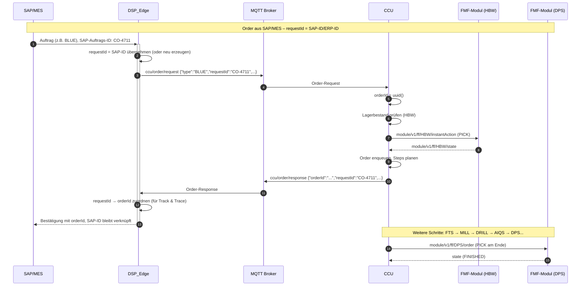
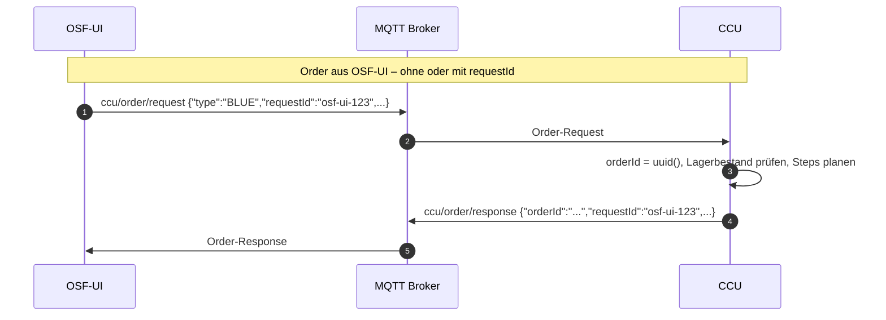
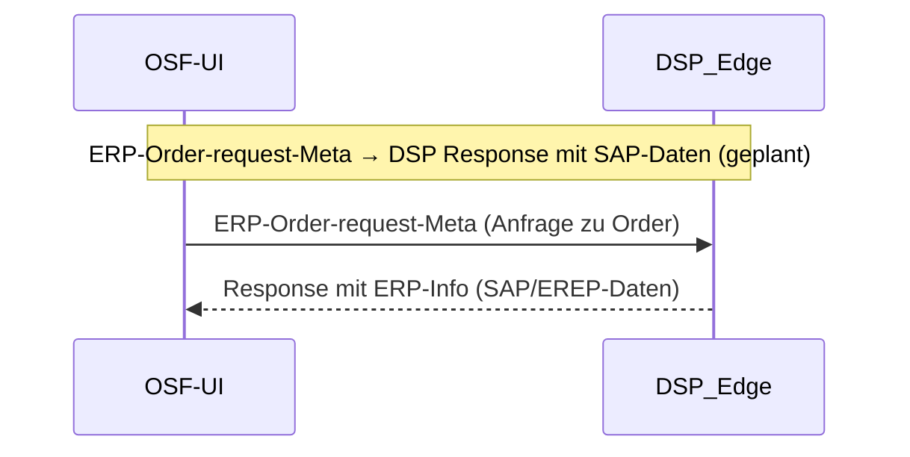

# Order-Request: Erweiterung um requestId

**Datum:** 2026-02-25  
**Kontext:** Sprint 16 – ERP/MES Integration  
**Quelle:** CCU-Änderungen in `integrations/APS-CCU/`

---

## 1. Was

Die Nachrichten-Struktur von **Order-Request** und **Order-Response** wurde um ein optionales Attribut **`requestId`** erweitert.

- **Request:** Jeder, der eine Order anfordert (OSF-UI, DSP_Edge, ERP/MES), kann `requestId` als optionales Attribut mitschicken.
- **Response:** Die CCU gibt die `requestId` in der Response zurück und verknüpft sie mit der internen `orderId`.

**Zweck:** Korrelation von Request und Response – z.B. ERP-System sendet Order mit eigener Customer-Order-ID als `requestId`, CCU bestätigt mit `orderId` und `requestId`, sodass das ERP-System die Zuordnung herstellen kann.

---

## 2. Wozu

- **ERP/MES-Integration:** Externe Systeme können ihre Auftrags-ID durch die gesamte Kette durchreichen.
- **Track & Trace:** Verknüpfung zwischen Kundennummer / SAP-Auftrag und interner Produktions-Order.
- **DSP_Edge:** Kann Request-Response-Paare zuverlässig zuordnen.
- **Rückwärtskompatibel:** Fehlt `requestId`, verhält sich alles wie bisher.

---

## 3. Wie

### 3.1 Format requestId

| Aspekt | Vorgabe |
|--------|---------|
| **Typ** | Beliebiger String |
| **Länge** | Beliebig |
| **Eindeutigkeit** | Nicht vom CCU garantiert – der **Requestor** muss seine `requestId` selbst eindeutig halten |
| **Beispiele** | `"dsp-edge-123"`, `"SAP-CO-4711"`, `"order-test-request-001"`, UUID |

### 3.2 Nachrichten-Struktur

**Order-Request** (`ccu/order/request`):
```json
{
  "type": "BLUE",
  "timestamp": "2026-02-24T10:15:00.000Z",
  "orderType": "PRODUCTION",
  "requestId": "dsp-edge-4711"
}
```

**Order-Response** (`ccu/order/response`):
```json
{
  "orderType": "PRODUCTION",
  "type": "BLUE",
  "timestamp": "2026-02-24T10:15:00.000Z",
  "orderId": "bbf1733d-c98d-4b7e-9f03-f1119978825f",
  "requestId": "dsp-edge-4711",
  "productionSteps": [...],
  "state": "IN_PROGRESS",
  ...
}
```

### 3.3 Betroffene Dateien

| Datei | Änderung |
|-------|----------|
| `common/protocol/ccu.ts` | `OrderRequest`, `OrderResponse`: optionales `requestId?: string` |
| `central-control/.../order/index.ts` | `sendResponse`: `requestId` aus Request in Response übernehmen |

---

## 4. Sequenzdiagramm

### 4.1 Pfad A: Order aus SAP/MES (ERP-Kontext)

Die Order wird logisch von SAP/MES ausgelöst. SAP/MES übergibt eine SAP-ID oder ERP-ID. DSP_Edge verwendet diese als `requestId` (oder erzeugt eine neue, falls keine übergeben wird).



### 4.2 Pfad B: Order aus OSF-UI (ohne SAP-Kontext)

OSF-UI kann ebenfalls eine Order auslösen – z.B. manuell oder in einer Testumgebung. Auch hier kann eine optionale `requestId` mitgegeben werden.



*Hinweis:* OSF-UI empfängt die Order-Response über MQTT. Da die OSF-UI im Browser läuft, nutzt sie **MQTT over WebSocket** (Port 9001) zum Broker – der Browser kann keine direkte TCP-Verbindung aufbauen. Es ist dieselbe MQTT-Nachricht; WebSocket ist nur der Transport.

### 4.3 Erweiterung 2 (geplant, ohne CCU-Beteiligung)

OSF-UI stellt eine Anfrage an DSP_Edge und erhält ERP-Info zur Order (Track & Trace mit SAP/EREP-Daten). Kein CCU-involviert.



---

## 5. Beteiligte Systeme

| System | Rolle |
|--------|-------|
| **SAP/MES** | Löst Order aus, übergibt SAP-ID/ERP-ID an DSP_Edge |
| **OSF-UI** | Dashboard; kann Order auslösen (ohne SAP-Kontext) oder ERP-Info anfragen |
| **DSP_Edge** | Vermittler zwischen SAP/ERP und Fabrik; setzt requestId (SAP-ID oder eigene) |
| **CCU** | Order-Handler, setzt orderId, gibt requestId in Response zurück |
| **FMF-Module** (HBW, DPS, MILL, …) | Führen Schritte aus, melden State über MQTT |
| **MQTT Broker** | Transport für ccu/order/request und ccu/order/response |

---

## 6. Test

```bash
./scripts/run-order-test.sh
```

Der Python-Test sendet eine Order mit `requestId: "order-test-request-001"` und prüft, ob die Response dieselbe `requestId` enthält.

---

## 7. OSF-UI-Erweiterung (geplant)

Die OSF-UI muss den optionalen Parameter `requestId` beim Senden einer Order unterstützen.

### Empfehlung: Automatisch erzeugen (keine manuelle Eingabe)

| Variante | Beschreibung | Bewertung |
|----------|--------------|-----------|
| **Manuelle Eingabe** | Popup/Feld für requestId beim Order-Auslösen | ❌ Kein Mehrwert: Nutzer würde zufällig tippen, keine Korrelation zu externem System |
| **Auto-generieren** | `OSF-UI_<UUID>` z.B. `OSF-UI_a1b2c3d4-...` | ✅ Empfohlen |

**Begründung:**
- OSF-UI-Orders sind in der Regel manuelle/ad-hoc Aufträge – kein SAP-Kontext.
- `requestId` ist sinnvoll, wenn ein externes System (SAP/MES) seine eigene ID mitschickt.
- Bei OSF-UI: Auto-generierte ID ermöglicht optionale Traceability (Logs, Debugging: welche Order kam von welchem Aufruf).
- Keine UI-Komplexität, keine Eingabefehler, konsistentes Format.

**Umsetzung:** In `sendCustomerOrder` (osf/libs/business) bei jedem Aufruf `requestId: \`OSF-UI_${uuid()}\`` zum Payload hinzufügen. Keine API- oder UI-Änderung nötig.

---

## 8. Referenzen

- [ccu-modification-and-deployment-analysis.md](./ccu-modification-and-deployment-analysis.md) – CCU-Anpassungen, Deployment
- [Sprint 16](../sprints/sprint_16.md) – ERP/MES Integration Task
