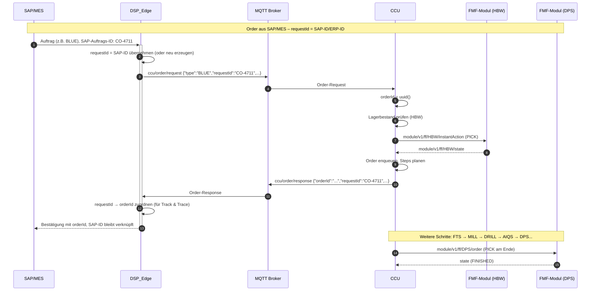
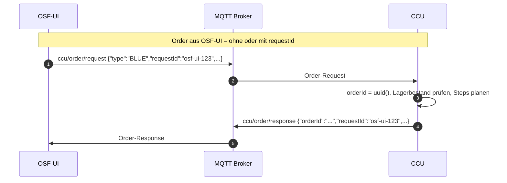
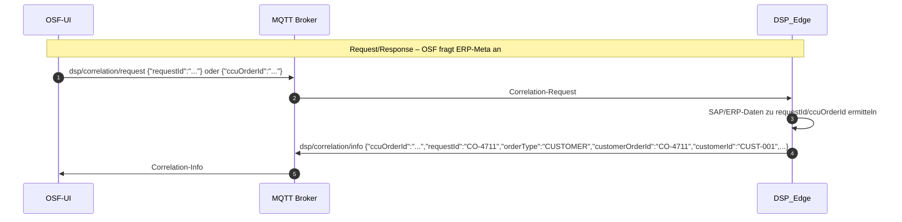
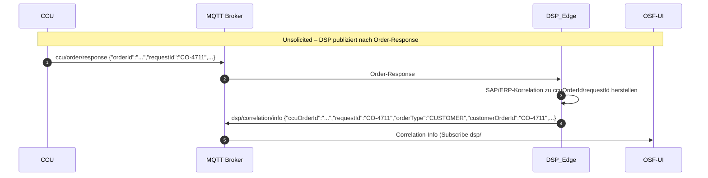

# Order-Request: Erweiterung um requestId

**Datum:** 2026-02-25  
**Kontext:** Sprint 16 – ERP/MES Integration  
**Quelle:** CCU-Änderungen in `integrations/APS-CCU/`

---

## 1. Was

Die Nachrichten-Struktur von **Order-Request** und **Order-Response** wurde um ein optionales Attribut **`requestId`** erweitert.

- **Request:** Jeder, der eine Order anfordert (OSF-UI, DSP_Edge, ERP/MES), kann `requestId` als optionales Attribut mitschicken.
- **Response:** Die CCU gibt die `requestId` in der Response zurück und verknüpft sie mit der internen `orderId`.

**Zweck:** Korrelation von Request und Response – z.B. ERP-System sendet Order mit eigener Customer-Order-ID als `requestId`, CCU bestätigt mit `orderId` und `requestId`, sodass das ERP-System die Zuordnung herstellen kann.

---

## 2. Wozu

- **ERP/MES-Integration:** Externe Systeme können ihre Auftrags-ID durch die gesamte Kette durchreichen.
- **Track & Trace:** Verknüpfung zwischen Kundennummer / SAP-Auftrag und interner Produktions-Order.
- **DSP_Edge:** Kann Request-Response-Paare zuverlässig zuordnen.
- **Rückwärtskompatibel:** Fehlt `requestId`, verhält sich alles wie bisher.

---

## 3. Wie

### 3.1 Format requestId

| Aspekt | Vorgabe |
|--------|---------|
| **Typ** | Beliebiger String |
| **Länge** | Beliebig |
| **Eindeutigkeit** | Nicht vom CCU garantiert – der **Requestor** muss seine `requestId` selbst eindeutig halten |
| **Beispiele** | `"dsp-edge-123"`, `"SAP-CO-4711"`, `"order-test-request-001"`, UUID |

### 3.2 Nachrichten-Struktur

**Order-Request** (`ccu/order/request`):
```json
{
  "type": "BLUE",
  "timestamp": "2026-02-24T10:15:00.000Z",
  "orderType": "PRODUCTION",
  "requestId": "dsp-edge-4711"
}
```

**Order-Response** (`ccu/order/response`):
```json
{
  "orderType": "PRODUCTION",
  "type": "BLUE",
  "timestamp": "2026-02-24T10:15:00.000Z",
  "orderId": "bbf1733d-c98d-4b7e-9f03-f1119978825f",
  "requestId": "dsp-edge-4711",
  "productionSteps": [...],
  "state": "IN_PROGRESS",
  ...
}
```

### 3.3 Betroffene Dateien

| Datei | Änderung |
|-------|----------|
| `common/protocol/ccu.ts` | `OrderRequest`, `OrderResponse`: optionales `requestId?: string` |
| `central-control/.../order/index.ts` | `sendResponse`: `requestId` aus Request in Response übernehmen |

---

## 4. Sequenzdiagramm

### 4.1 Pfad A: Order aus SAP/MES (ERP-Kontext)

Die Order wird logisch von SAP/MES ausgelöst. SAP/MES übergibt eine SAP-ID oder ERP-ID. DSP_Edge verwendet diese als `requestId` (oder erzeugt eine neue, falls keine übergeben wird).



### 4.2 Pfad B: Order aus OSF-UI (ohne SAP-Kontext)

OSF-UI kann ebenfalls eine Order auslösen – z.B. manuell oder in einer Testumgebung. Auch hier kann eine optionale `requestId` mitgegeben werden.



*Hinweis:* OSF-UI empfängt die Order-Response über MQTT. Da die OSF-UI im Browser läuft, nutzt sie **MQTT over WebSocket** (Port 9001) zum Broker – der Browser kann keine direkte TCP-Verbindung aufbauen. Es ist dieselbe MQTT-Nachricht; WebSocket ist nur der Transport.

### 4.3 Erweiterung 2: Correlation-Info (ohne CCU-Beteiligung)

OSF-UI erhält ERP-Info zur Order (Track & Trace mit SAP/EREP-Daten) von DSP_Edge. **Kein CCU-involviert.**

**Topics (C1, analog zu `dsp/drill/action`):**

| Topic | Publisher | Subscriber | Zweck |
|-------|-----------|------------|-------|
| `dsp/correlation/request` | OSF-UI | DSP_Edge | Anfrage nach ERP-Meta zu Order (Pfad 1) |
| `dsp/correlation/info` | DSP_Edge | OSF-UI | ERP-Korrelationsdaten (SAP CO-ID, Kunde, …) |

**Synonym:** `dsp/correlation/request` = ERP-Order-request-Meta (alte Bezeichnung).

#### Nachrichtenstruktur (Vorschlag)

**Request** (`dsp/correlation/request`): Mindestens einer der Schlüssel erforderlich.

| Feld | Typ | Pflicht | Beschreibung |
|------|-----|---------|---------------|
| `requestId` | string | optional | Korrelations-ID aus dem ursprünglichen Order-Request (OSF-UI, SAP-CO-ID, …) |
| `ccuOrderId` | string | optional | CCU-Produktions-Auftrags-ID (UUID aus `ccu/order/response`) |

*Regel:* Mindestens `requestId` oder `ccuOrderId` muss gesetzt sein. `ccuOrderId` statt `orderId`, um Verwechslung mit SAP-Order-ID zu vermeiden.

**Info** (`dsp/correlation/info`): An Track & Trace / ErpInfoBox angelehnt (`CustomerOrderData`, `PurchaseOrderData`).

| Feld | Typ | Pflicht | Beschreibung |
|------|-----|---------|---------------|
| `requestId` | string | optional | Echo aus Order-Request (Korrelationsschlüssel) |
| `ccuOrderId` | string | optional | CCU-Auftrags-ID (Korrelationsschlüssel) |
| `orderType` | `"CUSTOMER"` \| `"PURCHASE"` | ja | CUSTOMER = Produktionsauftrag, PURCHASE = Rohmaterial/Lagerauftrag |
| `timestamp` | string | optional | ISO-Zeitstempel (wann publiziert) |
| **Bei orderType CUSTOMER** | | | |
| `customerOrderId` | string | optional | SAP/ERP Kundenauftrags-ID (z.B. CO-4711, ERP-CO-…) |
| `customerId` | string | optional | Kunden-ID |
| `orderDate` | string | optional | Bestelldatum (ISO) |
| `orderAmount` | number | optional | Bestellmenge |
| `plannedDeliveryDate` | string | optional | Geplantes Lieferdatum (ISO) |
| **Bei orderType PURCHASE** | | | |
| `purchaseOrderId` | string | optional | SAP/ERP Bestellnummer (z.B. ERP-PO-…) |
| `supplierId` | string | optional | Lieferanten-ID |
| `orderDate` | string | optional | Bestelldatum (ISO) |
| `orderAmount` | number | optional | Bestellmenge |
| `plannedDeliveryDate` | string | optional | Geplantes Lieferdatum (ISO) |
| **Optional** | | | |
| `workpieceType` | string | optional | BLUE, WHITE, RED – für schnelleres UI-Mapping |

*Hinweis:* Struktur noch nicht final. Orientierung an `CustomerOrderData`/`PurchaseOrderData` (ErpInfoBox) und `OrderContext` (workpiece-history.service).

**Beispiel Request** (OSF kennt nur ccuOrderId):
```json
{"ccuOrderId":"bbf1733d-c98d-4b7e-9f03-f1119978825f"}
```

**Beispiel Request** (OSF kennt requestId):
```json
{"requestId":"OSF-UI_a1b2c3d4-e5f6-4789-ab12-cdef12345678"}
```

**Beispiel Info** (Produktionsauftrag):
```json
{
  "ccuOrderId": "bbf1733d-c98d-4b7e-9f03-f1119978825f",
  "requestId": "CO-4711",
  "orderType": "CUSTOMER",
  "customerOrderId": "CO-4711",
  "customerId": "CUST-001",
  "orderDate": "2026-02-24T08:00:00.000Z",
  "orderAmount": 1,
  "plannedDeliveryDate": "2026-03-01T12:00:00.000Z",
  "timestamp": "2026-02-24T10:16:00.000Z"
}
```

#### Pfad 1: Request/Response (OSF fragt an)

OSF-UI sendet eine Anfrage an DSP_Edge; DSP antwortet mit ERP-Korrelationsdaten.



#### Pfad 2: Unsolicited (DSP publiziert zeitlich nach Order-Response)

DSP_Edge publiziert `dsp/correlation/info` unaufgefordert, zeitlich nach `ccu/order/response`. OSF-UI subscribet `dsp/#` und empfängt die Info.



*Hinweis:* Nachrichtenstruktur ist Vorschlag (siehe Tabellen oben) und kann noch angepasst werden.

---

## 5. Beteiligte Systeme

| System | Rolle |
|--------|-------|
| **SAP/MES** | Löst Order aus, übergibt SAP-ID/ERP-ID an DSP_Edge |
| **OSF-UI** | Dashboard; kann Order auslösen, ERP-Info anfragen (Pfad 1) oder unsolicited empfangen (Pfad 2) |
| **DSP_Edge** | Vermittler zwischen SAP/ERP und Fabrik; setzt requestId; publiziert/antwortet `dsp/correlation/info` |
| **CCU** | Order-Handler, setzt orderId, gibt requestId in Response zurück |
| **FMF-Module** (HBW, DPS, MILL, …) | Führen Schritte aus, melden State über MQTT |
| **MQTT Broker** | Transport für `ccu/order/*`, `dsp/correlation/request`, `dsp/correlation/info` |

---

## 6. Test

### 6.1 Order-Test (CCU requestId-Roundtrip)

```bash
./scripts/run-order-test.sh
```

Der Python-Test sendet eine Order mit `requestId: "order-test-request-001"` und prüft, ob die Response dieselbe `requestId` enthält.

### 6.2 Correlation-Test (dsp/correlation/info)

Simuliert die DSP-Antwort, damit OSF-UI die ERP-Info anzeigen kann (ohne echten DSP):

```bash
./scripts/run-correlation-test.sh                    # Order-Test + Correlation (volle Abfolge)
./scripts/run-correlation-test.sh <orderId>           # Nur dsp/correlation/info für bestehende orderId
```

**Voraussetzung:** Mosquitto auf localhost (TCP 1883 + WebSocket 9001). OSF-UI in Replay- oder Live-Modus.  
**Ergebnis:** ERP-Info erscheint in Order-Tab (Order-Cards) und Track & Trace.

### 6.3 Troubleshooting: OSF zeigt keine Orders / keine Correlation-Info

| Prüfpunkt | Beschreibung |
|-----------|--------------|
| **1. Environment** | OSF muss auf **Replay** (oder Live) stehen – **nicht Mock**. Mock verbindet nicht mit MQTT. |
| **2. Connection Status** | In der Sidebar muss „Verbunden“ (grüner Status) angezeigt werden. Bei „Getrennt“ → Connect drücken oder Replay neu wählen. |
| **3. Mosquitto WebSocket** | OSF (Browser) nutzt **Port 9001** (WebSocket). Mosquitto muss `listener 9001` mit `protocol websockets` haben. Projekt-Config: `docs/04-howto/setup/mosquitto/mosquitto.conf.local-simple`. |
| **4. Reihenfolge** | **OSF zuerst verbinden**, dann Test ausführen. Oder: `./run-correlation-test.sh` (ohne orderId) führt Order-Test + Correlation aus – CCU muss laufen. |
| **5. CCU für Orders** | Orders kommen von der CCU (`ccu/order/active`). Bei `./run-correlation-test.sh <orderId>` ohne vorherige Order: Keine Order-Card, weil die orderId nie auf `ccu/order/active` erschien. |
| **6. Browser-Console** | DevTools → Console: Nach `[connection] Subscribed to: ccu/order/#` und `[connection] Subscribed to: dsp/#` suchen. Fehlermeldungen prüfen. |

---

## 7. OSF-UI-Erweiterung (bereits umgesetzt)

Die OSF-UI unterstützt den optionalen Parameter `requestId` beim Senden einer Order.

### Umsetzung: Automatisch erzeugen (keine manuelle Eingabe)

| Variante | Beschreibung | Bewertung |
|----------|--------------|-----------|
| **Manuelle Eingabe** | Popup/Feld für requestId beim Order-Auslösen | ❌ Kein Mehrwert: Nutzer würde zufällig tippen, keine Korrelation zu externem System |
| **Auto-generieren** | `OSF-UI_<UUID>` z.B. `OSF-UI_a1b2c3d4-...` | ✅ Empfohlen |

**Begründung:**
- OSF-UI-Orders sind in der Regel manuelle/ad-hoc Aufträge – kein SAP-Kontext.
- `requestId` ist sinnvoll, wenn ein externes System (SAP/MES) seine eigene ID mitschickt.
- Bei OSF-UI: Auto-generierte ID ermöglicht optionale Traceability (Logs, Debugging: welche Order kam von welchem Aufruf).
- Keine UI-Komplexität, keine Eingabefehler, konsistentes Format.

**Umsetzung:** In `sendCustomerOrder` (osf/libs/business) wird bei jedem Aufruf automatisch `requestId: \`OSF-UI_${uuid()}\`` zum Payload hinzugefügt. Keine API- oder UI-Änderung nötig. Unit-Tests in `publish-commands.spec.ts`.

---

## 8. ERP-Datenquelle: CorrelationInfoService + ErpOrderDataService (Fallback)

### 8.1 Architektur

Die ERP-Korrelationsdaten (Customer Order, Purchase Order) werden in OSF-UI an zwei Stellen angezeigt:

| Anzeige | Quelle (Priorität) |
|---------|--------------------|
| **Order-Tab** (Order-Cards) | `CorrelationInfoService` (dsp/correlation/info) |
| **Track & Trace** (Order Context) | `CorrelationInfoService` primär, `ErpOrderDataService` als Fallback |

### 8.2 CorrelationInfoService (primär)

- **Quelle:** MQTT-Topic `dsp/correlation/info` (DSP_Edge publiziert, Unsolicited oder als Response auf `dsp/correlation/request`)
- **Speicherung:** Nach `ccuOrderId` bzw. `requestId` indexiert
- **Einsatz:** Order-Tab (Order-Cards), Track & Trace (WorkpieceHistoryService)

### 8.3 ErpOrderDataService (Fallback, Übergangszeit)

- **Herkunft:** Temporärer Workaround; speichert ERP-Daten beim Ausführen von Orders im Process-Tab (generierte Mock-Daten)
- **Einsatz:** Nur als Fallback in Track & Trace, wenn für eine Order noch keine Correlation-Info von DSP vorliegt
- **Ziel:** Nach Anpassung des DSP und regulärem Versand von `dsp/correlation/info` entfällt die Notwendigkeit; für die Übergangszeit laufen beide Quellen parallel

### 8.4 CCU Order-Topics: Snapshot-Semantik (wie CCU-Frontend)

Die CCU publiziert `ccu/order/active` und `ccu/order/completed` als **vollständige Arrays** bei jeder Änderung (inkl. `[]` für Sync). Das CCU-Frontend subscribed direkt und zeigt das rohe Array.

Die OSF-UI nutzt im **Replay/Live-Modus** ausschließlich `MessageMonitor.getLastMessage()` für diese Topics – **nicht** die Gateway-/Business-Layer-Streams. Grund: Der Gateway verwendet additive `scan()`-Logik und kennt kein „Clear“; das würde die CCU-Snapshot-Semantik brechen. Siehe `order-tab.component.ts`.

### 8.5 Prioritätslogik in Track & Trace (WorkpieceHistoryService)

Beim Aufbau des `OrderContext` für Track & Trace:

1. **Zuerst:** `CorrelationInfoService.getCorrelationInfo(orderId)` abfragen
2. **Wenn vorhanden** und passender `orderType` (CUSTOMER → PRODUCTION, PURCHASE → STORAGE): diese Daten verwenden
3. **Sonst:** `ErpOrderDataService` nutzen (`popPurchaseOrderForWorkpieceType` / `popCustomerOrder`)

So wird in Track & Trace immer ERP-Kontext angezeigt – aus CorrelationInfoService, wenn der DSP sendet, andernfalls aus dem bestehenden ErpOrderDataService.

---

## 9. Referenzen

- [ccu-modification-and-deployment-analysis.md](./ccu-modification-and-deployment-analysis.md) – CCU-Anpassungen, Deployment  
- [Sprint 16](../sprints/sprint_16.md) – ERP/MES Integration Task
