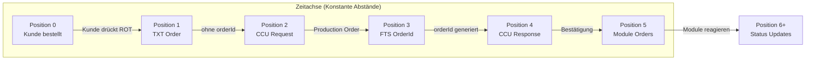

# Production Order Flow - Schematische Darstellung

## 🎯 Konzept

**Schematisches Diagramm** mit konstanten Abständen zwischen Events, unabhängig von der echten verstrichenen Zeit.

### ⚠️ **Wichtige Unterscheidung:**
- **Events (Kanten)**: MQTT Messages die wir sehen
- **Aktionen (Knoten)**: Wer macht was (versteckt in den Komponenten)

## 📊 Zwei verschiedene Szenarien

### 🏭 **Szenario 1: TXT Controller (Fischertechnik Cloud)**

```
Position 0: [Kunde drückt "Bestellen - ROT" in Fischertechnik Cloud]
            ↓ "Kunde bestellt ROT-Werkstück"

Lane 1: ccu/order/request  
        [Position 1] → CCU erhält Order (09:16:14.336Z)
        ↓ "CCU erstellt Production Order (ohne orderId)"

Lane 2: fts/v1/ff/5iO4/order
        [Position 2] → FTS generiert orderId (09:16:14.654Z)
        ↓ "FTS fügt orderId hinzu"

Lane 3: /j1/txt/1/f/i/order
        [Position 3] → TXT Controller reagiert (09:16:14.679Z)
        ↓ "TXT Controller wird informiert"

Lane 4: ccu/order/response
        [Position 4] → CCU bestätigt Order
        ↓ "CCU sendet Bestätigung"

Lane 5: module/v1/ff/SVR3QA0022/order
        [Position 5] → HBW erhält Order
        ↓ "HBW startet Produktion"

...weitere Module...
```

### 🔍 **Versteckte Aktionen (Knoten im Graph):**

```
Position 0: [Kunde] → [Dashboard/FT] → [sendet ccu/order/request OHNE orderId]
Position 1: [CCU] → [abonniert ccu/order/request] → [erstellt orderId] → [sendet fts/v1/ff/5iO4/order]
Position 2: [FTS] → [abonniert fts/v1/ff/5iO4/order] → [überschreibt orderId mit UUID] → [führt Transport aus]
Position 3: [CCU] → [sendet /j1/txt/1/f/i/order] → [TXT] → [abonniert /j1/txt/1/f/i/order]
Position 4: [CCU] → [sendet ccu/order/response]
Position 5: [Module] → [abonnieren module/*/order] → [führen Produktion aus]
```

### 🖥️ **Szenario 2: OMF Dashboard (Direkt)**

```
Position 0: [Kunde drückt "Bestellen - ROT" im OMF Dashboard]
            ↓ "Kunde bestellt ROT-Werkstück"

Lane 1: ccu/order/request  
        [Position 1] → CCU erhält Order DIREKT
        ↓ "CCU erstellt Production Order (mit orderId: 1001)"

Lane 2: fts/v1/ff/5iO4/order
        [Position 2] → FTS generiert NEUE orderId
        ↓ "FTS überschreibt orderId mit UUID"

Lane 3: /j1/txt/1/f/i/order
        [Position 3] → TXT Controller reagiert NACHHER
        ↓ "TXT Controller wird informiert"

Lane 4: ccu/order/response
        [Position 4] → CCU bestätigt Order
        ↓ "CCU sendet Bestätigung"

Lane 5: module/v1/ff/SVR3QA0022/order
        [Position 5] → HBW erhält Order
        ↓ "HBW startet Produktion"

...weitere Module...
```

## 🔍 Wichtige Erkenntnisse

### 1. **OrderId-Generierung**

#### **Szenario 1 (TXT Controller):**
- **Position 1**: TXT sendet Order **ohne** orderId
- **Position 3**: FTS generiert orderId und fügt sie hinzu
- **Ab Position 4**: Alle Messages haben die gleiche orderId

#### **Szenario 2 (OMF Dashboard):**
- **Position 1**: CCU erhält Order **ohne** orderId (wie Szenario 1)
- **Position 2**: FTS **überschreibt** orderId mit UUID
- **Ab Position 3**: Alle Messages haben die neue orderId

### 2. **Message-Flow**

#### **Szenario 1 (TXT Controller):**
```
Kunde → CCU → FTS → TXT → CCU → Module
 0      1     2     3     4     5+
```

#### **Szenario 2 (OMF Dashboard):**
```
Kunde → CCU → FTS → TXT → CCU → Module
 0      1     2     3     4     5+
```

### 3. **Kritische Punkte**

#### **Szenario 1:**
- **Position 1**: Erste Message ohne orderId
- **Position 3**: OrderId wird generiert (FTS)
- **Position 4+**: Alle Messages verwenden die orderId

#### **Szenario 2:**
- **Position 1**: OrderId wird vom OMF Dashboard generiert
- **Position 2**: FTS überschreibt orderId mit UUID
- **Position 3**: TXT Controller wird nachträglich informiert

## 📋 Beteiligte Topics (Chronologisch)

### **Szenario 1 (TXT Controller):**
| Position | Topic | Beschreibung | orderId | Timestamp |
|----------|-------|--------------|---------|-----------|
| 0 | [Kunde] | Bestellung ausgelöst | - | - |
| 1 | `ccu/order/request` | CCU Production Order | ❌ | 09:16:14.336Z |
| 2 | `fts/v1/ff/5iO4/order` | FTS OrderId Generation | ✅ | 09:16:14.654Z |
| 3 | `/j1/txt/1/f/i/order` | TXT Controller Info | ✅ | 09:16:14.679Z |
| 4 | `ccu/order/response` | CCU Bestätigung | ✅ | - |
| 5+ | `module/*/order` | Module Orders | ✅ | - |
| 6+ | `module/*/state` | Module Status | ✅ | - |

### **Szenario 2 (OMF Dashboard):**
| Position | Topic | Beschreibung | orderId |
|----------|-------|--------------|---------|
| 0 | [Kunde] | Bestellung ausgelöst | - |
| 1 | `ccu/order/request` | CCU Production Order | ❌ (ohne orderId) |
| 2 | `fts/v1/ff/5iO4/order` | FTS OrderId Generation | ✅ (UUID) |
| 3 | `/j1/txt/1/f/i/order` | TXT Controller Info | ✅ |
| 4 | `ccu/order/response` | CCU Bestätigung | ✅ |
| 5+ | `module/*/order` | Module Orders | ✅ |
| 6+ | `module/*/state` | Module Status | ✅ |

## 🎨 Mermaid-Diagramm (Schema)



## 💡 Verwendung

### Für Session Analyzer Filter:
```
topic == '/j1/txt/1/f/i/order' OR 
topic == 'ccu/order/request' OR 
topic == 'fts/v1/ff/5iO4/order' OR 
topic == 'ccu/order/response' OR 
topic LIKE 'module/%/order' OR 
topic LIKE 'module/%/state'
```

### Für Verständnis:
- **Konstante Abstände** = Einfache Visualisierung
- **Swimlanes** = Klare Topic-Zuordnung  
- **Pfeile** = Message-Flow verstehen
- **Position 0** = Auslöser (Kunde)

## 🔧 Implementierung

Das Schema kann als **Template** für alle Production Orders verwendet werden:
- **RED Orders**: Schema wie oben
- **WHITE Orders**: Gleiches Schema, andere orderId
- **BLUE Orders**: Gleiches Schema, andere orderId

**Wichtig**: Die echten Zeitabstände zwischen den Events sind irrelevant - das Schema zeigt die **logische Reihenfolge**.
