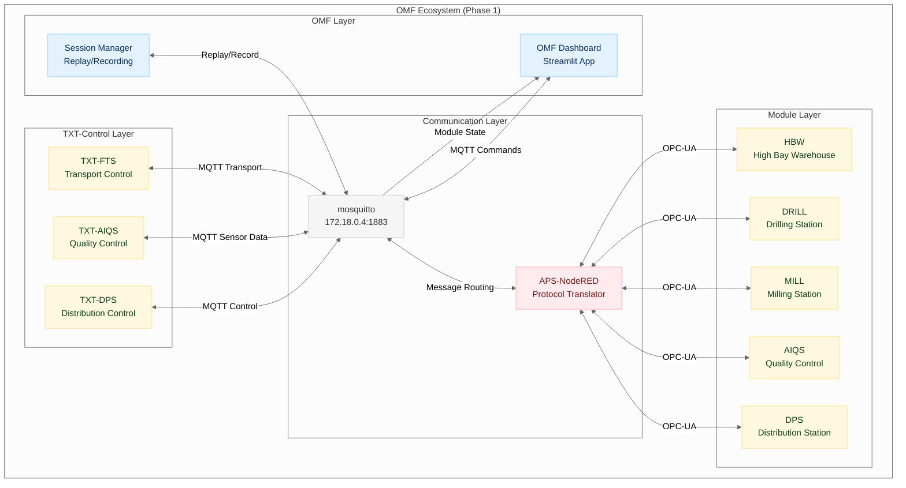

# System Context - OMF Architecture

## 🏗️ System-Kontextdiagramm

> **🔗 Integration Details:**
> - **[APS-Ecosystem](../../06-integrations/APS-Ecosystem/README.md)** - Fischertechnik Agile Production Simulation
> - **[APS-NodeRED Integration](../../06-integrations/APS-NodeRED/README.md)** - Gateway zwischen OPC-UA und MQTT
> - **[TXT-FTS](../../06-integrations/TXT-FTS/README.md)** - Fahrerloses Transportsystem


### Mermaid-Diagramm (Modern)


## 🔄 Message-Flow-Übersicht

### 1. Order-Flow (Outbound)
```
OMF Dashboard → MQTT Order → APS-NodeRED → OPC-UA → Module
```

**Beispiel: DRILL-Befehl**
- **Topic:** `module/v1/ff/SVR4H76449/order`
- **Payload:** `{"command": "DRILL", "type": "WHITE", "orderId": "123"}`
- **APS-NodeRED:** Übersetzt zu OPC-UA-Call
- **Module:** Führt DRILL-Aktion aus

### 2. State-Flow (Inbound)
```
Module → OPC-UA → APS-NodeRED → MQTT State → OMF Dashboard
```

**Beispiel: DRILL-Status**
- **Topic:** `module/v1/ff/SVR4H76449/state`
- **Payload:** `{"actionState": {"command": "DRILL", "state": "RUNNING"}}`
- **OMF Dashboard:** Zeigt Status-Update an

### 3. HBW-Spezialfall
```
HBW → OPC-UA → APS-NodeRED → MQTT State (Full) → OMF Dashboard
HBW → OPC-UA → APS-NodeRED → MQTT State (Delta) → OMF Dashboard
```

**Erster State:** Vollständige Inventory-Liste
**Folgende States:** Nur Änderungen (Deltas)

## 🏭 Komponenten-Details

### OMF Dashboard
- **Rolle:** Zentrale Steuerung und Orchestrierung (Phase 1)
- **Plattform:** Streamlit App
- **MQTT-Topics:** `ccu/order/request`, `ccu/state/*`
- **Verantwortlich:** Workflow-Management, Order-Erstellung
- **UI:** APS-Dashboard Funktionalität im OMF-Dashboard nachgebaut

### Session Manager (Optional)
- **Rolle:** Hilfs-App für Analyse und Testing
- **Plattform:** Unabhängige Helper-Anwendung
- **Verantwortlich:** Replay/Recording von Sessions
- **Zweck:** Test des OMF Dashboards ohne reale Hardware

### APS-NodeRED
- **Rolle:** MQTT ↔ OPC-UA Vermittler
- **Verantwortlich:** 
  - MQTT-Befehle zu OPC-UA-Calls übersetzen
  - OPC-UA-Daten zu MQTT-Status aggregieren
  - Modul-spezifische State-Machine implementieren

### mosquitto (MQTT-Broker)
- **Rolle:** Zentrale Message-Routing-Infrastruktur
- **Plattform:** Docker-Container auf Raspberry Pi (172.18.0.4:1883)
- **Verantwortlich:** Message-Routing zwischen allen OMF-Komponenten

### Module (HBW, DRILL, MILL, AIQS, DPS)
- **Rolle:** Physische Produktionsmodule
- **OPC-UA:** Direkte Hardware-Steuerung
- **MQTT:** Status-Updates über APS-NodeRED

### FTS (Fahrerlose Transportsysteme)
- **Rolle:** Material-Transport zwischen Modulen
- **MQTT-Topics:** `fts/v1/ff/5iO4/*`
- **Verantwortlich:** Workpiece-Transport, Navigation

### TXT-Controller (TXT-FTS, TXT-AIQS, TXT-DPS)
- **Rolle:** Fischertechnik-Controller für spezifische Module
- **Verantwortlich:**
  - TXT-FTS: Transport-Steuerung
  - TXT-AIQS: Quality Control
  - TXT-DPS: Distribution Control
  - Sensor-Daten und einfache Steuerung

## 🔗 Kommunikations-Patterns

### MQTT-Topic-Struktur
```
module/v1/ff/{serial_number}/{type}
ccu/{type}/{subtype}
fts/v1/ff/{serial_number}/{type}
/j1/txt/1/f/i/{type}
```

### Message-Directions
- **Outbound:** OMF Dashboard → Module (Orders, Commands)
- **Inbound:** Module → OMF Dashboard (States, Status)
- **Bidirectional:** Connection-Status, Heartbeats
- **Optional:** Session Manager → mosquitto (Replay/Recording)

### Registry-Integration
- **Templates:** Definieren Nachrichtenstrukturen
- **Mappings:** Verbinden Topics mit Templates
- **Validierung:** Registry-basierte Message-Validierung

---

**"Phase 1: OMF Dashboard mit APS-CCU Frontend-Funktionalität - Alle Steuerung läuft über MQTT, APS-NodeRED ist der intelligente Vermittler zur Hardware."**
