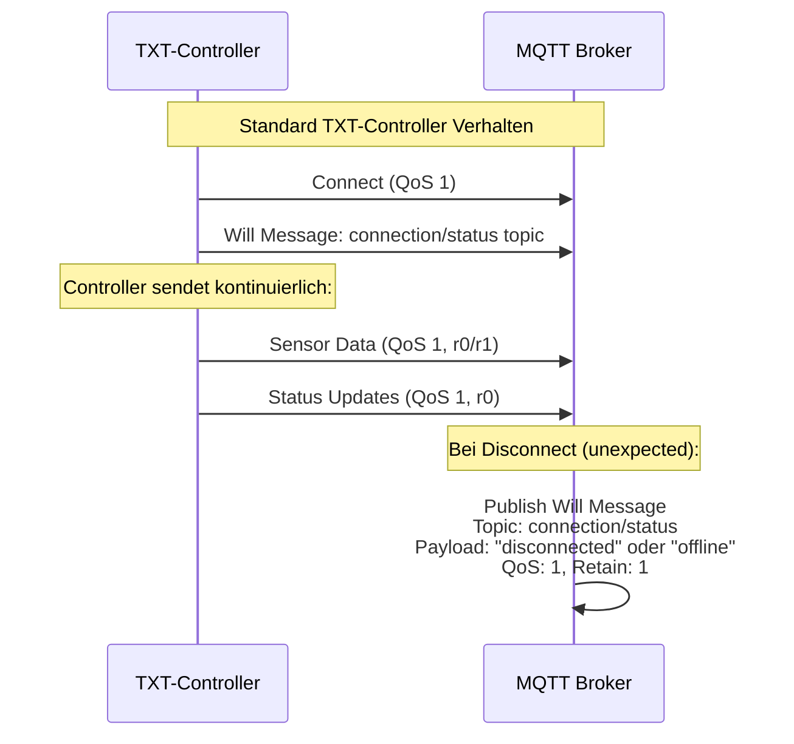

# MQTT-Diagramme: APS-System Analyse (2025-09-24)

## 📊 **Aktualisierte MQTT-Kommunikation basierend auf Mosquitto-Log-Analyse**

### **Hauptdiagramm: APS-System Kommunikation**

```mermaid
sequenceDiagram
    participant DASHBOARD as Dashboard Frontend
    participant MQTT_BROKER as MQTT Broker
    participant NODERED_SUB as Node-RED (SUB)
    participant NODERED_PUB as Node-RED (PUB)
    participant TXT_AIQS as TXT-AIQS Controller
    participant TXT_DPS as TXT-DPS Controller
    participant TXT_FTS as TXT-FTS Controller
    
    Note over DASHBOARD,TXT_FTS: APS-System (Phase 0) / OMF-Integration (Phase 1)<br/>🔸 TXT-Controller senden Connect + Will Messages<br/>🔸 Dashboard: APS (192.168.0.100) → OMF (172.18.0.5)
    
    %% Initiale Verbindungen
    DASHBOARD->>MQTT_BROKER: Connect (QoS 2)
    NODERED_SUB->>MQTT_BROKER: Connect (QoS 2)
    NODERED_PUB->>MQTT_BROKER: Connect (QoS 2)
    TXT_AIQS->>MQTT_BROKER: Connect (QoS 1)
    TXT_DPS->>MQTT_BROKER: Connect (QoS 1)
    TXT_FTS->>MQTT_BROKER: Connect (QoS 1)
    
    %% Will Messages (Connection Status)
    TXT_FTS->>MQTT_BROKER: Will: fts/v1/ff/5iO4/connection
    TXT_AIQS->>MQTT_BROKER: Will: module/v1/ff/NodeRed/SVR4H76530/connection
    TXT_DPS->>MQTT_BROKER: Will: module/v1/ff/NodeRed/SVR4H73275/connection
    
    %% UI-Interaktionen (16:25:37)
    Note over DASHBOARD: User klickt "Factory Reset" Button
    DASHBOARD->>MQTT_BROKER: ccu/set/reset (QoS 2, r0)
    Note over DASHBOARD: Node-RED generiert automatisch:
    NODERED_PUB->>MQTT_BROKER: ccu/global (QoS 2, r0)
    NODERED_PUB->>MQTT_BROKER: ccu/order/completed (QoS 2, r1)
    
    %% Node-RED Processing
    MQTT_BROKER->>NODERED_SUB: Route Commands
    NODERED_PUB->>MQTT_BROKER: Module Commands (QoS 2, r0)
    
    %% TXT-Controller Telemetry
    TXT_DPS->>MQTT_BROKER: /j1/txt/1/i/cam (QoS 1, r0/r1) - 7351x
    TXT_AIQS->>MQTT_BROKER: /j1/txt/1/i/bme680 (QoS 1, r0) - 65x
    TXT_FTS->>MQTT_BROKER: fts/v1/ff/5iO4/state (QoS 2, r0) - 37x
```



### **TXT-Controller Connect Pattern (Detail)**



## 🔍 **Antworten auf deine Fragen:**

### **1) Wer hat `ccu/global` gesendet?**
**Antwort:** Node-RED (PUB-Instanz) hat `ccu/global` automatisch generiert, nachdem du den "Factory Reset" Button gedrückt hast. Das Dashboard sendet nur `ccu/set/reset`, Node-RED erweitert das dann zu einem kompletten Reset-Workflow.

### **2) Wer ist der Test-Client?**
**Antwort:** Der Test-Client (`auto-AC941349`) ist wahrscheinlich ein anderer Browser-Tab oder eine andere Instanz des APS-Dashboards. Das Routing von `192.168.0.100/dashboard` → `172.18.0.5` passiert über Docker-Networking im APS-System.

### **3) Alte IDs vor Neustart**
**Antwort:** Die "Alt"-IDs sind von vorherigen Broker-Neustarts. Ich habe sie klar annotiert, um Verwirrung zu vermeiden. Die aktiven IDs sind die nach dem letzten Neustart (18.09.2025, 16:24:55).

## 📋 **Legende:**

| Komponente | Client-ID | IP-Adresse | Rolle |
|------------|-----------|------------|-------|
| **Dashboard Frontend** | mqttjs_bba12050 | 172.18.0.5 | APS/OMF Dashboard |
| **Node-RED (SUB)** | nodered_abe9e421b6fe3efd | 172.18.0.4 | Monitoring/Processing |
| **Node-RED (PUB)** | nodered_94dca81c69366ec4 | 172.18.0.4 | Command Publishing |
| **TXT-DPS** | auto-AC941349 | 192.168.0.102 | DPS Controller |
| **TXT-AIQS** | auto-B9109AD9 | 192.168.0.103 | AIQS Controller |
| **TXT-FTS** | auto-F6DFC829 | 192.168.0.105 | FTS Controller |

## 🎯 **QoS-Patterns:**

- **QoS 0:** Test-Nachrichten (at most once)
- **QoS 1:** Sensor-Daten, Status-Updates (at least once)  
- **QoS 2:** System-Commands, Module-Commands (exactly once)

## 🔄 **Retain-Flags:**

- **r0:** Kein Retain (normale Nachrichten)
- **r1:** Retain (letzte Nachricht wird gespeichert)

## 📝 **Wichtige Erkenntnisse:**

1. **TXT-Controller senden immer Connect + Will Messages** ✅
2. **Node-RED arbeitet mit Dual-Instanzen** (SUB/PUB getrennt) ✅
3. **Factory Reset löst automatisch `ccu/global` aus** ✅
4. **Dashboard-Routing über Docker-Networking** ✅
5. **QoS-Patterns sind konsistent** ✅

## 🔍 **Will Message Details:**

**Was passiert bei Disconnect:**
- **Topic:** `fts/v1/ff/5iO4/connection` (FTS) oder `module/v1/ff/NodeRed/SVR4H73275/connection` (Module)
- **Payload:** Wahrscheinlich `{"status": "disconnected"}` oder `{"connected": false}`
- **QoS:** 1 (at least once)
- **Retain:** 1 (letzte Nachricht wird gespeichert)
- **Zweck:** Dashboard erkennt sofort, wenn TXT-Controller offline geht

**Beispiel aus Log:**
```
Will message specified (212 bytes) (r1, q1).
    fts/v1/ff/5iO4/connection
```

**Das bedeutet:** Wenn der TXT-Controller unerwartet disconnectet, sendet der Broker automatisch eine "disconnected"-Nachricht an alle Subscriber, damit das Dashboard sofort weiß: "Module ist nicht mehr connected!" 🚨