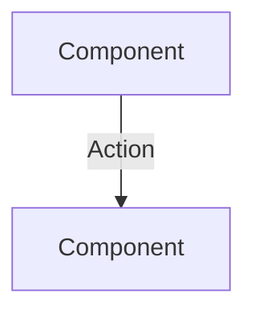

# Mermaid Test Directory

**Zweck:** Testen der Mermaid-Integration und IDE-Einrichtung

## 🎯 Test-Diagramme

### **Session Manager Dataflow**
- **Datei:** `session-manager-dataflow.mermaid`
- **Zweck:** Test des Session Manager Datenflusses
- **Farben:** 
  - Blau: APS-Fabrik, OMF-Dashboard
  - Grün: Session Recorder, Session Replay
  - Orange: Sessions Directory, Analysis Tools
  - Lila: MQTT-Broker

## 🔧 IDE-Einrichtung

### **Empfohlene VSCode Extensions:**
1. **"Mermaid Markdown Syntax Highlighting"** - Syntax-Highlighting
2. **"Mermaid Preview"** - Live Preview mit Toggle
3. **"Markdown Preview Mermaid Support"** - Integration in Markdown

### **Test-Anweisungen:**
1. **Extension installieren** und VSCode neu starten
2. **`.mermaid` Datei öffnen** und Preview testen
3. **Toggle zwischen Edit/Preview** testen
4. **Farben und Styling** überprüfen

## 📋 Cursor-Anweisungen

### **Mermaid-Diagramm-Erstellung:**
- **OMF-Komponenten:** Blau (`#e1f5fe`)
- **MQTT-Broker:** Lila (`#f3e5f5`)
- **Session-Tools:** Grün (`#e8f5e8`)
- **Data-Storage:** Orange (`#fff3e0`)
- **Analysis-Tools:** Orange (`#fff3e0`)

### **Standard-Pattern:**

---

*Test-Directory für Mermaid-Integration | [Zurück zur README](../README.md)*

