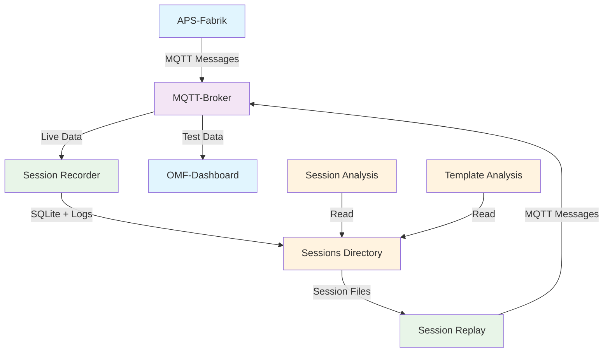
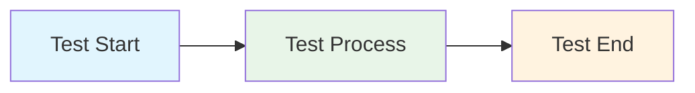

# Mermaid Hybrid-Modell Test

## Shared Diagram (aus _shared)



## Lokales Diagramm (für diese Sektion)



## Verwendung

### **Markdown Preview testen:**
1. **Strg+Shift+V** für Markdown Preview
2. **Mermaid-Diagramme** sollten gerendert werden

### **In anderen Dateien referenzieren:**
```markdown
<!-- Shared Diagram -->


<!-- Lokales Diagram -->

```

---

*Test für Mermaid Hybrid-Modell | [Zurück zur README](../README.md)*
