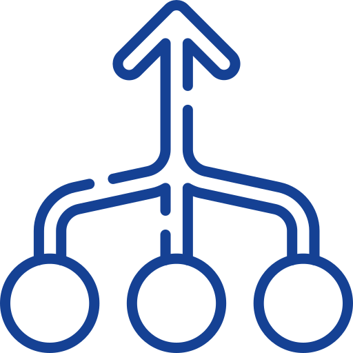
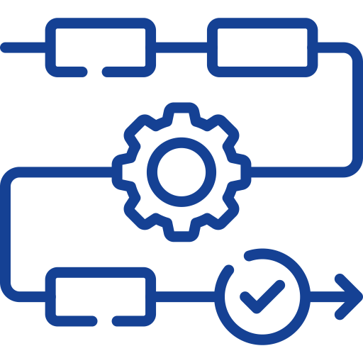
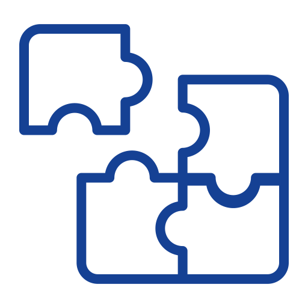

# SVG Inventory

_Generated: 2025-12-06T14:04:20.262Z_

## public/assets/svg

public/assets/svg

- svg
  - brand
    - aws-logo.svg — `assets/svg/brand/aws-logo.svg`       
    - azure-logo.svg — `assets/svg/brand/azure-logo.svg`       
    - docker-logo.svg — `assets/svg/brand/docker-logo.svg`       
    - dsp-logo.svg — `assets/svg/brand/dsp-logo.svg`       
    - google-cloud-logo.svg — `assets/svg/brand/google-cloud-logo.svg`       
    - grafana-logo.svg — `assets/svg/brand/grafana-logo.svg`       
    - kubernetes-logo.svg — `assets/svg/brand/kubernetes-logo.svg`       
    - orbis-logo.svg — `assets/svg/brand/orbis-logo.svg`       
    - sap-logo.svg — `assets/svg/brand/sap-logo.svg`       
  - business
    - analytics-application.svg — `assets/svg/business/analytics-application.svg`       
    - cloud-application.svg — `assets/svg/business/cloud-application.svg`       
    - crm-application.svg — `assets/svg/business/crm-application.svg`       
    - data-lake.svg — `assets/svg/business/data-lake.svg`       
    - erp-application.svg — `assets/svg/business/erp-application.svg`       
    - scm-application.svg — `assets/svg/business/scm-application.svg`       
  - dsp
    - architecture
      - dsp-cockpit-box.svg — `assets/svg/dsp/architecture/dsp-cockpit-box.svg`         
      - dsp-edge-box.svg — `assets/svg/dsp/architecture/dsp-edge-box.svg`         
      - dsp-smartfactory-dashboard.svg — `assets/svg/dsp/architecture/dsp-smartfactory-dashboard.svg`         
    - edge-components
      - edge-agent.svg — `assets/svg/dsp/edge-components/edge-agent.svg`         
      - edge-app-server.svg — `assets/svg/dsp/edge-components/edge-app-server.svg`         
      - edge-database.svg — `assets/svg/dsp/edge-components/edge-database.svg`         
      - edge-disc.svg — `assets/svg/dsp/edge-components/edge-disc.svg`         
      - edge-disi.svg — `assets/svg/dsp/edge-components/edge-disi.svg`         
      - edge-event-bus.svg — `assets/svg/dsp/edge-components/edge-event-bus.svg`         
      - edge-log-server.svg — `assets/svg/dsp/edge-components/edge-log-server.svg`         
      - edge-router.svg — `assets/svg/dsp/edge-components/edge-router.svg`         
    - extra
      - cloud-computing.svg — `assets/svg/dsp/extra/cloud-computing.svg`         
      - dashboard.svg — `assets/svg/dsp/extra/dashboard.svg`         
      - data-lake.svg — `assets/svg/dsp/extra/data-lake.svg`         
      - database-storage.svg — `assets/svg/dsp/extra/database-storage.svg`         
      - database.svg — `assets/svg/dsp/extra/database.svg`         
      - digital-twin.svg — `assets/svg/dsp/extra/digital-twin.svg`         
      - network.svg — `assets/svg/dsp/extra/network.svg`         
      - process.svg — `assets/svg/dsp/extra/process.svg`         
      - storage-device.svg — `assets/svg/dsp/extra/storage-device.svg`         
      - technology-iot.svg — `assets/svg/dsp/extra/technology-iot.svg`         
      - workflow.svg — `assets/svg/dsp/extra/workflow.svg`         
    - functions
      - edge-analytics.svg — `assets/svg/dsp/functions/edge-analytics.svg`         
      - edge-buffering.svg — `assets/svg/dsp/functions/edge-buffering.svg`         
      - edge-connectivity.svg — `assets/svg/dsp/functions/edge-connectivity.svg`         
      - edge-data-storage.svg — `assets/svg/dsp/functions/edge-data-storage.svg`         
      - edge-digital-twin.svg — `assets/svg/dsp/functions/edge-digital-twin.svg`         
      - edge-process-logic.svg — `assets/svg/dsp/functions/edge-process-logic.svg`         
      - edge-workflow.svg — `assets/svg/dsp/functions/edge-workflow.svg`         
    - use-cases
      - use-case-data-aggregation.svg — `assets/svg/dsp/use-cases/use-case-data-aggregation.svg`         
      - use-case-predictive-maintenance.svg — `assets/svg/dsp/use-cases/use-case-predictive-maintenance.svg`         
      - use-case-process-optimization.svg — `assets/svg/dsp/use-cases/use-case-process-optimization.svg`         
      - use-case-track-trace.svg — `assets/svg/dsp/use-cases/use-case-track-trace.svg`         
  - methodology
    - phase1-data-foundation.svg — `assets/svg/methodology/phase1-data-foundation.svg`       
    - phase2-data-integration.svg — `assets/svg/methodology/phase2-data-integration.svg`       
    - phase3-advanced-analytics.svg — `assets/svg/methodology/phase3-advanced-analytics.svg`       
    - phase4-automation-orchestration.svg — `assets/svg/methodology/phase4-automation-orchestration.svg`       
    - phase5-autonomous-enterprise.svg — `assets/svg/methodology/phase5-autonomous-enterprise.svg`       
  - orbis
    - ai-algorithm.svg — `assets/svg/orbis/ai-algorithm.svg`       
    - ai.svg — `assets/svg/orbis/ai.svg`       
    - consolidate.svg — `assets/svg/orbis/consolidate.svg`       
    - dashboard.svg — `assets/svg/orbis/dashboard.svg`       
    - data-lake.svg — `assets/svg/orbis/data-lake.svg`       
    - database-management.svg — `assets/svg/orbis/database-management.svg`       
    - integration.svg — `assets/svg/orbis/integration.svg`       
    - semantic.svg — `assets/svg/orbis/semantic.svg`       
    - stack.svg — `assets/svg/orbis/stack.svg`       
    - workflow-1.svg — `assets/svg/orbis/workflow-1.svg`       
  - shopfloor
    - intersections
      - intersection-1.svg — `assets/svg/shopfloor/intersections/intersection-1.svg`         
      - intersection-2.svg — `assets/svg/shopfloor/intersections/intersection-2.svg`         
      - intersection-3.svg — `assets/svg/shopfloor/intersections/intersection-3.svg`         
      - intersection-4.svg — `assets/svg/shopfloor/intersections/intersection-4.svg`         
    - shared
      - agv-vehicle.svg — `assets/svg/shopfloor/shared/agv-vehicle.svg`         
      - battery.svg — `assets/svg/shopfloor/shared/battery.svg`         
      - charging-active.svg — `assets/svg/shopfloor/shared/charging-active.svg`         
      - dock-event.svg — `assets/svg/shopfloor/shared/dock-event.svg`         
      - driving-status.svg — `assets/svg/shopfloor/shared/driving-status.svg`         
      - drop-event.svg — `assets/svg/shopfloor/shared/drop-event.svg`         
      - fts-vehicle.svg — `assets/svg/shopfloor/shared/fts-vehicle.svg`         
      - location-marker.svg — `assets/svg/shopfloor/shared/location-marker.svg`         
      - order-tracking.svg — `assets/svg/shopfloor/shared/order-tracking.svg`         
      - pass-event.svg — `assets/svg/shopfloor/shared/pass-event.svg`         
      - paused-status.svg — `assets/svg/shopfloor/shared/paused-status.svg`         
      - pick-event.svg — `assets/svg/shopfloor/shared/pick-event.svg`         
      - process-event.svg — `assets/svg/shopfloor/shared/process-event.svg`         
      - question.svg — `assets/svg/shopfloor/shared/question.svg`         
      - stopped-status.svg — `assets/svg/shopfloor/shared/stopped-status.svg`         
      - turn-event.svg — `assets/svg/shopfloor/shared/turn-event.svg`         
    - stations
      - aiqs-station.svg — `assets/svg/shopfloor/stations/aiqs-station.svg`         
      - chrg-station.svg — `assets/svg/shopfloor/stations/chrg-station.svg`         
      - conveyor.svg — `assets/svg/shopfloor/stations/conveyor.svg`         
      - dps-station.svg — `assets/svg/shopfloor/stations/dps-station.svg`         
      - drill-station.svg — `assets/svg/shopfloor/stations/drill-station.svg`         
      - hbw-station.svg — `assets/svg/shopfloor/stations/hbw-station.svg`         
      - mill-station.svg — `assets/svg/shopfloor/stations/mill-station.svg`         
      - mixer.svg — `assets/svg/shopfloor/stations/mixer.svg`         
      - stone-oven.svg — `assets/svg/shopfloor/stations/stone-oven.svg`         
    - systems
      - agv-system.svg — `assets/svg/shopfloor/systems/agv-system.svg`         
      - any-system.svg — `assets/svg/shopfloor/systems/any-system.svg`         
      - factory.svg — `assets/svg/shopfloor/systems/factory.svg`         
      - warehouse.svg — `assets/svg/shopfloor/systems/warehouse.svg`         
    - workpieces
      - wp-blue-3dim.svg — `assets/svg/shopfloor/workpieces/wp-blue-3dim.svg`         
      - wp-blue-instock-processed.svg — `assets/svg/shopfloor/workpieces/wp-blue-instock-processed.svg`         
      - wp-blue-instock-reserved.svg — `assets/svg/shopfloor/workpieces/wp-blue-instock-reserved.svg`         
      - wp-blue-instock-unprocessed.svg — `assets/svg/shopfloor/workpieces/wp-blue-instock-unprocessed.svg`         
      - wp-blue-product.svg — `assets/svg/shopfloor/workpieces/wp-blue-product.svg`         
      - wp-red-3dim.svg — `assets/svg/shopfloor/workpieces/wp-red-3dim.svg`         
      - wp-red-instock-processed.svg — `assets/svg/shopfloor/workpieces/wp-red-instock-processed.svg`         
      - wp-red-instock-reserved.svg — `assets/svg/shopfloor/workpieces/wp-red-instock-reserved.svg`         
      - wp-red-instock-unprocessed.svg — `assets/svg/shopfloor/workpieces/wp-red-instock-unprocessed.svg`         
      - wp-red-product.svg — `assets/svg/shopfloor/workpieces/wp-red-product.svg`         
      - wp-slot-empty.svg — `assets/svg/shopfloor/workpieces/wp-slot-empty.svg`         
      - wp-white-3dim.svg — `assets/svg/shopfloor/workpieces/wp-white-3dim.svg`         
      - wp-white-instock-processed.svg — `assets/svg/shopfloor/workpieces/wp-white-instock-processed.svg`         
      - wp-white-instock-reserved.svg — `assets/svg/shopfloor/workpieces/wp-white-instock-reserved.svg`         
      - wp-white-instock-unprocessed.svg — `assets/svg/shopfloor/workpieces/wp-white-instock-unprocessed.svg`         
      - wp-white-product.svg — `assets/svg/shopfloor/workpieces/wp-white-product.svg`         
  - ui
    - heading-camera.svg — `assets/svg/ui/heading-camera.svg`       
    - heading-ccu.svg — `assets/svg/ui/heading-ccu.svg`       
    - heading-customer-orders.svg — `assets/svg/ui/heading-customer-orders.svg`       
    - heading-factory-configuration.svg — `assets/svg/ui/heading-factory-configuration.svg`       
    - heading-info.svg — `assets/svg/ui/heading-info.svg`       
    - heading-inventory.svg — `assets/svg/ui/heading-inventory.svg`       
    - heading-message-monitor.svg — `assets/svg/ui/heading-message-monitor.svg`       
    - heading-modules.svg — `assets/svg/ui/heading-modules.svg`       
    - heading-production.svg — `assets/svg/ui/heading-production.svg`       
    - heading-purchase-orders.svg — `assets/svg/ui/heading-purchase-orders.svg`       
    - heading-route.svg — `assets/svg/ui/heading-route.svg`       
    - heading-sensors.svg — `assets/svg/ui/heading-sensors.svg`       
    - heading-shopfloor-layout.svg — `assets/svg/ui/heading-shopfloor-layout.svg`       
    - heading-storage.svg — `assets/svg/ui/heading-storage.svg`       
    - heading-track-trace.svg — `assets/svg/ui/heading-track-trace.svg`       
    - order-production.svg — `assets/svg/ui/order-production.svg`       
    - order-storage.svg — `assets/svg/ui/order-storage.svg`       
    - process-flow.svg — `assets/svg/ui/process-flow.svg`       

