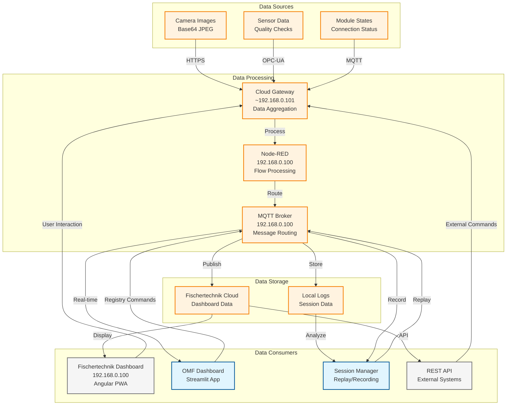
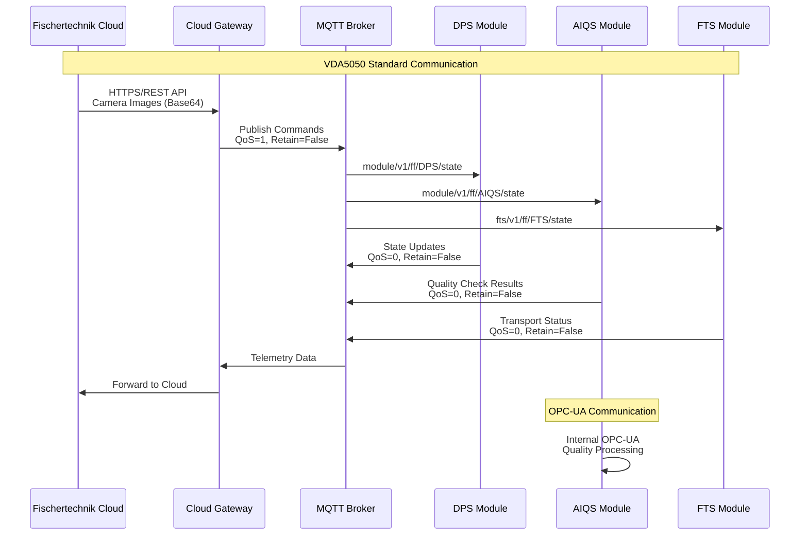
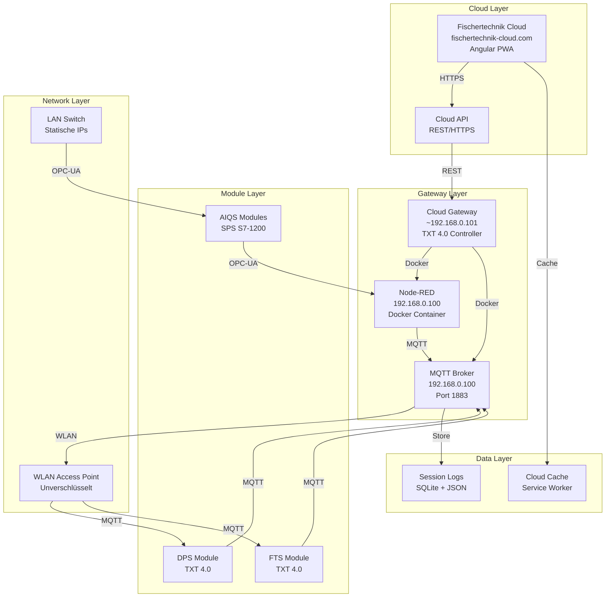
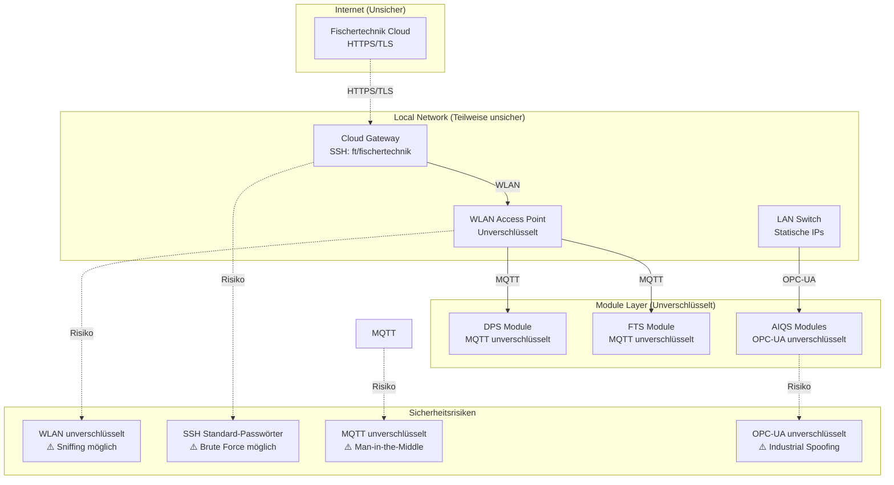

# APS Data Flow Architecture

## 📋 Architektur-Phasen

### Phase 1: Ausgangssituation (Fischertechnik Standard)
- **Fischertechnik Cloud** als zentrale Datenquelle
- **Fischertechnik Dashboard** für lokale Visualisierung
- **Keine ORBIS-Integration**

### Phase 2: ORBIS-Integration (Aktuell)
- **OMF Dashboard** für erweiterte Steuerung
- **Session Manager** für Replay/Recording
- **Registry v1** für Template-Management
- **DPS-Modul** hinzugefügt

---

## 📊 Datenfluss-Diagramm (Phase 2: ORBIS-Integration)



## 🔄 Kommunikations-Protokoll-Diagramm



## 🏗️ System-Komponenten-Diagramm



## 🔐 Sicherheits-Architektur-Diagramm



## 📈 Datenverarbeitungs-Pipeline

### 1. **Datenaufnahme**
- **Camera Images**: Base64-kodierte JPEG-Daten
- **Sensor Data**: Qualitätsprüfungen, Temperatur, Druck
- **Module States**: Verbindungsstatus, Fehlerzustände

### 2. **Datenverarbeitung**
- **Cloud Gateway**: Aggregation und Routing
- **Node-RED**: Flow-basierte Verarbeitung
- **MQTT Broker**: Message Queuing und Distribution

### 3. **Datenspeicherung**
- **Fischertechnik Cloud**: Dashboard-Daten, Caching
- **Local Logs**: Session-Daten, Debug-Informationen

### 4. **Datenverbrauch**
- **Dashboard UI**: Echtzeit-Visualisierung
- **REST API**: Externe System-Integration
- **Log Analysis**: Debugging und Optimierung

## 🔄 Message Flow Patterns

### **Command Flow (Outbound)**
```
Cloud → Gateway → MQTT → Module
```

### **Telemetry Flow (Inbound)**
```
Module → MQTT → Gateway → Cloud
```

### **Local Processing Flow**
```
Module → MQTT → Session Manager → Logs
```

---

**"Daten fließen über MQTT, werden in Node-RED verarbeitet und in der Cloud visualisiert."**
