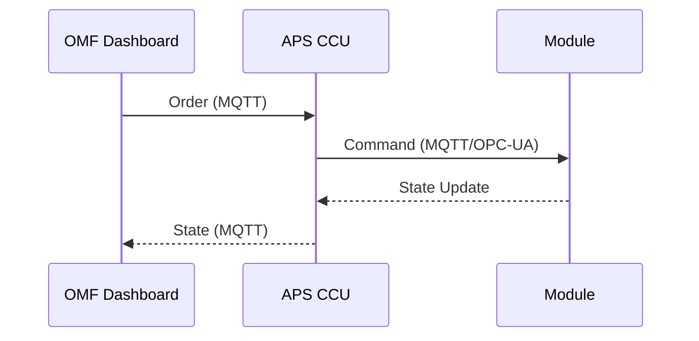
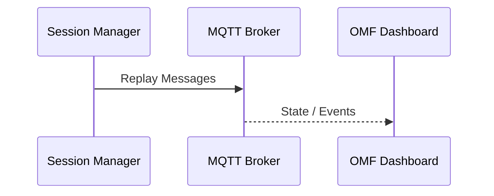
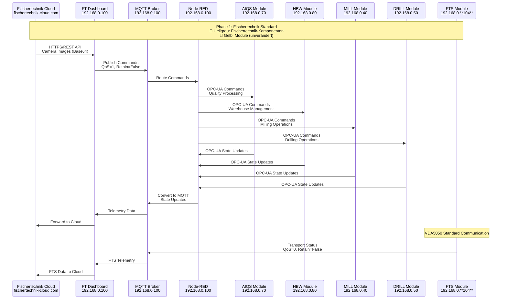
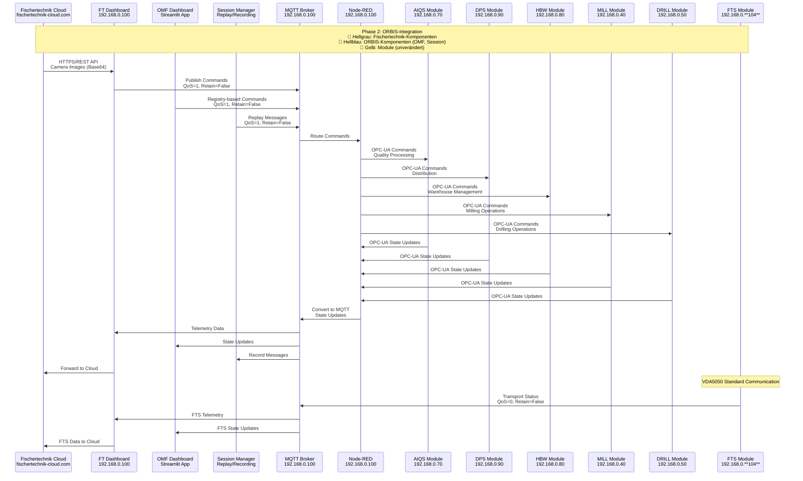
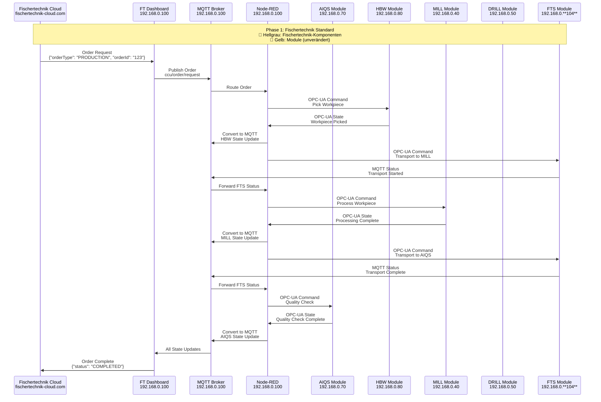
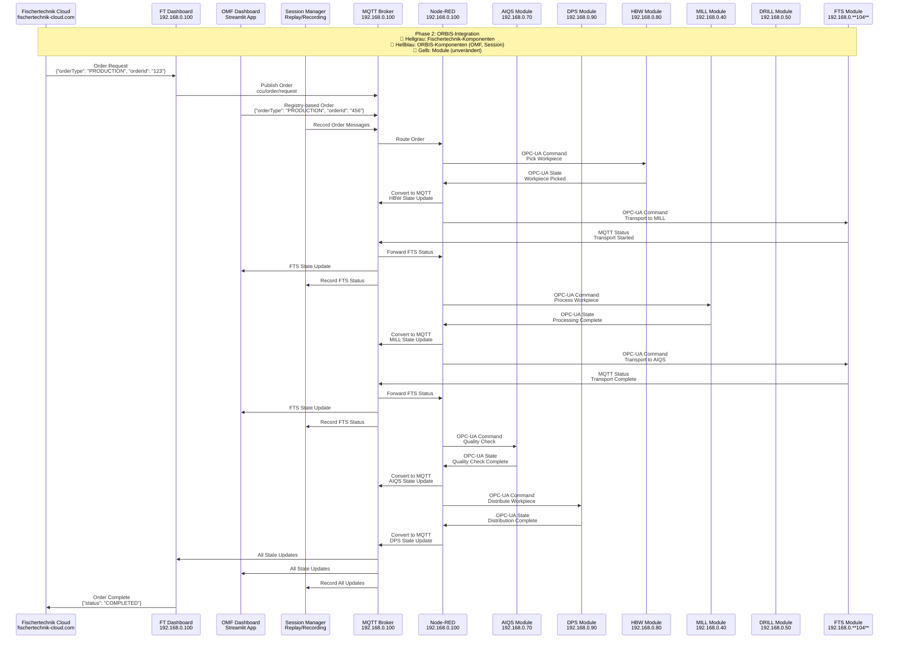

# Message Flow

Version: 0.1 (Draft)  
Last updated: 2025-09-14  
Author: OMF Development Team  

---

## 📑 Overview
Dieses Dokument beschreibt die End-to-End Message Flows im OMF System.  

---

## 🔄 Order Flow

---

## 📊 Replay Flow

---

## 📡 APS Communication Flow

### 🎨 Farbkodierung
- **🔸 Hellgrau**: Fischertechnik-Komponenten (werden ersetzt)
- **🔸 Hellblau**: ORBIS-Komponenten (OMF Dashboard, Session Manager)
- **🔸 Gelb**: Module (bleiben unverändert)

### Phase 1: Ausgangssituation (Fischertechnik Standard)

### Phase 2: ORBIS-Integration (Aktuell)

---

## 🔄 APS Order Processing Flow

### Phase 1: Ausgangssituation (Fischertechnik Standard)

### Phase 2: ORBIS-Integration (Aktuell)

