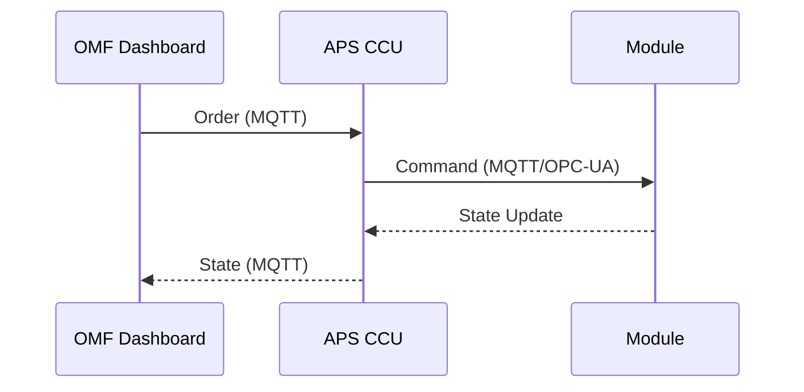
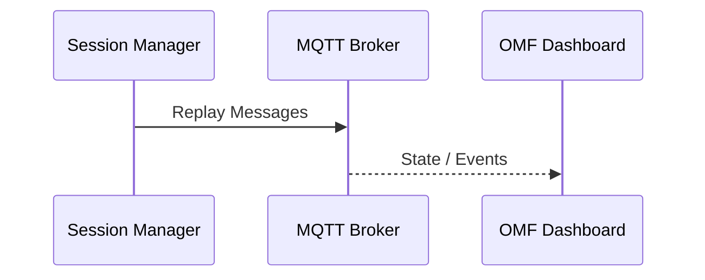

# Message Flow

Version: 0.1 (Draft)  
Last updated: 2025-09-14  
Author: OMF Development Team  

---

## 📑 Overview
Dieses Dokument beschreibt die End-to-End Message Flows im OMF System.  

---

## 🔄 Order Flow

---

## 📊 Replay Flow

