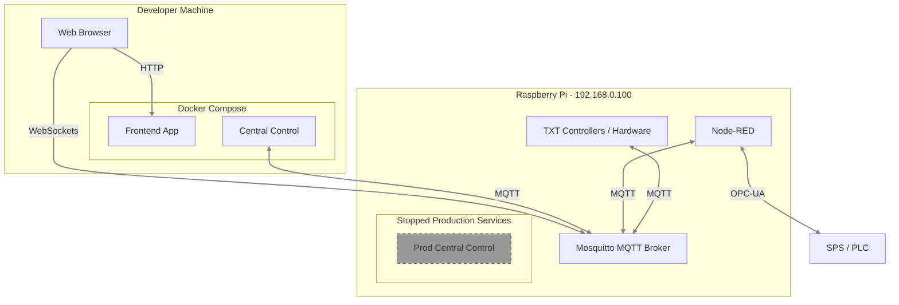
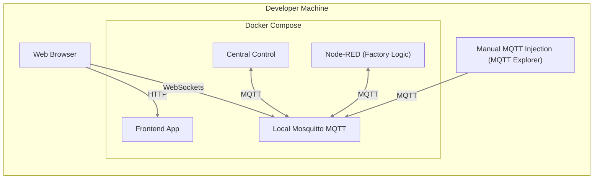

# fischertechnik APS (Agile Production Simulation) - Central Control Unit

This repository contains the central control unit for the fischertechnik APS (Agile Production Simulation), including:

* **Frontend** - Angular-based dashboard for monitoring factory status, managing orders, and manual control.
* **Central Control** - Main Node.js/TypeScript service that acts as the "brain". It manages global state, orchestrates FTS (AGV) routing, and coordinates production steps.
* **Node-RED** - Middleware handling the translation between high-level MQTT commands and the low-level OPC UA protocol used by the PLC controllers.
* **MQTT Broker** - Mosquitto broker serving as the central communication backbone for real-time data exchange between all components.

> **Note:** This documentation is intended for developers with experience in the tooling used by this project, particularly Docker and Node.js. Familiarity with these technologies is expected to effectively understand and work with this system.

## Table of Contents

- [Prerequisites & Setup](#prerequisites--setup)
- [Local Development](#local-development)
  - [1. Installation](#1-installation)
  - [2. Architecture](#2-architecture)
  - [3. Start Application](#3-start-application)
    - [3.1 Access and Credentials](#31-access-and-credentials)
  - [4. Access Services](#4-access-services)
  - [5. Development Workflow](#5-development-workflow)
- [Deployment to Hardware](#deployment-to-hardware)
  - [Authentication](#authentication)
  - [Quick Deploy](#quick-deploy)
  - [Selective Deploy](#selective-deploy)
  - [Manual Deployment](#manual-deployment)
- [Troubleshooting](#troubleshooting)
- [Module States](#module-states)
- [Additional Documentation](#additional-documentation)
- [Contributing](#contributing)
- [Appendix: Local Mode](#appendix-local-mode)

## Prerequisites & Setup

### 1. Docker (Required)

Docker is required to run the local containerized environment.

*   **Windows:**
    *   **Install:** Follow the official instructions at [Docker Desktop for Windows](https://docs.docker.com/desktop/setup/install/windows-install/).
    *   **Config:** We recommend using the **WSL 2** backend.
    *   **Start:** Launch "Docker Desktop" to start the engine.

*   **Ubuntu:**
    *   **Install:** Follow the official instructions at [Docker Engine on Ubuntu](https://docs.docker.com/engine/install/ubuntu/).
    *   **Requirements:** Ensure the `docker-buildx-plugin` is installed.
    *   **Setup:** Configure [binfmt for cross-compilation](https://docs.docker.com/build/building/multi-platform/#install-qemu-manually) (required for building ARM images on AMD64).

### 2. Tools & Environment

Install the required tools using the commands below.

> **Note (Windows):** Run `winget` commands in an **Administrator** PowerShell terminal. After tool installation, close that terminal and continue in a **normal (non-admin)** terminal opened in your working folder (for example, `C:\Users\YOUR_NAME\Documents`).

| Tool | Windows Command | Ubuntu Command | Notes |
|------|-----------------|----------------|-------|
| **nvm** *(Version Manager)* | *(Not applicable — use winget for Node)* | `curl -o- https://raw.githubusercontent.com/nvm-sh/nvm/v0.39.7/install.sh \| bash && source ~/.bashrc` | Install `nvm` first on Linux. |
| **Node.js 18.20.7** | `winget install --id OpenJS.NodeJS.18 --version 18.20.7 --exact` | `nvm install 18.20.7 && nvm use 18.20.7` | Includes `npm`. Tested on v18.20.7. |
| **Git** | `winget install --id Git.Git --exact` | `sudo apt install -y git` | Version control. |
| **OpenSSH** | **Check first:** `ssh -V` | `sudo apt install -y openssh-client` | Required for deployment scripts. |

### Verification

Ensure these commands return versions without errors in your terminal. Recommended minimum versions:

> **Note (Windows):** If you just installed Node.js, close the terminal and open a new one before running the checks so PATH updates are applied.

```bash
docker --version   # >= 20.10
node -v            # 18.x (higher version should work, but are not tested)
npm -v             # >= 9.x 
git --version      # >= 2.30
ssh -V             # Any recent OpenSSH version
```

## Development

### 1. Installation

Clone the repository and install dependencies used for development scripts.

> **Working directory:** Before cloning, navigate to a workspace folder (for example, `C:\Users\YOUR_NAME\Documents`). Do not clone into system folders like `C:\Windows\System32`.

```bash
git clone <repository-url> ff-central-control-unit
cd ff-central-control-unit
npm run setup
```

> **Timing:** `npm run setup` can take around 10 to 20 minutes on a typical machine.

### 2. Architecture

The following diagram illustrates how the development environment connects to the physical 
factory hardware. When running in **Factory Mode** (`npm start`), the local services replace the production services on the Raspberry Pi.



### 3. Start Application

The default development mode connects to the physical factory hardware.

*   **Target:** Physical Factory Hardware (Raspberry Pi at `192.168.0.100`)
*   **Prerequisite:** Connect your PC to the factory Wi-Fi/Network. See [Step 5 of Setup and commissioning of the Agile Production
Simulation](https://www.fischertechnik.de/-/media/fischertechnik/rebrush/industrie-und-hochschulen/technische-dokumente/agile-production-simulation/en/documentation_aps_en-0424.pdf) for WiFi setup instructions.
*   **Docker Desktop:** Make sure Docker Desktop is running and shows **Engine running** before you continue.
*   **Command:**
    ```bash
    npm start
    # Or to rebuild containers first:
    npm run start:build
    ```
*   **Behavior:** Connects to the factory MQTT broker (`192.168.0.100`) and **uses SSH** to automatically stop conflicting containers on the Pi.
*   **Important:** Ensure your local factory layout configuration matches your physical factory.
*   **Timing:** The first `npm start` can take around 3 to 5 minutes. Wait for `Compiled successfully` before opening the UI.

> **No factory access?** Use Local Mode: `npm start -- local` (see [Appendix: Local Mode](#appendix-local-mode)).

### 3.1 Access and Credentials

When running in factory mode, the start script will use SSH to stop conflicting services on the Raspberry Pi.

*   **SSH User/Pass:** `ff22` / `ff22+`
*   **Raspberry Pi IP:** `192.168.0.100`
*   **More details:** See [Authentication](#authentication) and [DEPLOYMENT.md](DEPLOYMENT.md).

### 4. Access Services

Once started, access the development tools via your browser. Wait until you see `Compiled successfully` in the terminal before opening the URLs.

| Service | URL | Description |
|---------|-----|-------------|
| **Frontend** | [http://localhost:4200](http://localhost:4200) | The Angular web interface (Hot Reload enabled) |
| **Node-RED** | [http://192.168.0.100:1880](http://192.168.0.100:1880) | Visual flow editor for factory logic |
| **MQTT Broker** | `192.168.0.100:1883` | Connect with [MQTT Explorer](http://mqtt-explorer.com/). See [MQTT Protocol Docs](docs/README.md). |
| **MQTT WebSocket** | `ws://192.168.0.100:9001` | WebSocket access to MQTT broker. |

### 5. Development Workflow

**Project Structure:**
```
ff-central-control-unit/
├── central-control/    # Backend service (Node.js)
├── frontend/          # Frontend application (Angular)
├── nodeRed/           # Node-RED flows and config
├── common/            # Shared code and protocols
├── mosquitto/         # MQTT broker configuration
├── docs/              # Project documentation
├── examples/          # Example scenarios and configurations
├── scripts/           # Build and deployment scripts
├── raspberrypi/       # Raspberry Pi system configuration and service files
├── docker-compose.yml # Development environment configuration
├── docker-compose-prod.yml # Production environment configuration
└── package.json       # Root package dependencies
```

**Working with Services:**
*   **View Logs:**
    *   All: `docker compose logs -f`
    *   Specific: `docker compose logs -f frontend`

**MQTT Communication:**
By default, the development environment connects to the factory's MQTT broker.
Monitor MQTT messages using [MQTT Explorer](http://mqtt-explorer.com/):
- **Host:** `192.168.0.100`
- **Port:** `1883`
- **User/Pass:** `default` / `default`

For topic structure, message payloads, and module-specific examples, see [MQTT Protocol Docs](docs/README.md).

### Testing Changes

This development workflow allows you to make code changes and quickly test them against the real hardware.

> **Tip:** After restarting the backend or deploying new logic, you will likely need to **reset the factory state** and re-dock the FTS to ensure a clean starting point.

**Local Only:** If you are developing without hardware, see [Appendix: Local Mode](#appendix-local-mode). In that mode, you must simulate factory MQTT messages manually to trigger state changes.

## Deployment to Hardware

For full details, including manual deployment steps, autostart configuration, and hybrid development, see the [Deployment Guide](DEPLOYMENT.md).

### Authentication

The deployment scripts use SSH. You will be prompted for the password multiple times.
*   **User/Pass:** `ff22` / `ff22+`
*   **IP:** `192.168.0.100`

### Automated Deployment

**Option 1: Deploy All (Standard)**
Build and deploy all services to the Raspberry Pi.

> **Note:** The compilation process (`npm run docker:build`) involves cross-compiling for ARM architecture via QEMU emulation. This step can take a considerable amount of time (up to 40 min) to complete depending on your system performance.

```bash
npm run docker:build
npm run docker:deploy -- ff22@192.168.0.100
```

**Option 2: Selective Deploy (Faster)**
Deploy only specific services to save time.
```bash
# Example: Deploy only central-control
npm run docker:build -- userdev central
npm run docker:deploy -- ff22@192.168.0.100 userdev central
```
Available service names: `central`, `frontend`, `nodered`

## Troubleshooting

### General Issues
- **Containers won't start:** Ensure Docker Desktop is running
- **Port conflicts:** Check if ports 4200, 1883, 1880, 9001 are available
- **Build failures:** Try `docker system prune -a` to free up space

For deployment-specific errors (SSH, host keys), see [DEPLOYMENT.md](DEPLOYMENT.md#troubleshooting).

### Service Issues
- **Frontend not loading:** Check `docker compose logs frontend`
- **MQTT connection errors:** Verify broker is running: `docker compose ps`
- **Modules not responding:** See [central-control/README.md](central-control/README.md) for protocol details

### Reset Environment
```bash
npm stop
docker compose rm -f
npm start
```

### Reset Raspberry Pi (Factory Services)

> **Warning:** This will restore the Raspberry Pi services to the repository version and restart them.

```bash
npm run docker:reset -- ff22@192.168.0.100
```

If you are prompted for credentials, use the SSH details in [Authentication](#authentication).

## Module States

The Central Control Unit assigns these states to factory modules:

- **BLOCKED** - Module is paused, has errors, or loaded workpiece without action
- **BUSY** - Module is executing an action
- **READY** - Module available for new orders (specific or any)
- **OFFLINE** - Module not connected

For detailed MQTT protocol and module communication, see [MQTT Protocol Docs](docs/README.md).

## Additional Documentation

- [DEPLOYMENT.md](DEPLOYMENT.md) - Advanced deployment options and hybrid development
- [examples/FTS_SPIN_EXAMPLE.md](examples/FTS_SPIN_EXAMPLE.md) - **Example:** Modifying FTS Logic (Spin before docking)
- [docs/README.md](docs/README.md) - Full MQTT protocol documentation hub
- [docs/02-architecture.md](docs/02-architecture.md) - System architecture and message flows
- [docs/03-ui-integration.md](docs/03-ui-integration.md) - UI integration and custom clients
- [docs/05-message-structure.md](docs/05-message-structure.md) - Message formats and VDA5050 adaptations
- [docs/06-modules.md](docs/06-modules.md) - Module-specific commands and examples
- [docs/09-tools-and-testing.md](docs/09-tools-and-testing.md) - MQTT/OPC-UA tools and testing guidance

### Official fischertechnik Resources

- [APS 24V User Manual (PDF)](https://www.fischertechnik.de/-/media/fischertechnik/rebrush/industrie-und-hochschulen/technische-dokumente/agile-production-simulation/en/documentation_aps_en-0424.pdf) - Official hardware setup and UI control documentation
- [APS 24V GitHub Repository](https://github.com/fischertechnik/Agile-Production-Simulation-24V) - Official fischertechnik APS documentation and resources

## Contributing

See [CONTRIBUTING.md](CONTRIBUTING.md) for commit conventions and development guidelines.

## License

See LICENSE file for details.

## Appendix: Local Mode

If you do not have access to the physical factory or want to work in an isolated environment, you can run in **Local Mode**.

*   **Target:** Local Simulation Only
*   **Prerequisite:** None (Isolated environment).
*   **Command:**
    ```bash
    npm start -- local
    ```
*   **Behavior:** Starts a local Docker container for MQTT. Ideal for UI work or logic testing without hardware.
    *   *Note:* Since there is no hardware, you must send manual MQTT messages to emulate factory modules.
    *   *Important:* Ensure your local factory layout configuration matches your simulation needs.
*   **Access:**
    *   **Node-RED:** [http://localhost:1880](http://localhost:1880) - Visual flow editor for factory logic.
    *   **MQTT Broker:** `localhost:1883`



