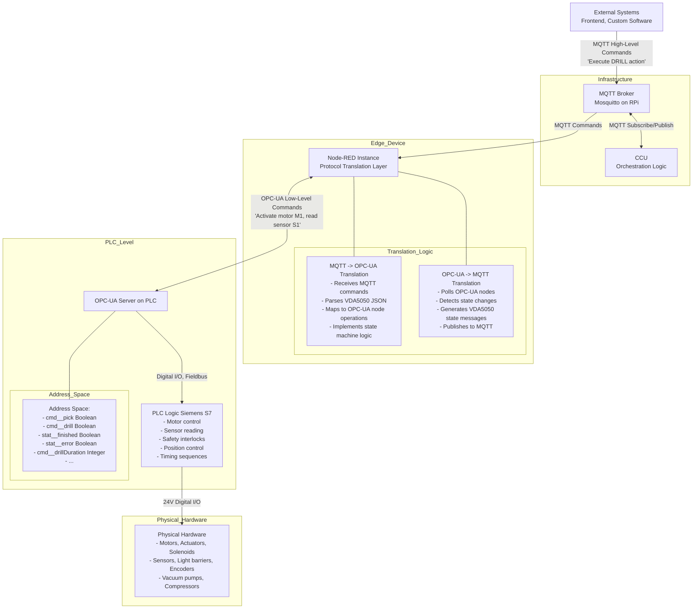

# 4. Relationship with OPC-UA

## 4.1 Interfaces in System Context

The APS uses two distinct communication protocols, each serving different purposes:

### MQTT Interface
- **Purpose**: High-level production control and coordination
- **Used By**: CCU, external systems, monitoring applications
- **Scope**: Factory-wide orchestration, order management, state monitoring
- **Protocol**: MQTT (pub/sub messaging)
- **Data Level**: Logical actions (DRILL, MILL, FIRE) and abstract states

### OPC-UA Interface
- **Purpose**: Low-level hardware control and sensor reading
- **Used By**: Node-RED bridge, PLC controllers
- **Scope**: Module-internal operations, motor control, sensor reading
- **Protocol**: OPC-UA (client-server architecture)
- **Data Level**: Physical operations (motor on/off, sensor values, position data)

### Interface Comparison

| Aspect | MQTT | OPC-UA |
|--------|------|--------|
| **Architecture** | Publish-Subscribe | Client-Server |
| **Target Users** | External integrators, CCU | Internal module control |
| **Data Format** | JSON (VDA5050-based) | Structured OPC-UA nodes |
| **Abstraction Level** | High (actions, orders) | Low (sensors, actuators) |
| **Use Case** | "Drill this workpiece" | "Turn on drill motor, move actuator" |
| **Network Scope** | Factory-wide | Module-internal |
| **Real-time** | Near real-time (~1Hz) | Real-time (PLC cycle) |

## 4.2 System Integration Architecture



## 4.3 Data Exchange and Conversion

### MQTT to OPC-UA Flow (Command Path)

When the CCU sends a production command via MQTT, the following conversion happens:

#### Example: DRILL Command

**1. MQTT Command (from CCU)**
```json
{
  "timestamp": "2024-12-08T10:30:00.000Z",
  "serialNumber": "DRILL001",
  "orderId": "order-123",
  "orderUpdateId": 1,
  "action": {
    "id": "action-456",
    "command": "DRILL",
    "metadata": {
      "duration": 5
    }
  }
}
```

**2. Node-RED Processing**
- Receives message on `module/v1/ff/DRILL001/order`
- Validates JSON structure
- Extracts action command: `DRILL`
- Stores orderId and actionId in internal state
- Looks up calibration parameters (duration)

**3. OPC-UA Write Operations**
Node-RED writes to PLC via OPC-UA:
```javascript
// Set command flag
write("ns=4;s=cmd__drill", true)

// Set duration (if configurable)
write("ns=4;s=cmd__drillDuration", 5)
```

**4. PLC Execution**
- PLC detects `cmd__drill` flag
- Executes drilling sequence
  - Activate conveyor
  - Position workpiece
  - Lower drill
  - Activate drill motor
  - Wait for duration
  - Raise drill
- Sets `stat__finished` when complete

**5. OPC-UA to MQTT Flow (State Update)**

Node-RED polls OPC-UA and detects changes:
```javascript
// Periodic read
status = read("ns=4;s=stat__finished")  // returns true
error = read("ns=4;s=stat__error")   // returns false
```

**6. MQTT State Message (to CCU)**
```json
{
  "headerId": 42,
  "timestamp": "2024-12-08T10:30:05.000Z",
  "serialNumber": "DRILL001",
  "type": "DRILL",
  "orderId": "order-123",
  "orderUpdateId": 1,
  "paused": false,
  "actionState": {
    "id": "action-456",
    "timestamp": "2024-12-08T10:30:05.000Z",
    "state": "FINISHED",
    "command": "DRILL",
    "result": "PASSED"
  },
  "errors": [],
  "loads": []
}
```

### Typical OPC-UA Node Structure

Each module exposes a set of OPC-UA nodes for control and monitoring:

#### Command Nodes (Boolean)
```
befehl__PICK          # Start PICK action
befehl__DROP          # Start DROP action
befehl__DRILL         # Start DRILL action (DRILL module)
befehl__MILL          # Start MILL action (MILL module)
befehl__FIRE          # Start FIRE action (OVEN module)
befehl__CHECK_QUALITY # Start quality check (AIQS module)
befehl__KALIBRIERE    # Enter calibration mode
befehl__ANFAHREN      # Move to position (calibration)
```

#### Status Nodes (Boolean)
```
stat__finished        # Action completed successfully (e.g. stat__pickFinished)
stat__error           # Error occurred
stat__idle            # Module ready/idle
stat__busy            # Module busy
stat__calibActive     # In calibration mode
```

#### Sensor Nodes (Boolean/Integer)
```
stat__input           # Light barrier at entrance
stat__gripperInner    # Suction cup in inner position
stat__gripperOuter    # Suction cup in outer position
stat__encoderA        # Encoder signal A
stat__encoderB        # Encoder signal B
```

#### Calibration Parameters (Integer/Real)
```
cal__pickTime         # Duration for PICK action (seconds)
cal__dropTime         # Duration for DROP action (seconds)
cal__drillDuration    # Duration for DRILL action (seconds)
cal__posX             # X-axis position
cal__posY             # Y-axis position
cal__colorBlueSetpoint # Blue color threshold
```

## 4.4 Important Notes for Integration

### When to Use MQTT
✅ **Use MQTT for:**
- Starting production actions (DRILL, MILL, FIRE, etc.)
- Navigating AGV between modules
- Monitoring factory state
- Order management
- Configuration changes
- Error monitoring
- Integration with external systems

### When to Use OPC-UA
✅ **Use OPC-UA for:**
- Direct PLC programming (internal to module)
- Hardware-level debugging
- Custom module development
- Direct sensor value reading (if MQTT state is insufficient)
- Low-level calibration adjustments

### ⚠️ Avoid Mixing Interfaces

**Do NOT:**
- Send MQTT commands while manually controlling via OPC-UA
- Modify OPC-UA nodes directly during normal production
- Assume OPC-UA state matches MQTT state (synchronization is one-way)
- Use OPC-UA for factory-level orchestration

**Reason:** The Node-RED translation layer maintains state consistency. Manual OPC-UA changes can desynchronize the system.

### Synchronization Timing

- **MQTT → OPC-UA**: Immediate (within milliseconds)
- **OPC-UA → MQTT**: Polling-based (~100-500ms delay)
- **State Updates**: Published ~1Hz or on change
- **PLC Cycle Time**: Typically 10-100ms

### Error Propagation

Errors detected at the PLC level are propagated as follows:

```
PLC Error Detection
    ↓
stat__error = TRUE
    ↓
Node-RED polls OPC-UA
    ↓
Node-RED detects error flag
    ↓
MQTT State Message with errors array
    ↓
CCU receives error
    ↓
Order marked as ERROR/FAILED
```

## 4.5 Which Data is Transported Where?

| Data Type | MQTT | OPC-UA |
|-----------|------|--------|
| Production Commands | ✅ Yes | ✅ Yes (via Node-RED) |
| Navigation Orders | ✅ Yes | ❌ No |
| Module State | ✅ Yes | ✅ Yes (source) |
| Sensor Values (raw) | ❌ No | ✅ Yes |
| Order Tracking | ✅ Yes | ❌ No |
| Stock Management | ✅ Yes | ❌ No |
| Error Messages | ✅ Yes | ✅ Yes (source) |
| Calibration Data | ✅ Yes | ✅ Yes |
| Factory Layout | ✅ Yes | ❌ No |
| Device Connection Status | ✅ Yes | ⚠️ Partial |
| Battery Level (AGV) | ✅ Yes | ❌ No |
| Position (encoders) | ⚠️ Abstract | ✅ Yes (raw) |

## 4.6 Node-RED as Translation Layer

Node-RED serves as the critical bridge between protocols:

### Key Responsibilities:
1. **Protocol Translation**: Converts between JSON/MQTT and OPC-UA node operations
2. **State Management**: Maintains current action state to generate proper VDA5050 messages
3. **Command Sequencing**: Ensures commands are executed in the correct order
4. **Error Detection**: Monitors OPC-UA status nodes and generates error messages
5. **Timing Control**: Implements action durations based on calibration parameters
6. **Factsheet Generation**: Publishes module capabilities on startup

### Node-RED Flow Structure (Simplified):

```
[MQTT Input] → [Parse JSON] → [Validate] → [OPC-UA Write]
                                                  ↓
[MQTT Output] ← [Format VDA5050] ← [State Machine] ← [OPC-UA Read Poll]
```

### Configuration Files
Node-RED flows are stored in:
- `nodeRed/flows.json` - Flow definitions
- `nodeRed/flows_cred.json` - Credentials (encrypted)
- `nodeRed/settings.js` - Node-RED configuration

## Next Steps

- Continue to [Message Structure](05-message-structure.md) for detailed MQTT message formats
- See [Module Documentation](06-modules.md) for specific command examples
- Review [Calibration](07-calibration.md) for OPC-UA parameter tuning

## 4.3 Internal MQTT Communication (Node-RED to TXT)

Some complex modules (AIQS, DPS) contain an internal TXT 4.0 controller in addition to the PLC. This controller handles specific tasks (e.g., camera processing, NFC reading) that are not suitable for the PLC.

**Communication Path**:
Node-RED (Module Bridge) <--> MQTT (Internal Topics) <--> Internal TXT Controller

This traffic occurs on the **local** MQTT broker of the module but uses a specific topic namespace nested under the module's main device ID.

**General Topic Pattern**:
`module/v1/ff/{DEVICEID}/{internal-TXT-DEVICEID}/{topic}`

**Key Use Cases**:
- **AIQS**: Camera image processing and color detection
- **DPS**: NFC tag reading and writing

For specific payload examples, see [AIQS Internal Communication](06-modules/aiqs.md#internal-communication-node-red-to-txt).

## 4.5 OPC UA Variable Naming Conventions

To ensure consistency and readability across the automation system, all OPC UA variables follow a strict naming convention.

### Structure
Variables consist of a **prefix** and a **descriptive name**, separated by double underscores (`__`). CamelCase is used for the descriptive part.

Format: `prefix__descriptiveName`

### Prefixes
| Prefix | Category | Description |
|--------|----------|-------------|
| `cmd__` | Commands | Control actions (e.g. `cmd__pick`) |
| `stat__` | Status | State indicators (e.g. `stat__busy`) |
| `rack__` | Rack | Storage positions (e.g. `rack__A1_occupied`) |
| `cal__` | Calibration | Parameters for tuning (e.g. `cal__upperLimitX`) |

### Syntax Rules
- **Separator**: Double underscore (`__`) separates prefix and name.
- **Casing**: camelCase (first letter small, subsequent words capitalized), e.g., `startPosX`.

### Examples

**Commands (`cmd__`)**:
- `cmd__start`: Start command
- `cmd__pick`: Pick operation
- `cmd__dropTargetRack`: Target rack for drop operation

**Status (`stat__`)**:
- `stat__busy`: System is in use
- `stat__pickActive`: Pick process active
- `stat__referencedXAxis`: X-axis referenced

**Rack (`rack__`)**:
- `rack__A1_occupied`: Position A1 in rack is occupied
- `rack__B2_workpieceId`: Workpiece ID at position B2

**Calibration (`cal__`)**:
- `cal__rampPositionX`: Calibration position of ramp in X
- `cal__upperLimitY`: Upper limit for Y calibration
- `cal__agvPositionRot`: Calibration position of AGV rotation
