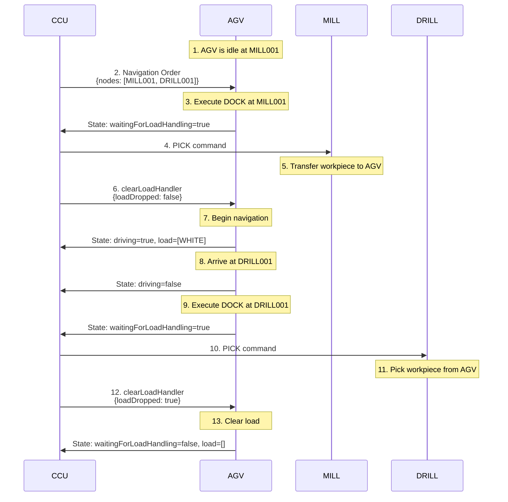

# 6.8 Automated Guided Vehicle (AGV)

## Overview

The AGV (Automated Guided Vehicle) is an automated guided vehicle that transports workpieces between modules. It navigates using line-following sensors and can carry up to 3 workpieces simultaneously.

**Device Type**: AGV (not MODULE)  
**Serial Number**: TXT4.0 Id
**Loading Capacity**: 3 bays (positions "1", "2", "3")

## MQTT Topics

AGV uses `fts/` prefix instead of `module/`:

### Subscriptions
- `fts/v1/ff/<serial>/order` - Navigation orders from CCU
- `fts/v1/ff/<serial>/instantAction` - Immediate commands

### Publications
- `fts/v1/ff/<serial>/state` - Current state (~1Hz or on change)
- `fts/v1/ff/<serial>/connection` - ONLINE/OFFLINE status (retained + LWT)
- `fts/v1/ff/<serial>/factsheet` - Vehicle capabilities (on startup)

## Supported Actions

| Action | Purpose | Metadata | Location |
|--------|---------|----------|----------|
| `DOCK` | Dock at module | None | At node |
| `PASS` | Drive past node | None | At node |
| `TURN` | Change direction | `direction`, `degree` | At intersection |

## Supported Instant Actions

| Action | Purpose | Metadata | Description |
|--------|---------|----------|-------------|
| `factsheetRequest` | Request AGV info | None | Triggers publication of factsheet message |
| `reset` | Reset AGV | None | Return AGV to initial state |
| `findInitialDockPosition`| Initialize position | `nodeId` | Force AGV to assume it is at a specific node |
| `clearLoadHandler` | Confirm load transfer | `loadDropped` / `loadPicked` | Confirm physical transfer complete so AGV can move |
| `stopCharging` | Stop battery charging | None | Interrupt charging process |

## Navigation Order Structure

AGV orders are more complex than module orders, containing navigation graphs:

**Order Message**:
```json
{
  "headerId": 10,
  "timestamp": "2024-12-08T10:00:00.000Z",
  "version": "1.0",
  "manufacturer": "fischertechnik",
  "serialNumber": "AGV001",
  "orderId": "nav-order-123",
  "orderUpdateId": 1,
  "nodes": [
    {
      "nodeId": "MILL001",
      "sequenceId": 0,
      "released": true,
      "actions": [
        {
          "actionType": "DOCK",
          "actionId": "dock-action-1",
          "blockingType": "HARD"
        }
      ]
    },
    {
      "nodeId": "DRILL001",
      "sequenceId": 1,
      "released": false,
      "actions": [
        {
          "actionType": "DOCK",
          "actionId": "dock-action-2",
          "blockingType": "HARD"
        }
      ]
    }
  ],
  "edges": []
}
```

### Order Fields

- `nodes`: Array of destination nodes to visit
  - `nodeId`: Module serial number or intersection ID
  - `sequenceId`: Order of traversal
  - `released`: Whether AGV can proceed to this node
  - `actions`: Actions to perform at this node
- `edges`: Array of path segments between nodes (typically empty for simple routing)

### Action Types

#### DOCK
Approach and dock at a module for load exchange.

**Behavior**:
1. AGV approaches module slowly
2. Uses sensors to align precisely
3. Stops at docking position
4. Sets `waitingForLoadHandling = true`
5. Waits for module PICK/DROP and clearLoadHandler

#### PASS
Drive past a node without stopping (used for intersections).

#### TURN
Change direction at an intersection.

**Metadata**:
```json
{
  "actionType": "TURN",
  "actionId": "turn-action-3",
  "actionParameters": [
    {
      "key": "direction",
      "value": "left"
    },
    {
      "key": "degree",
      "value": 90
    }
  ]
}
```

## AGV State Message

**State Topic**: `fts/v1/ff/<serial>/state`

```json
{
  "headerId": 100,
  "timestamp": "2024-12-08T10:00:05.000Z",
  "serialNumber": "AGV001",
  "type": "AGV",
  "orderId": "nav-order-123",
  "orderUpdateId": 1,
  "paused": false,
  "battery": 85,
  "position": {
    "mapId": "factory",
    "x": 100,
    "y": 250,
    "theta": 90
  },
  "velocity": {
    "vx": 0,
    "vy": 0,
    "omega": 0
  },
  "errors": [],
  "loads": []
}
```

### Key AGV State Fields

- `position`: Current coordinates and orientation
- `battery`: Battery level in percent
- `velocity`: Current speed
- `waitingForLoadHandling`: `true` when docked and waiting for module interaction

## Handshake Process (Docking)

1. AGV arrives and docks at MILL
   AGV publishes: {lastNodeId: "MILL001", waitingForLoadHandling: true}
2. CCU detects AGV is ready
3. CCU sends `PICK` or `DROP` command to the **Module**
4. Module performs action
5. Module sends `loadDropped` or `loadPicked` in its state
6. CCU detects action completion
7. CCU sends next navigation command to AGV (or releases next node)

### Load Handling Logic

When docked, the AGV waits for the module to perform the transfer. The module's state confirms the transfer:

- `loadPicked`: `true` if module took workpiece from AGV, `false` if module gave workpiece to AGV
- `loadDropped`: `true` if module took workpiece from AGV, `false` if module gave workpiece to AGV

**AGV Response**:
Once the module completes the action, the AGV updates its `loads` array to reflect the new state.

### Loading Bay Positions

- `"1"` - Left bay
- `"2"` - Middle bay
- `"3"` - Right bay

## Instant Actions

### clearLoadHandler

Confirms that load handling (PICK/DROP) is complete and AGV can continue.

**Sent by CCU after module completes PICK/DROP:**

```json
{
  "serialNumber": "AGV001",
  "timestamp": "2024-12-08T10:05:32.000Z",
  "actions": [
    {
      "actionType": "clearLoadHandler",
      "actionId": "clear-123",
      "metadata": {
        "loadDropped": true,
        "loadId": "wp-123",
        "loadType": "WHITE",
        "loadPosition": "2"
      }
    }
  ]
}
```

**Metadata**:
- `loadDropped`: `true` if module took workpiece from AGV, `false` if module gave workpiece to AGV
- `loadId`: Workpiece identifier
- `loadType`: Workpiece color
- `loadPosition`: Which bay was used ("1", "2", or "3")

**AGV Response**:
Updates state with `waitingForLoadHandling = false` and updated `load` array.

### findInitialDockPosition

Initialize AGV position after startup or reset.

```json
{
  "serialNumber": "AGV001",
  "timestamp": "2024-12-08T09:00:00.000Z",
  "actions": [
    {
      "actionType": "findInitialDockPosition",
      "actionId": "init-pos-1",
      "metadata": {
        "nodeId": "MILL001"
      }
    }
  ]
}
```

**Behavior**:
1. AGV performs docking action
2. Assumes it is docked at specified `nodeId`
3. Updates `lastNodeId` to given module

### stopCharging

Stop the charging process (if AGV is at charging station).

```json
{
  "serialNumber": "AGV001",
  "timestamp": "2024-12-08T11:00:00.000Z",
  "actions": [
    {
      "actionType": "stopCharging",
      "actionId": "stop-charge-1"
    }
  ]
}
```

## Battery Management

### Battery State

```json
{
  "batteryState": {
    "charging": false,
    "percentage": 65,
    "maxVolt": 14.8,
    "minVolt": 10.5,
    "currentVoltage": 11.8
  }
}
```

### Charging Process

1. CCU monitors battery percentage
2. When low (<20%), CCU sends navigation order to charging station
3. AGV docks at charging station (special module type `CHRG`)
4. `batteryState.charging` becomes `true`
5. When fully charged or needed, CCU sends `stopCharging` instant action
6. AGV returns to normal operation

## Navigation Flow Example

Complete flow for transporting workpiece from MILL to DRILL:



## Errors

| Error Type | Description |
|------------|-------------|
| `COLLISION` | Collision detected by sensors |
| `ACTION_DISMISSED` | Action cancelled or timed out |
| `RESET` | AGV was reset |

## Hardware Details

The AGV is built on the TXT 4.0 controller platform with:
- Line-following sensors
- Collision detection sensors
- Motor encoders
- Battery voltage monitoring
- Loading bay sensors (3 positions)

## Special Considerations

### Load Handling Synchronization

The `waitingForLoadHandling` flag is critical:
- ✅ **Set to `true`**: AGV is ready for module to PICK/DROP
- ⚠️ **Do NOT** send clearLoadHandler before module action completes
- ⚠️ **Do NOT** send navigation order while `waitingForLoadHandling` is `true`

### Multi-Bay Loading

AGV can carry up to 3 workpieces:
- Allows batch transport
- Reduces AGV trips
- Requires careful bay selection by CCU

### Charging Station Management

- CCU must monitor battery levels
- Charging interrupts normal production
- Balance between uptime and battery health

## Notes

**Order Cancellation**: The `cancelOrder` instant action is **not supported**. Order cancellation is handled via the CCU topic `ccu/order/cancel` for workpiece production orders only.


## Related Documentation

- [System Architecture](../02-architecture.md)
- [General Module Overview](../06-modules.md)
- [Message Structure](../05-message-structure.md)
- [Calibration](../07-calibration.md)
- [Manual Intervention](../08-manual-intervention.md)
