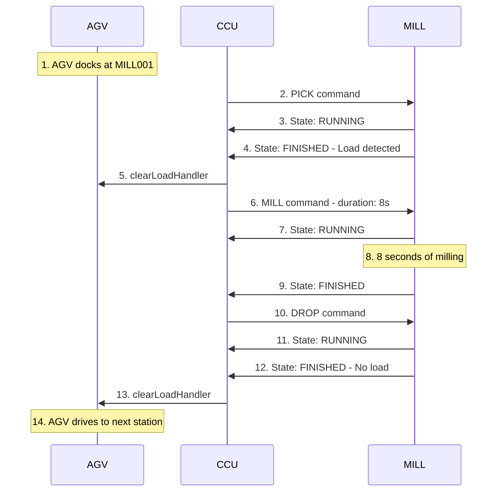

# 6.2 Milling Station (MILL)

## Overview

The Milling Station performs milling operations on workpieces. It can pick up workpieces from the AGV, perform milling operations, and return them to the AGV.

**Module Type**: `MILL`  
**Serial Number**: Cleaned variant of the SPS serial number

## Supported Commands

| Command | Purpose | Metadata | Typical Duration |
|---------|---------|----------|------------------|
| `PICK` | Pick workpiece from AGV | None | ~3 seconds |
| `MILL` | Perform milling operation | `duration` (seconds) | Configurable (default 5s) |
| `DROP` | Return workpiece to AGV | None | ~3 seconds |

## Supported Instant Actions

| Action | Purpose | Metadata | Description |
|--------|---------|----------|-------------|
| `factsheetRequest` | Request module info | None | Triggers publication of factsheet message |
| `reset` | Reset module | None | Return module to initial state |
| `startCalibration` | Enter calibration mode | None | Switch operating mode to TEACHIN |
| `stopCalibration` | Exit calibration mode | None | Switch operating mode to AUTOMATIC |
| `setCalibrationValues`| Update calibration | Calibration data | Update internal position values |

## MQTT Topics

### Subscriptions (Module listens to):
- `module/v1/ff/<serial>/order` - Production commands from CCU
- `module/v1/ff/<serial>/instantAction` - Immediate commands (calibration, reset)

### Publications (Module sends):
- `module/v1/ff/<serial>/state` - Current state (~1Hz or on change)
- `module/v1/ff/<serial>/connection` - ONLINE/OFFLINE status (retained + LWT)
- `module/v1/ff/<serial>/factsheet` - Module capabilities (on startup)

## Command Examples

### Example 1: PICK Workpiece

**Command** (CCU → Module):
```json
{
  "timestamp": "2024-12-08T10:30:00.000Z",
  "serialNumber": "MILL001",
  "orderId": "order-abc-123",
  "orderUpdateId": 1,
  "action": {
    "id": "pick-action-456",
    "command": "PICK"
  }
}
```

**State Response** (Module → CCU) during execution:
```json
{
  "headerId": 42,
  "timestamp": "2024-12-08T10:30:01.000Z",
  "serialNumber": "MILL001",
  "type": "MILL",
  "orderId": "order-abc-123",
  "orderUpdateId": 1,
  "paused": false,
  "actionState": {
    "id": "pick-action-456",
    "timestamp": "2024-12-08T10:30:01.000Z",
    "state": "RUNNING",
    "command": "PICK"
  },
  "errors": [],
  "loads": []
}
```

**State Response** on completion:
```json
{
  "headerId": 43,
  "timestamp": "2024-12-08T10:30:03.000Z",
  "serialNumber": "MILL001",
  "type": "MILL",
  "orderId": "order-abc-123",
  "orderUpdateId": 1,
  "paused": false,
  "actionState": {
    "id": "pick-action-456",
    "timestamp": "2024-12-08T10:30:03.000Z",
    "state": "FINISHED",
    "command": "PICK"
  },
  "errors": [],
  "loads": [
    {
      "loadId": null,
      "loadType": "WHITE",
      "loadPosition": "MODULE"
    }
  ]
}
```

### Example 2: MILL Operation

**Command** (CCU → Module):
```json
{
  "timestamp": "2024-12-08T10:30:05.000Z",
  "serialNumber": "MILL001",
  "orderId": "order-abc-123",
  "orderUpdateId": 2,
  "action": {
    "id": "mill-action-789",
    "command": "MILL",
    "metadata": {
      "duration": 8
    }
  }
}
```

**State Updates**:

Running state:
```json
{
  "headerId": 44,
  "timestamp": "2024-12-08T10:30:06.000Z",
  "serialNumber": "MILL001",
  "type": "MILL",
  "orderId": "order-abc-123",
  "orderUpdateId": 2,
  "paused": false,
  "actionState": {
    "id": "mill-action-789",
    "timestamp": "2024-12-08T10:30:06.000Z",
    "state": "RUNNING",
    "command": "MILL"
  },
  "errors": [],
  "loads": [
    {
      "loadType": "WHITE",
      "loadPosition": "MODULE"
    }
  ]
}
```

Finished state (after 8 seconds):
```json
{
  "headerId": 45,
  "timestamp": "2024-12-08T10:30:14.000Z",
  "serialNumber": "MILL001",
  "type": "MILL",
  "orderId": "order-abc-123",
  "orderUpdateId": 2,
  "paused": false,
  "actionState": {
    "id": "mill-action-789",
    "timestamp": "2024-12-08T10:30:14.000Z",
    "state": "FINISHED",
    "command": "MILL"
  },
  "errors": [],
  "loads": [
    {
      "loadType": "WHITE",
      "loadPosition": "MODULE"
    }
  ]
}
```

### Example 3: DROP Workpiece

**Command**:
```json
{
  "timestamp": "2024-12-08T10:30:16.000Z",
  "serialNumber": "MILL001",
  "orderId": "order-abc-123",
  "orderUpdateId": 3,
  "action": {
    "id": "drop-action-def",
    "command": "DROP"
  }
}
```

**State on Completion**:
```json
{
  "headerId": 47,
  "timestamp": "2024-12-08T10:30:19.000Z",
  "serialNumber": "MILL001",
  "type": "MILL",
  "orderId": "order-abc-123",
  "orderUpdateId": 3,
  "paused": false,
  "actionState": {
    "id": "drop-action-def",
    "timestamp": "2024-12-08T10:30:19.000Z",
    "state": "FINISHED",
    "command": "DROP"
  },
  "errors": [],
  "loads": []
}
```

## Hardware Details

### PLC Connections

The MILL module uses a Siemens S7 PLC with the following I/O:

**Inputs** (Sensors):
- Light barrier at entrance
- Light barrier at processing position
- Suction cup position sensors (inner/outer)
- Encoder signals for motor feedback

**Outputs** (Actuators):
- Conveyor belt motor (forward/reverse, PWM)
- Suction cup motors (extend/retract, PWM)
- Vacuum pump
- Compressor
- Milling motor

## Error Scenarios

### PICK_ERROR

**Cause**: No workpiece detected after PICK operation

**State Message**:
```json
{
  "actionState": {
    "id": "pick-action-456",
    "state": "FAILED",
    "command": "PICK"
  },
  "errors": [
    {
      "errorType": "PICK_ERROR",
      "timestamp": "2024-12-08T10:30:05.000Z",
      "errorLevel": "FATAL",
      "errorReferences": [
        {
          "referenceKey": "sensor",
          "referenceValue": "no_workpiece_detected"
        }
      ]
    }
  ]
}
```

### MILL_ERROR

**Cause**: Motor fault or timeout during milling

**State Message**:
```json
{
  "actionState": {
    "id": "mill-action-789",
    "state": "FAILED",
    "command": "MILL"
  },
  "errors": [
    {
      "errorType": "MILL_ERROR",
      "timestamp": "2024-12-08T10:30:10.000Z",
      "errorLevel": "FATAL",
      "errorReferences": [
        {
          "referenceKey": "reason",
          "referenceValue": "motor_fault"
        }
      ]
    }
  ]
}
```

### DROP_ERROR

**Cause**: Workpiece not released or AGV not detected

## Complete Production Cycle Example

Full sequence for milling a workpiece:



## Related Documentation

- [System Architecture](../02-architecture.md)
- [General Module Overview](../06-modules.md)
- [Message Structure](../05-message-structure.md)
- [Calibration](../07-calibration.md)
- [Manual Intervention](../08-manual-intervention.md)

## OPC UA Variables

| Variable Name | Description | Type |
|---|---|---|
| `model` | Model name | STRING |
| `stat__idle` | Status: System is idle | BOOL |
| `cmd__mill` | Command: Milling operation | BOOL |
| `cmd__pick` | Command: Pick operation | BOOL |
| `cmd__drop` | Command: Drop operation | BOOL |
| `stat__pickFinished` | Status: Pick process finished | BOOL |
| `stat__dropFinished` | Status: Drop process finished | BOOL |
| `stat__millFinished` | Status: Milling process finished | BOOL |
| `cmd__millDuration` | Command: Milling duration | INT |
| `stat__pickFailed` | Status: Pick process failed | BOOL |
| `stat__dropFailed` | Status: Drop process failed | BOOL |
| `stat__dropActive` | Status: Drop process active | BOOL |
| `stat__pickActive` | Status: Pick process active | BOOL |
| `stat__millActive` | Status: Milling process active | BOOL |
| `cal__processEndTime` | Calibration time for process end | TIME |
| `cal__vacuumReleaseTime` | Calibration time for vacuum release | TIME |
| `cal__gripperDownTime` | Calibration time for gripper down | TIME |
| `cal__preFaultCheckTime` | Calibration time before fault check | TIME |
| `version` | Versioning | STRING |
| `cal__midLightGateTime` | Calibration time to position the workpiece centrically in the light barrier | TIME |
| `cal__postMillingTime` | Calibration time after milling | TIME |
| `cal__vacuumGenerateTime` | Calibration time for vacuum generation by compressor | TIME |
