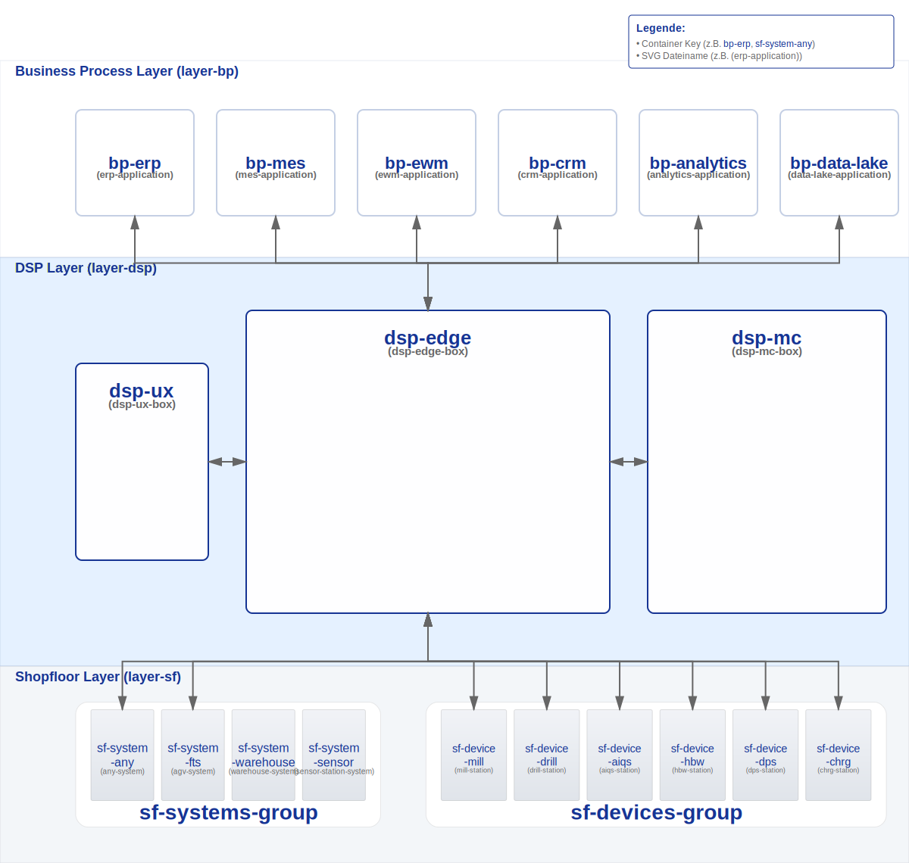
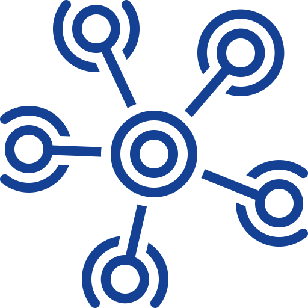
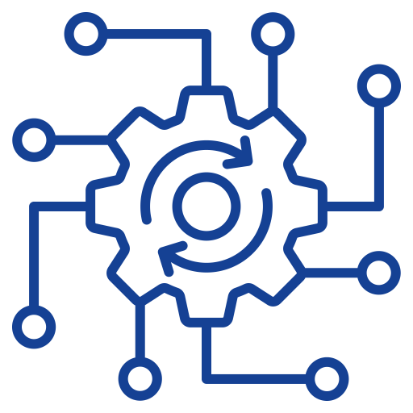
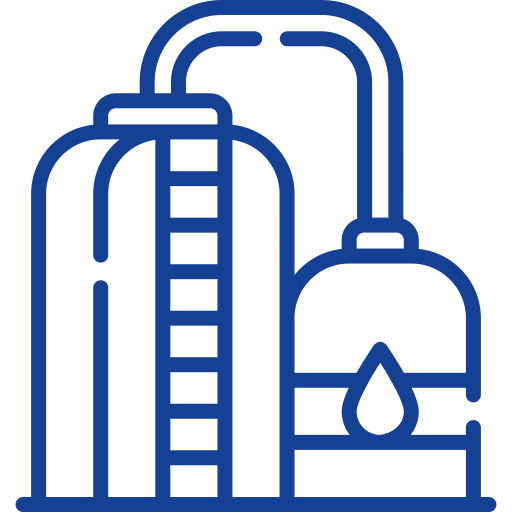
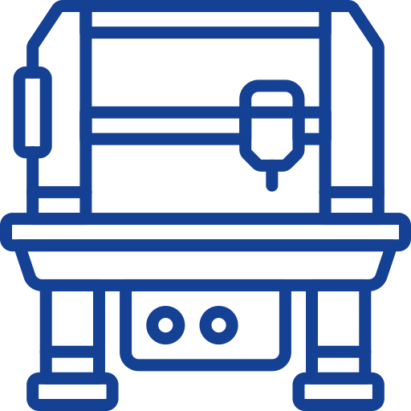
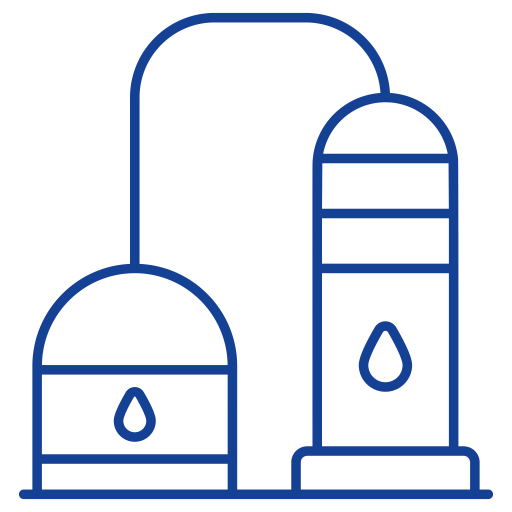

# DSP Architecture Objects Reference

Diese Dokumentation beschreibt alle Objekte (Container), Connections und Function Icons, die in der DSP-Animation verwendet werden. Sie dient als zentrale Referenz für die DSP-Architektur und zeigt alle verfügbaren Komponenten, ihre Icon-Keys, SVG-Dateien und Konfigurationsmöglichkeiten.

**Wichtige Konventionen:**
- **Container-IDs:** Verwenden durchgängig semantische Namen (z.B. `sf-system-scada`, `sf-device-mill`)
- **Icon-Keys:** Folgen der Nomenklatur `*-station.svg` (Devices), `*-system.svg` (Systems), `*-application.svg` (Business Processes)
- **SVG-Dateien:** Werden in den entsprechenden Verzeichnissen abgelegt (`assets/svg/shopfloor/stations/`, `assets/svg/shopfloor/systems/`, `assets/svg/business/`)
- **Semantische IDs:** Alle Container-IDs und Icon-Keys müssen semantisch und selbsterklärend sein (siehe auch [HOWTO_ADD_CUSTOMER.md](./HOWTO_ADD_CUSTOMER.md))

## Übersicht

Der letzte Step im Functional View zeigt die vollständige DSP-Architektur mit allen Layern, Containern und Connections. Es ist der finale Überblick, in dem alle Komponenten gleichzeitig sichtbar sind (ohne Highlighting).

### Verfügbare View-Modi

Die DSP-Animation unterstützt drei verschiedene View-Modi:

1. **Functional View** (`viewMode: 'functional'`): Zeigt die funktionale Architektur mit Edge Functions, MC Functions und Shopfloor-Integration. Dies ist der Standard-View-Modus mit 20 animierten Steps.
2. **Component View** (`viewMode: 'component'`): Zeigt die interne Struktur des DSP Edge mit allen 8 Komponenten im 3x3 Grid (Router, App Server, Agent, etc.).
3. **Deployment View** (`viewMode: 'deployment'`): Zeigt die Deployment-Pipeline innerhalb des DSP Edge mit 4 Pipeline-Steps (Integration, Transformation, Consolidation, Provisioning).

Alle View-Modi werden durch separate SVG-Diagramme dokumentiert (siehe Abschnitt [SVG-Diagramme](#svg-diagramme) unten). Diese Diagramme zeigen die strukturelle Übersicht mit Key-Namen statt Icons für bessere Referenzierbarkeit.

## Layer-Struktur

Die DSP-Animation ist in drei horizontale Layer unterteilt:

1. **Business Process Layer** (oben, weiß) - `layer-bp`
2. **DSP Layer** (Mitte, blau) - `layer-dsp`
3. **Shopfloor Layer** (unten, grau) - `layer-sf`

---

## Business Process Layer (`layer-bp`)

### Functional View - Vollständige Architektur

Das folgende Diagramm zeigt die komplette Functional View mit allen Layern, Containern und Connections:



**Enthält:**
- Alle 3 Layer (Business Process, DSP, Shopfloor)
- Alle Container mit ihren IDs als Labels
- Alle Connections in L-Form mit bidirektionalen Pfeilen
- Semantische Keys für alle Shopfloor-Systems und -Devices

### Container IDs

Die folgenden Business Process Applications sind verfügbar:

| Container ID | Label | Icon Key | SVG Datei | Brand Logo |
|--------------|-------|----------|-----------|------------|
| `bp-erp` | ERP Applications | `erp-application` | `erp-application.svg` | `logo-sap` (top-right) |
| `bp-mes` | MES Applications | `mes-application` | `mes-application.svg` | `logo-orbis` (top-left) |
| `bp-cloud` | Cloud Applications | `bp-cloud-apps` | `cloud-application.svg` | `aws-logo`, `google-cloud-logo` (multiple) |
| `bp-analytics` | Analytics Applications | `bp-analytics` | `analytics-application.svg` | `logo-grafana` (top-right) |
| `bp-data-lake` | Data Lake | `bp-data-lake` | `data-lake-application.svg` | `aws-logo` (optional) |
| `bp-scm` | SCM Applications | `scm-application` | `scm-application.svg` | - |
| `bp-crm` | CRM Applications | `crm-application` | `crm-application.svg` | - |

**Verfügbare Business Process Application Icons:**

<div style="display: grid; grid-template-columns: repeat(auto-fit, minmax(120px, 1fr)); gap: 16px; margin: 16px 0;">

<div style="text-align: center; border: 1px solid #ddd; border-radius: 4px; padding: 12px;">

<div style="font-weight: 600; margin-top: 8px;">`erp-application`</div>
<div style="font-size: 0.9em; color: #666;">erp-application.svg</div>
</div>

<div style="text-align: center; border: 1px solid #ddd; border-radius: 4px; padding: 12px;">

<div style="font-weight: 600; margin-top: 8px;">`mes-application`</div>
<div style="font-size: 0.9em; color: #666;">mes-application.svg</div>
</div>

<div style="text-align: center; border: 1px solid #ddd; border-radius: 4px; padding: 12px;">

<div style="font-weight: 600; margin-top: 8px;">`bp-cloud-apps`</div>
<div style="font-size: 0.9em; color: #666;">cloud-application.svg</div>
</div>

<div style="text-align: center; border: 1px solid #ddd; border-radius: 4px; padding: 12px;">

<div style="font-weight: 600; margin-top: 8px;">`bp-analytics`</div>
<div style="font-size: 0.9em; color: #666;">analytics-application.svg</div>
</div>

<div style="text-align: center; border: 1px solid #ddd; border-radius: 4px; padding: 12px;">

<div style="font-weight: 600; margin-top: 8px;">`bp-data-lake`</div>
<div style="font-size: 0.9em; color: #666;">data-lake-application.svg</div>
</div>

<div style="text-align: center; border: 1px solid #ddd; border-radius: 4px; padding: 12px;">

<div style="font-weight: 600; margin-top: 8px;">`bp-scm`</div>
<div style="font-size: 0.9em; color: #666;">scm-application.svg</div>
</div>

<div style="text-align: center; border: 1px solid #ddd; border-radius: 4px; padding: 12px;">

<div style="font-weight: 600; margin-top: 8px;">`bp-crm`</div>
<div style="font-size: 0.9em; color: #666;">crm-application.svg</div>
</div>

</div>

**Hinweis:** Weitere Business Process Applications können über Customer Configs hinzugefügt werden. Die SVG-Dateien müssen im Verzeichnis `assets/svg/business/` abgelegt werden und der Nomenklatur `*-application.svg` folgen.

### Connections von Business Process Layer

Alle Business Process Container haben Connections zum DSP Edge. Die Connection-IDs folgen dem Schema `conn_<bp-id>_dsp-edge`:

**Beispiel:**
- **`conn_bp-erp_dsp-edge`** - ERP → DSP Edge
  - **From:** `bp-erp` (bottom)
  - **To:** `dsp-edge` (top)
  - **Bidirectional:** Ja
  - **Arrow:** Ja

**Weitere Business Process Connections:** `conn_bp-mes_dsp-edge`, `conn_bp-cloud_dsp-edge`, `conn_bp-analytics_dsp-edge`, `conn_bp-data-lake_dsp-edge` (alle mit identischen Eigenschaften)

---

## DSP Layer (`layer-dsp`)

### Container IDs

- **`dsp-ux`** - SmartFactory Dashboard (UX)
  - **Icon:** `ux-box` (center)
  - **Type:** `ux`
  - **Position:** Links, halbe Höhe
  - **URL:** `/dashboard`

- **`dsp-edge`** - DSP Edge
  - **Logo:** `logo-dsp` (top-left)
  - **Center Icon:** `logo-edge`
  - **Type:** `dsp-edge`
  - **Position:** Mitte, volle Höhe
  - **Environment Label:** "On Premise"
  - **URL:** `/edge`
  - **Function Icons:** 9 Edge Function Icons (siehe unten)
  - **Edge Components:** 8 interne Komponenten (nur in Component View sichtbar)

- **`dsp-mc`** - Management Cockpit
  - **Logo:** `logo-orbis` (top-left)
  - **Secondary Logo:** `logo-azure` (top-right)
  - **Center Icon:** `logo-mc`
  - **Type:** `dsp-cloud`
  - **Position:** Rechts, volle Höhe
  - **Environment Label:** "Cloud"
  - **URL:** `/management-cockpit`
  - **Function Icons:** 3 MC Function Icons (siehe unten)
  - **Edge Instances:** 3 Edge-Instance Icons (siehe unten)

### DSP Edge Function Icons

**Verfügbare Edge Function Icons:**

<div style="display: grid; grid-template-columns: repeat(auto-fit, minmax(120px, 1fr)); gap: 16px; margin: 16px 0;">

<div style="text-align: center; border: 1px solid #ddd; border-radius: 4px; padding: 12px;">

<div style="font-weight: 600; margin-top: 8px;">`edge-interoperability`</div>
<div style="font-size: 0.9em; color: #666;">edge-interoperability.svg</div>
</div>

<div style="text-align: center; border: 1px solid #ddd; border-radius: 4px; padding: 12px;">

<div style="font-weight: 600; margin-top: 8px;">`edge-network`</div>
<div style="font-size: 0.9em; color: #666;">edge-connectivity.svg</div>
</div>

<div style="text-align: center; border: 1px solid #ddd; border-radius: 4px; padding: 12px;">

<div style="font-weight: 600; margin-top: 8px;">`edge-event-driven`</div>
<div style="font-size: 0.9em; color: #666;">edge-event-driven.svg</div>
</div>

<div style="text-align: center; border: 1px solid #ddd; border-radius: 4px; padding: 12px;">

<div style="font-weight: 600; margin-top: 8px;">`edge-choreography`</div>
<div style="font-size: 0.9em; color: #666;">edge-choreography.svg</div>
</div>

<div style="text-align: center; border: 1px solid #ddd; border-radius: 4px; padding: 12px;">

<div style="font-weight: 600; margin-top: 8px;">`edge-digital-twin`</div>
<div style="font-size: 0.9em; color: #666;">edge-digital-twin.svg</div>
</div>

<div style="text-align: center; border: 1px solid #ddd; border-radius: 4px; padding: 12px;">

<div style="font-weight: 600; margin-top: 8px;">`edge-best-of-breed`</div>
<div style="font-size: 0.9em; color: #666;">edge-best-of-breed.svg</div>
</div>

<div style="text-align: center; border: 1px solid #ddd; border-radius: 4px; padding: 12px;">

<div style="font-weight: 600; margin-top: 8px;">`edge-analytics`</div>
<div style="font-size: 0.9em; color: #666;">edge-analytics.svg</div>
</div>

<div style="text-align: center; border: 1px solid #ddd; border-radius: 4px; padding: 12px;">

<div style="font-weight: 600; margin-top: 8px;">`edge-ai-enablement`</div>
<div style="font-size: 0.9em; color: #666;">edge-ai-enablement.svg</div>
</div>

<div style="text-align: center; border: 1px solid #ddd; border-radius: 4px; padding: 12px;">

<div style="font-weight: 600; margin-top: 8px;">`edge-autonomous-enterprise`</div>
<div style="font-size: 0.9em; color: #666;">edge-autonomous-enterprise.svg</div>
</div>

</div>

### DSP Edge Function Icons (Details)

Diese Icons werden innerhalb des `dsp-edge` Containers angezeigt (nur in Functional View, wenn `showFunctionIcons: true`):

1. **`edge-interoperability`** - Interoperabilität
   - **Icon Key:** `edge-interoperability`
   - **SVG:** `assets/svg/dsp/functions/edge-interoperability.svg`
   - **Size:** 48px
   - **Beschreibung:** Ermöglicht die Kommunikation zwischen verschiedenen Systemen und Protokollen

2. **`edge-network`** - Netzwerk / Connectivity
   - **Icon Key:** `edge-network`
   - **SVG:** `assets/svg/dsp/functions/edge-connectivity.svg`
   - **Size:** 48px
   - **Beschreibung:** Netzwerk-Konnektivität und Kommunikationsinfrastruktur

3. **`edge-event-driven`** - Event-Driven Processing
   - **Icon Key:** `edge-event-driven`
   - **SVG:** `assets/svg/dsp/functions/edge-event-driven.svg`
   - **Size:** 48px
   - **Beschreibung:** Ereignisgesteuerte Verarbeitung von Shopfloor-Events

4. **`edge-choreography`** - Process Choreography
   - **Icon Key:** `edge-choreography`
   - **SVG:** `assets/svg/dsp/functions/edge-choreography.svg`
   - **Size:** 48px
   - **Beschreibung:** Dezentrale Prozess-Choreographie ohne zentrale Orchestrierung

5. **`edge-digital-twin`** - Digital Twin
   - **Icon Key:** `edge-digital-twin`
   - **SVG:** `assets/svg/dsp/functions/edge-digital-twin.svg`
   - **Size:** 48px
   - **Beschreibung:** Digitale Abbildung physischer Assets und Prozesse

6. **`edge-best-of-breed`** - Best-of-Breed Integration
   - **Icon Key:** `edge-best-of-breed`
   - **SVG:** `assets/svg/dsp/functions/edge-best-of-breed.svg`
   - **Size:** 48px
   - **Beschreibung:** Integration verschiedener Best-of-Breed Lösungen

7. **`edge-analytics`** - Analytics
   - **Icon Key:** `edge-analytics`
   - **SVG:** `assets/svg/dsp/functions/edge-analytics.svg`
   - **Size:** 48px
   - **Beschreibung:** Lokale Datenanalyse und Auswertung

8. **`edge-ai-enablement`** - AI Enablement
   - **Icon Key:** `edge-ai-enablement`
   - **SVG:** `assets/svg/dsp/functions/edge-ai-enablement.svg`
   - **Size:** 48px
   - **Beschreibung:** KI-Funktionalitäten am Edge

9. **`edge-autonomous-enterprise`** - Autonomous Enterprise
   - **Icon Key:** `edge-autonomous-enterprise`
   - **SVG:** `assets/svg/dsp/functions/edge-autonomous-enterprise.svg`
   - **Size:** 48px
   - **Beschreibung:** Autonome und adaptive Fertigungsprozesse

**Hinweis:** Im letzten Step des Functional View sind diese Function Icons **nicht sichtbar** (`showFunctionIcons: false`). Sie werden in früheren Steps (Step 3-12) schrittweise eingeblendet.

### Management Cockpit (MC) Function Icons

Diese Icons werden innerhalb des `dsp-mc` Containers angezeigt (nur in Functional View, wenn `showFunctionIcons: true`):

**Verfügbare MC Function Icons:**

<div style="display: grid; grid-template-columns: repeat(auto-fit, minmax(120px, 1fr)); gap: 16px; margin: 16px 0;">

<div style="text-align: center; border: 1px solid #ddd; border-radius: 4px; padding: 12px;">

<div style="font-weight: 600; margin-top: 8px;">`mc-hierarchical-structure`</div>
<div style="font-size: 0.9em; color: #666;">mc-hierarchical-structure.svg</div>
</div>

<div style="text-align: center; border: 1px solid #ddd; border-radius: 4px; padding: 12px;">

<div style="font-weight: 600; margin-top: 8px;">`mc-orchestration`</div>
<div style="font-size: 0.9em; color: #666;">mc-orchestration.svg</div>
</div>

<div style="text-align: center; border: 1px solid #ddd; border-radius: 4px; padding: 12px;">

<div style="font-weight: 600; margin-top: 8px;">`mc-governance`</div>
<div style="font-size: 0.9em; color: #666;">mc-governance.svg</div>
</div>

</div>

### MC Function Icons (Details)

1. **`mc-hierarchical-structure`** - Hierarchische Struktur
   - **Icon Key:** `mc-hierarchical-structure`
   - **SVG:** `assets/svg/dsp/functions/mc-hierarchical-structure.svg`
   - **Size:** 48px
   - **Beschreibung:** Hierarchische Organisation mehrerer Edge-Instanzen

2. **`mc-orchestration`** - Orchestrierung
   - **Icon Key:** `mc-orchestration`
   - **SVG:** `assets/svg/dsp/functions/mc-orchestration.svg`
   - **Size:** 48px
   - **Beschreibung:** Zentrale Orchestrierung von Edge-Prozessen

3. **`mc-governance`** - Governance
   - **Icon Key:** `mc-governance`
   - **SVG:** `assets/svg/dsp/functions/mc-governance.svg`
   - **Size:** 48px
   - **Beschreibung:** Governance und Compliance-Management

### Edge Instance Icons (MC Visualization)

Diese Icons werden im Management Cockpit zur Visualisierung verteilter DSP Edge-Komponenten verwendet (nur in Functional View Step 18, wenn `showFunctionIcons: true`):

**Verfügbare Edge Instance Icons:**

<div style="display: grid; grid-template-columns: repeat(auto-fit, minmax(120px, 1fr)); gap: 16px; margin: 16px 0;">

<div style="text-align: center; border: 1px solid #ddd; border-radius: 4px; padding: 12px;">

<div style="font-weight: 600; margin-top: 8px;">`logo-edge-a`</div>
<div style="font-size: 0.9em; color: #666;">dsp-edge-box.svg</div>
</div>

<div style="text-align: center; border: 1px solid #ddd; border-radius: 4px; padding: 12px;">

<div style="font-weight: 600; margin-top: 8px;">`logo-edge-b`</div>
<div style="font-size: 0.9em; color: #666;">dsp-edge-box.svg</div>
</div>

<div style="text-align: center; border: 1px solid #ddd; border-radius: 4px; padding: 12px;">

<div style="font-weight: 600; margin-top: 8px;">`logo-edge-c`</div>
<div style="font-size: 0.9em; color: #666;">dsp-edge-box.svg</div>
</div>

</div>

**Hinweis:** 
- In Step 18 werden nur die `logo-edge-*` Icons angezeigt (3 Edge-Instanzen zur Visualisierung)
- In anderen Steps werden nur die MC-Funktions-Icons (`mc-hierarchical-structure`, `mc-orchestration`, `mc-governance`) angezeigt
- Im letzten Step des Functional View sind alle Function Icons **nicht sichtbar** (`showFunctionIcons: false`)
- Die Edge Instance Icons sind **keine Function Icons**, sondern dienen der Visualisierung verteilter DSP Edge-Komponenten durch das Management Cockpit

### Edge Components (nur in Component View sichtbar)

Diese Komponenten sind innerhalb des `dsp-edge` Containers angeordnet (3x3 Grid):

**Verfügbare Edge Component Icons:**

<div style="display: grid; grid-template-columns: repeat(auto-fit, minmax(120px, 1fr)); gap: 16px; margin: 16px 0;">

<div style="text-align: center; border: 1px solid #ddd; border-radius: 4px; padding: 12px;">

<div style="font-weight: 600; margin-top: 8px;">`edge-comp-disc`</div>
<div style="font-size: 0.9em; color: #666;">edge-disc.svg</div>
</div>

<div style="text-align: center; border: 1px solid #ddd; border-radius: 4px; padding: 12px;">

<div style="font-weight: 600; margin-top: 8px;">`edge-comp-event-bus`</div>
<div style="font-size: 0.9em; color: #666;">edge-event-bus.svg</div>
</div>

<div style="text-align: center; border: 1px solid #ddd; border-radius: 4px; padding: 12px;">

<div style="font-weight: 600; margin-top: 8px;">`edge-comp-app-server`</div>
<div style="font-size: 0.9em; color: #666;">edge-app-server.svg</div>
</div>

<div style="text-align: center; border: 1px solid #ddd; border-radius: 4px; padding: 12px;">

<div style="font-weight: 600; margin-top: 8px;">`edge-comp-router`</div>
<div style="font-size: 0.9em; color: #666;">edge-router.svg</div>
</div>

<div style="text-align: center; border: 1px solid #ddd; border-radius: 4px; padding: 12px;">

<div style="font-weight: 600; margin-top: 8px;">`edge-comp-agent`</div>
<div style="font-size: 0.9em; color: #666;">edge-agent.svg</div>
</div>

<div style="text-align: center; border: 1px solid #ddd; border-radius: 4px; padding: 12px;">

<div style="font-weight: 600; margin-top: 8px;">`edge-comp-log-server`</div>
<div style="font-size: 0.9em; color: #666;">edge-log-server.svg</div>
</div>

<div style="text-align: center; border: 1px solid #ddd; border-radius: 4px; padding: 12px;">

<div style="font-weight: 600; margin-top: 8px;">`edge-comp-disi`</div>
<div style="font-size: 0.9em; color: #666;">edge-disi.svg</div>
</div>

<div style="text-align: center; border: 1px solid #ddd; border-radius: 4px; padding: 12px;">

<div style="font-weight: 600; margin-top: 8px;">`edge-comp-database`</div>
<div style="font-size: 0.9em; color: #666;">edge-database.svg</div>
</div>

</div>

**Layout (3x3 Grid):**

**Row 1:**
- **`edge-comp-disc`** - DISC Component (Row 1, Column 1)
- **`edge-comp-event-bus`** - Event Bus Component (Row 1, Column 3)

**Row 2:**
- **`edge-comp-app-server`** - App Server Component (Row 2, Column 1)
- **`edge-comp-router`** - Router Component (Row 2, Column 2)
- **`edge-comp-agent`** - Agent Component (Row 2, Column 3)

**Row 3:**
- **`edge-comp-log-server`** - Log Server Component (Row 3, Column 1)
- **`edge-comp-disi`** - DISI Component (Row 3, Column 2)
- **`edge-comp-database`** - Database Component (Row 3, Column 3)

### Connections im DSP Layer

- **`conn_dsp-ux_dsp-edge`** - UX → Edge
  - **From:** `dsp-ux` (right)
  - **To:** `dsp-edge` (left)
  - **Bidirectional:** Ja
  - **Arrow:** Ja

- **`conn_dsp-edge_dsp-mc`** - Edge → Management Cockpit
  - **From:** `dsp-edge` (right)
  - **To:** `dsp-mc` (left)
  - **Bidirectional:** Ja
  - **Arrow:** Ja

---

## Shopfloor Layer (`layer-sf`)

### Container IDs

#### Shopfloor Systems Group (`sf-systems-group`)

**Verfügbare Shopfloor System Container:**

| Container ID | Label | Icon Key | SVG Datei | Typ |
|--------------|-------|----------|-----------|-----|
| `sf-system-any` | Any System (Generic) | `any-system` | `any-system.svg` | `device` |
| `sf-system-fts` | FTS/AGV System | `agv-system` | `agv-system.svg` | `device` |
| `sf-system-warehouse` | Warehouse System | `warehouse-system` | `warehouse-system.svg` | `device` |
| `sf-system-factory` | Factory System | `factory-system` | `factory-system.svg` | `device` |
| `sf-system-scada` | SCADA System | `scada-system` | `scada-system.svg` | `device` |
| `sf-system-industrial-process` | Industrial Process System | `industrial-process-system` | `industrial-process-system.svg` | `device` |
| `sf-system-cargo` | Cargo System | `cargo-system` | `cargo-system.svg` | `device` |
| `sf-system-pump` | Pump System | `pump-system` | `pump-system.svg` | `device` |

**Verfügbare Shopfloor System Icons:**

<div style="display: grid; grid-template-columns: repeat(auto-fit, minmax(120px, 1fr)); gap: 16px; margin: 16px 0;">

<div style="text-align: center; border: 1px solid #ddd; border-radius: 4px; padding: 12px;">

<div style="font-weight: 600; margin-top: 8px;">`any-system`</div>
<div style="font-size: 0.9em; color: #666;">any-system.svg</div>
</div>

<div style="text-align: center; border: 1px solid #ddd; border-radius: 4px; padding: 12px;">

<div style="font-weight: 600; margin-top: 8px;">`agv-system`</div>
<div style="font-size: 0.9em; color: #666;">agv-system.svg</div>
</div>

<div style="text-align: center; border: 1px solid #ddd; border-radius: 4px; padding: 12px;">

<div style="font-weight: 600; margin-top: 8px;">`warehouse-system`</div>
<div style="font-size: 0.9em; color: #666;">warehouse-system.svg</div>
</div>

<div style="text-align: center; border: 1px solid #ddd; border-radius: 4px; padding: 12px;">

<div style="font-weight: 600; margin-top: 8px;">`factory-system`</div>
<div style="font-size: 0.9em; color: #666;">factory-system.svg</div>
</div>

<div style="text-align: center; border: 1px solid #ddd; border-radius: 4px; padding: 12px;">

<div style="font-weight: 600; margin-top: 8px;">`scada-system`</div>
<div style="font-size: 0.9em; color: #666;">scada-system.svg</div>
</div>

<div style="text-align: center; border: 1px solid #ddd; border-radius: 4px; padding: 12px;">

<div style="font-weight: 600; margin-top: 8px;">`industrial-process-system`</div>
<div style="font-size: 0.9em; color: #666;">industrial-process-system.svg</div>
</div>

<div style="text-align: center; border: 1px solid #ddd; border-radius: 4px; padding: 12px;">

<div style="font-weight: 600; margin-top: 8px;">`cargo-system`</div>
<div style="font-size: 0.9em; color: #666;">cargo-system.svg</div>
</div>

<div style="text-align: center; border: 1px solid #ddd; border-radius: 4px; padding: 12px;">

<div style="font-weight: 600; margin-top: 8px;">`pump-system`</div>
<div style="font-size: 0.9em; color: #666;">pump-system.svg</div>
</div>

</div>

**Hinweis:** Bei Customer Configs sollten semantische System-IDs verwendet werden (z.B. `sf-system-scada`, `sf-system-fts`, `sf-system-warehouse`, etc.). Die SVG-Dateien müssen im Verzeichnis `assets/svg/shopfloor/systems/` abgelegt werden und der Nomenklatur `*-system.svg` folgen.

#### Shopfloor Devices Group (`sf-devices-group`)

**Verfügbare Shopfloor Device Container:**

| Container ID | Label | Icon Key | SVG Datei | Typ |
|--------------|-------|----------|-----------|-----|
| `sf-device-mill` | Mill Station | `mill-station` | `mill-station.svg` | `device` |
| `sf-device-drill` | Drill Station | `drill-station` | `drill-station.svg` | `device` |
| `sf-device-aiqs` | AIQS Station | `aiqs-station` | `aiqs-station.svg` | `device` |
| `sf-device-hbw` | HBW Station | `hbw-station` | `hbw-station.svg` | `device` |
| `sf-device-dps` | DPS Station | `dps-station` | `dps-station.svg` | `device` |
| `sf-device-chrg` | Charging Station | `chrg-station` | `chrg-station.svg` | `device` |
| `sf-device-cnc` | CNC Station | `cnc-station` | `cnc-station.svg` | `device` |
| `sf-device-hydraulic` | Hydraulic Station | `hydraulic-station` | `hydraulic-station.svg` | `device` |
| `sf-device-printer-3d` | 3D Printer Station | `printer-3d-station` | `printer-3d-station.svg` | `device` |
| `sf-device-weight` | Weight Station | `weight-station` | `weight-station.svg` | `device` |
| `sf-device-laser` | Laser Station | `laser-station` | `laser-station.svg` | `device` |
| `sf-device-conveyor` | Conveyor Station | `conveyor-station` | `conveyor-station.svg` | `device` |
| `sf-device-oven` | Oven Station | `oven-station` | `oven-station.svg` | `device` |
| `sf-device-robotic-arm` | Robotic Arm Station | `robotic-arm-station` | `robotic-arm-station.svg` | `device` |
| `sf-device-pump` | Pump Station | `pump-station` | `pump-station.svg` | `device` |
| `sf-device-destillation` | Destillation Station | `destillation-station` | `destillation-station.svg` | `device` |

**Verfügbare Shopfloor Device Icons:**

<div style="display: grid; grid-template-columns: repeat(auto-fit, minmax(120px, 1fr)); gap: 16px; margin: 16px 0;">

<div style="text-align: center; border: 1px solid #ddd; border-radius: 4px; padding: 12px;">

<div style="font-weight: 600; margin-top: 8px;">`mill-station`</div>
<div style="font-size: 0.9em; color: #666;">mill-station.svg</div>
</div>

<div style="text-align: center; border: 1px solid #ddd; border-radius: 4px; padding: 12px;">

<div style="font-weight: 600; margin-top: 8px;">`drill-station`</div>
<div style="font-size: 0.9em; color: #666;">drill-station.svg</div>
</div>

<div style="text-align: center; border: 1px solid #ddd; border-radius: 4px; padding: 12px;">

<div style="font-weight: 600; margin-top: 8px;">`aiqs-station`</div>
<div style="font-size: 0.9em; color: #666;">aiqs-station.svg</div>
</div>

<div style="text-align: center; border: 1px solid #ddd; border-radius: 4px; padding: 12px;">

<div style="font-weight: 600; margin-top: 8px;">`hbw-station`</div>
<div style="font-size: 0.9em; color: #666;">hbw-station.svg</div>
</div>

<div style="text-align: center; border: 1px solid #ddd; border-radius: 4px; padding: 12px;">

<div style="font-weight: 600; margin-top: 8px;">`dps-station`</div>
<div style="font-size: 0.9em; color: #666;">dps-station.svg</div>
</div>

<div style="text-align: center; border: 1px solid #ddd; border-radius: 4px; padding: 12px;">

<div style="font-weight: 600; margin-top: 8px;">`chrg-station`</div>
<div style="font-size: 0.9em; color: #666;">chrg-station.svg</div>
</div>

<div style="text-align: center; border: 1px solid #ddd; border-radius: 4px; padding: 12px;">

<div style="font-weight: 600; margin-top: 8px;">`cnc-station`</div>
<div style="font-size: 0.9em; color: #666;">cnc-station.svg</div>
</div>

<div style="text-align: center; border: 1px solid #ddd; border-radius: 4px; padding: 12px;">

<div style="font-weight: 600; margin-top: 8px;">`hydraulic-station`</div>
<div style="font-size: 0.9em; color: #666;">hydraulic-station.svg</div>
</div>

<div style="text-align: center; border: 1px solid #ddd; border-radius: 4px; padding: 12px;">

<div style="font-weight: 600; margin-top: 8px;">`printer-3d-station`</div>
<div style="font-size: 0.9em; color: #666;">printer-3d-station.svg</div>
</div>

<div style="text-align: center; border: 1px solid #ddd; border-radius: 4px; padding: 12px;">

<div style="font-weight: 600; margin-top: 8px;">`weight-station`</div>
<div style="font-size: 0.9em; color: #666;">weight-station.svg</div>
</div>

<div style="text-align: center; border: 1px solid #ddd; border-radius: 4px; padding: 12px;">

<div style="font-weight: 600; margin-top: 8px;">`laser-station`</div>
<div style="font-size: 0.9em; color: #666;">laser-station.svg</div>
</div>

<div style="text-align: center; border: 1px solid #ddd; border-radius: 4px; padding: 12px;">

<div style="font-weight: 600; margin-top: 8px;">`conveyor-station`</div>
<div style="font-size: 0.9em; color: #666;">conveyor-station.svg</div>
</div>

<div style="text-align: center; border: 1px solid #ddd; border-radius: 4px; padding: 12px;">

<div style="font-weight: 600; margin-top: 8px;">`oven-station`</div>
<div style="font-size: 0.9em; color: #666;">oven-station.svg</div>
</div>

<div style="text-align: center; border: 1px solid #ddd; border-radius: 4px; padding: 12px;">

<div style="font-weight: 600; margin-top: 8px;">`robotic-arm-station`</div>
<div style="font-size: 0.9em; color: #666;">robotic-arm-station.svg</div>
</div>

<div style="text-align: center; border: 1px solid #ddd; border-radius: 4px; padding: 12px;">

<div style="font-weight: 600; margin-top: 8px;">`pump-station`</div>
<div style="font-size: 0.9em; color: #666;">pump-station.svg</div>
</div>

<div style="text-align: center; border: 1px solid #ddd; border-radius: 4px; padding: 12px;">

<div style="font-weight: 600; margin-top: 8px;">`destillation-station`</div>
<div style="font-size: 0.9em; color: #666;">destillation-station.svg</div>
</div>

</div>

**Hinweis:** Bei Customer Configs sollten semantische Device-IDs verwendet werden (z.B. `sf-device-mill`, `sf-device-drill`, `sf-device-cnc`, etc.). Die SVG-Dateien müssen im Verzeichnis `assets/svg/shopfloor/stations/` abgelegt werden und der Nomenklatur `*-station.svg` folgen.

### Connections von Shopfloor Layer

Alle Shopfloor Systems und Devices haben Connections zum DSP Edge. Die Connection-IDs folgen dem Schema `conn_dsp-edge_<container-id>`:

**Beispiele:**
- **`conn_dsp-edge_sf-system-any`** - Edge → Any System
  - **From:** `dsp-edge` (bottom)
  - **To:** `sf-system-any` (top)
  - **Bidirectional:** Ja
  - **Arrow:** Ja

- **`conn_dsp-edge_sf-device-mill`** - Edge → Mill Device
  - **From:** `dsp-edge` (bottom)
  - **To:** `sf-device-mill` (top)
  - **Bidirectional:** Ja
  - **Arrow:** Ja

**Hinweis:** Bei Customer Configs werden die Connection-IDs dynamisch aus den Container-IDs generiert: `conn_dsp-edge_${system.id}` bzw. `conn_dsp-edge_${device.id}`

---

## Connection-Naming-Konvention

Alle Connections folgen dem Schema:

```
conn_<from-id>_<to-id>
```

**Beispiele:**
- `conn_dsp-ux_dsp-edge` - Von UX zu Edge
- `conn_dsp-edge_dsp-mc` - Von Edge zu Management Cockpit
- `conn_bp-erp_dsp-edge` - Von ERP zu Edge
- `conn_dsp-edge_sf-device-mill` - Von Edge zu Mill Device

**Connection-Eigenschaften:**
- **`fromSide`** / **`toSide`**: `'top'`, `'bottom'`, `'left'`, `'right'`
- **`hasArrow`**: `true` (zeigt Richtung an)
- **`bidirectional`**: `true` (zweiseitige Verbindung)
- **`state`**: `'hidden'` (wird im letzten Step des Functional View auf `'visible'` gesetzt)

---

## Container-Typen

- **`layer`** - Layer-Hintergrund (Gruppe)
- **`business`** - Business Process Container
- **`ux`** - UX/Dashboard Container
- **`dsp-edge`** - DSP Edge Container
- **`dsp-cloud`** - Management Cockpit Container
- **`device`** - Shopfloor Device/System Container
- **`shopfloor-group`** - Shopfloor Group Container (Gruppe)

---

## Wartung und Erweiterung

### Neue Container hinzufügen

1. **Container in `layout.shared.config.ts` erstellen:**
   ```typescript
   containers.push({
     id: 'neuer-container',
     label: '',
     x: 100,
     y: 200,
     width: 150,
     height: 100,
     type: 'device',
     state: 'hidden',
     logoIconKey: 'device-example' as IconKey,
     // ...
   });
   ```

2. **Container-ID zum letzten Step hinzufügen:**
   ```typescript
   visibleContainerIds: [
     // ... bestehende IDs
     'neuer-container',
   ],
   ```

3. **Connection erstellen (falls nötig):**
   ```typescript
   {
     id: 'conn_dsp-edge_neuer-container',
     fromId: 'dsp-edge',
     toId: 'neuer-container',
     fromSide: 'bottom',
     toSide: 'top',
     state: 'hidden',
     hasArrow: true,
     bidirectional: true,
   }
   ```

### Connection-Verhalten verstehen

**Connection-Rendering:**
- Connections werden als SVG-Pfade (`<path>`) gerendert
- **Anchors:** Verbindungspunkte an Container-Rändern (top, bottom, left, right)
- **Routing:** Automatisches Routing um Container herum
- **Arrows:** Pfeilspitzen zeigen Richtung an (bei `hasArrow: true`)
- **Bidirectional:** Zweiseitige Verbindung (beide Richtungen)

**Connection-Sichtbarkeit:**
- `state: 'hidden'` - Connection ist nicht sichtbar
- `state: 'normal'` - Connection ist sichtbar (grau)
- `state: 'highlighted'` - Connection ist hervorgehoben (blau, dicker)

### Function Icons hinzufügen

1. **Function Icon zu Container hinzufügen:**
   ```typescript
   functionIcons: [
     // ... bestehende Icons
     { iconKey: 'neues-icon' as IconKey, size: 48 },
   ],
   ```

2. **Icon in `icon-registry.ts` registrieren:**
   ```typescript
   'neues-icon': 'assets/svg/dsp/functions/neues-icon.svg',
   ```

3. **Icon in Functional View Steps verwenden:**
   ```typescript
   highlightedFunctionIcons: ['neues-icon'],
   ```

---

## Zusammenfassung

**Der letzte Step des Functional View enthält:**

- **3 Layer:** Business Process, DSP, Shopfloor
- **7 Business Process Container:** ERP, MES, Cloud, Analytics, Data Lake, SCM, CRM
- **3 DSP Container:** UX, Edge, Management Cockpit
- **9 Edge Function Icons:** Interoperability, Network, Event-Driven, Choreography, Digital Twin, Best-of-Breed, Analytics, AI Enablement, Autonomous Enterprise
- **3 MC Function Icons:** Hierarchical Structure, Orchestration, Governance
- **3 Edge Instance Icons:** logo-edge-a, logo-edge-b, logo-edge-c (zur Visualisierung verteilter Edge-Komponenten)
- **8 Edge Components:** DISC, Event Bus, App Server, Router, Agent, Log Server, DISI, Database
- **2 Shopfloor Groups:** Systems Group, Devices Group
- **Shopfloor Container:** Variieren je nach Customer-Config (im DSP-Tab wird FMF verwendet: 2 Systems, 6 Devices)
- **Connections:** Alle folgen dem Schema `conn_<from-id>_<to-id>`

**Hinweis zu Default Systems/Devices:**
- Die "Default Systems/Devices" werden nur als **Fallback** verwendet, wenn keine Customer-Config übergeben wird
- Im DSP-Tab wird immer **FMF_CONFIG** verwendet (siehe `dsp-architecture-functional-section.component.ts`)
- Für neue Customer-Configs sollte **FMF_CONFIG als Template** verwendet werden (nicht die Default-Config)
- Edge Functions, MC Functions und Edge Components sind **nicht** in Customer-Configs definiert, sondern zentral in `layout.shared.config.ts` (bei Änderungen muss nur eine Datei angepasst werden)

**Total:** ~20 Container + ~15 Connections + 12 Function/Instance Icons + 8 Components
